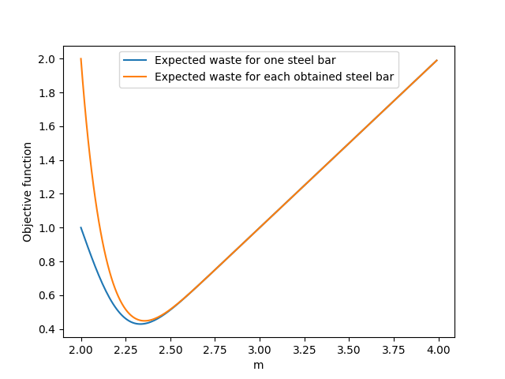

# 数学实验 Exp11

赵晨阳 计 06 2020012363

## 11.5

### 问题分析、模型假设与模型建立

为了简化模型，我们假设地面是一个严格平坦的平面，因此可以使用欧几里德几何来进行考虑。我们将以目标圆区域的圆心为原点建立一个平面直角坐标系。因此，圆形区域可以表示为 $\Omega: x^2 + y^2 \leq a^2$，其中 $a$ 是半径，对于本题而言，$a = 100$。

根据题意，炮弹落点服从二维正态分布，以圆心为中心。我们使用概率密度函数 $p(x,y) \, dx \, dy$ 来表示炮弹落在 $[x, x+dx] \times [y, y+dy]$ 区域的概率。该概率密度函数可以表示为：

$$
p(x,y) = \frac{1}{2\pi \sigma_x \sigma_y \sqrt{1-r^2}} \exp\left(-\frac{1}{2(1-r^2)}\left(\frac{x^2}{\sigma_x^2}-2r\frac{xy}{\sigma_x\sigma_y}+\frac{y^2}{\sigma_y^2}\right)\right)
$$

其中，$\sigma_x = 80$、$\sigma_y = 50$、$r = 0.4$。要计算炮弹命中目标区域 $\Omega$ 的概率，即 $P = \iint_{\Omega} p(x,y) \, dx \, dy$，我们可以进行如下积分计算：

$$
P = \int_{-a}^{a} \int_{-\sqrt{a^2-x^2}}^{\sqrt{a^2-x^2}} p(x,y) \, dy \, dx
$$

需要注意的是，由于概率密度函数 $p(x,y)$ 关于原点中心对称，即 $p(x,y) = p(-x,-y)$ 恒成立，因此上述积分也可以写成：

$$
P = 2\int_{-a}^{a} \int_{0}^{\sqrt{a^2-x^2}} p(x,y) \, dy \, dx
$$

### 算法设计

为了验证模型并进行蒙特卡洛方法的计算，我们可以使用 Python 的 SciPy 库中提供的dblquad函数来求解二重积分。通过将这个准确的结果与不同采样下的蒙特卡洛方法进行比较，可以评估蒙特卡洛算法的准确性。

首先，我们可以使用dblquad函数来计算准确的积分结果。然后，我们可以通过设置不同的采样数n来执行蒙特卡洛算法的计算。蒙特卡洛算法的基本思想是在目标区域中随机生成大量的点，然后根据这些点的分布情况来估计积分结果。

### 代码

代码位于 `./codes/11_5.py` 下，通过 `python3 11_5.py` 可以运行整个程序：

```python
import numpy as np
from scipy import integrate


def calculate_p(x, y, sigma_x, sigma_y, r):
    coefficient = 1.0 / (2.0 * np.pi * sigma_x * sigma_y * np.sqrt(1 - r**2))
    return coefficient * np.exp(
        -(
            x**2 / sigma_x**2
            - 2 * r * x * y / (sigma_x * sigma_y)
            + y**2 / sigma_y**2
        )
        / (2 * (1 - r**2))
    )


def integrate_exact(a, sigma_x, sigma_y, r):
    def integrand(y, x):
        return calculate_p(x, y, sigma_x, sigma_y, r)

    return (
        2.0
        * integrate.dblquad(
            integrand, -a, a, lambda x: 0.0, lambda x: np.sqrt(a**2 - x**2)
        )[0]
    )


def monte_carlo_simulation(a, sigma_x, sigma_y, r, n):
    p_max = calculate_p(
        0, 0, sigma_x, sigma_y, r
    )  # Maximum value of the probability density function

    def in_target_region(x, y):
        return x**2 + y**2 <= a**2

    hits = 0
    for _ in range(n):
        x, y = np.random.uniform(-a, a, size=2)
        if in_target_region(x, y):
            hits += calculate_p(x, y, sigma_x, sigma_y, r)

    return hits / n * (2 * a) ** 2


def run_experiment(a, sigma_x, sigma_y, r, sample_sizes):
    exact_result = integrate_exact(a, sigma_x, sigma_y, r)
    print("[integrate]:", exact_result)

    for n in sample_sizes:
        monte_carlo_result = monte_carlo_simulation(a, sigma_x, sigma_y, r, n)
        print(
            f"[MC {n}]",
            monte_carlo_result,
            " error:",
            abs(exact_result - monte_carlo_result),
        )


# Set parameters
a = 100
sigma_x = 80
sigma_y = 50
r = 0.4
sample_sizes = [100, 1000, 10000, 100000, 1000000, 10000000]

# Run the experiment
run_experiment(a, sigma_x, sigma_y, r, sample_sizes)

```

### 结果、分析与结论

程序结果如下：

```python
[integrate]: 0.6979392744870446
[MC 100] 0.6002100873429235  error: 0.09772918714412115
[MC 1000] 0.7089813403026255  error: 0.01104206581558087
[MC 10000] 0.6960450461027968  error: 0.001894228384247798
[MC 100000] 0.6991659800332181  error: 0.0012267055461734344
[MC 1000000] 0.6981655312096956  error: 0.00022625672265097485
[MC 10000000] 0.6981115878885865  error: 0.00017231340154189034
```

可以观察到，在不同的 n 值下，蒙特卡洛方法的误差和方差都指数级地减小。这表明随着采样数量的增加，蒙特卡洛方法变得更加精确和稳定。然而，我们也要意识到精确性和稳定性是以效率为代价的。因此，在实际应用中，我们需要根据具体场景来衡量所需的精确性和稳定性，并解决这个权衡问题。

当需要高精确性和低方差时，我们可以选择更大的采样数，以获得更接近准确结果的估计。这种情况下，蒙特卡洛方法可能需要更多的计算资源和时间。相反，如果对结果的近似程度要求较低，可以选择较小的采样数，以降低计算成本。

在实际应用中，我们需要根据问题的特点和需求来平衡精确性、稳定性和计算成本。通过对不同采样数的实验和分析，我们可以更好地理解蒙特卡洛方法的性质，并为决策提供参考依据。

此外，注意到在上述解中，方差和 n 的值成负相关关系。我们进一步查阅资料，得到如下推导过程：

设第 $i$ 次的蒙特卡洛方法求解的结果为:
$$
P_i = g(X_i,Y_i)
$$
那么:
$$
E[P_i] = E[g(X_i,Y_i)]= E[g(X,Y)]
$$
由于随机变量 $P_i$ 之间互相独立，且方差存在，那么:
$$
D\left[\frac{1}{n}\sum_{i=1}^nP_i\right]=\frac{1}{n^2}D\left[\sum_{i=1}^nP_i\right]=\frac{1}{n^2}\sum_{i=1}^nD[P_i] = \frac{1}{n} D[P]
$$
根据切比雪夫不等式:
$$
P\left(\left|\frac{1}{n}\sum_{i=1}^nP_i-E[g(X,Y)]\right|\geq \epsilon\right)\leq \frac{D[P]}{n\epsilon^2}\quad \forall \epsilon>0
$$
因此，当 n 增大时，估算的误差越小，二者为负相关关系。

这个结果表明，随着采样数的增加，蒙特卡洛方法的估计结果越接近真实值，同时方差也减小。切比雪夫不等式提供了误差上界的估计，表示当采样数足够大时，估计误差的概率会逐渐减小。因此，在实际应用中，我们可以根据需求和计算资源的限制，选择合适的采样数来达到所需的精度和可靠性。

总之，蒙特卡洛方法是一种强大的数值计算工具，能够通过随机采样来估计复杂问题的积分、概率和期望值等。在使用蒙特卡洛方法时，我们应根据实际需求和计算资源的限制，权衡精确性、稳定性和计算成本，以得到适合的结果。


## 11.7

### 问题分析、模型假设、模型建立与算法设计

在报童问题中，我们考虑购进报纸数量为 $n$ 时，每天的报纸需求量是一个随机变量，记为 $X$。报童的利润 $I_n$ 也是一个随机变量，我们希望最大化其期望利润 $E[I_n]$。为了计算 $E[I_n]$，我们对每个可能的需求量 $x$ 进行分类讨论，分为 $x \leq n$ 和 $x > n$ 两种情况。

可以得到以下表达式：
$$
E[I_n] = -a(n)n + \sum_{x=0}^{n}(bx+(n-x)c)P[X=x]+\sum_{x=n+1}^{+\infty}bnP[X=x]
$$
其中 $a(n) = A(1-\frac{n}{K})$，$A$、$b$、$c$ 和 $K$ 是报童问题中的常数。

当需求量 $x$ 是离散的时候，我们可以将其视为连续变量，且服从正态分布 $N(\mu, \sigma^2)$。因此，我们可以近似地将概率 $P[X=x]$ 表示为：
$$
P[X=x] \approx \frac{1}{\sqrt{2\pi}\sigma}e^{-\frac{(x-\mu)^2}{2\sigma^2}}
$$
这里的归一化分母 $1-\Phi(\frac{0-\mu}{\sigma})$ 用于确保正态分布在 $x \geq 0$ 的范围内。对于参数 $n$，也可以看作是非负实数。

因此，我们可以将 $E[I_n]$ 表达式改写为：
$$
E[I_n] = -A(1-\frac{n}{K})n + \int_{0}^n (bx+(n-x)c)P[X=x]dx + \int_{n}^{+\infty} bnP[X=x]dx
$$
记这个表达式为 $f(n)$，我们的目标是找到使 $f(n)$ 最大化的 $n_0$。注意，在最终求解原实际问题时，我们会选择一个相近的整数作为解。

对 $f(n)$ 求导得到：
$$
f'(n) = A(\frac{2n}{K}-1) + c\int_{0}^n P[X=x]dx + b\int_{n}^{+\infty} P[X=x]dx
$$
同时求二阶导可以得到：
$$
f''(n) = \frac{2A}{K} + (c-b)P[X=n]
$$

首先，我们寻找一个 $n_0$ 使得 $f'(n_0) = 0$。注意到当 $\mu$ 远大于 $\sigma$ 时，我们可以近似地将：
$$
\int_{0}^n P[X=x]dx
$$
看作：
$$
1-\int_{n}^{+\infty} P[X=x]dx
$$
进而我们有：
$$
A(\frac{2n_0}{K}-1) + b + (c-b)\Phi(\frac{n_0-\mu}{\sigma}) = 0
$$
其中 $\Phi$ 表示标准正态分布的累积分布函数。我们需要找到一个 $n_0$，使得：
$$
\Phi(\frac{n_0-\mu}{\sigma}) = \frac{A(\frac{2n_0}{K}-1) + b}{b-c}
$$
一旦找到 $n_0$，我们可以判断 $f''(n_0)$ 的符号，如果 $f''(n_0) < 0$，则 $f(n_0)$ 是一个极大值点，从而我们可以从该点出发找到最优的整数解。在求解过程中，我们还需要确保所得的解不超过 $K$，以确保模型中 $a(n_0)$ 有实际意义。

综上所述，在解决报童问题时，我们可以通过最大化期望利润 $E[I_n]$ 来确定最优的购进报纸数量。通过对 $f(n)$ 进行求导和求二阶导，我们可以找到满足 $f'(n_0) = 0$ 的点，并进一步判断其是否为极大值点。最后，我们需要确保所得的解符合实际情况的限制。

这种方法提供了一种定量的方式来解决报童问题，通过考虑需求量的概率分布和期望值，我们可以优化报童的购进决策以最大化利润。

### 代码

代码位于 `./codes/11_7.py` 下，通过，`python3 11_7.py` 即可运行。

```py
import numpy as np
from scipy.optimize import fsolve
from scipy.stats import norm


def calculate_n0(mu, sigma, A, K, b, c):
    """
    Calculate the number of customers that need to be served in order to maximize the profit.

    Parameters
    ----------
    mu : float
        The mean number of customers.
    sigma : float
        The standard deviation of the number of customers.
    A : float
        The cost of serving a customer.
    K : float
        The fixed cost.
    b : float
        The minimum profit.
    c : float
        The maximum profit.

    Returns
    -------
    float
        The number of customers that need to be served in order to maximize the profit.
    """

    equation = lambda n0: norm.cdf(n0, mu, sigma) - (A * (2 * n0 / K - 1) + b) / (b - c)
    n0_solution = fsolve(equation, mu)
    return n0_solution[0]


def calculate_second_derivative(mu, sigma, A, K, b, c, n0):
    """
    Calculate the second derivative of the profit function.

    Parameters
    ----------
    mu : float
        The mean number of customers.
    sigma : float
        The standard deviation of the number of customers.
    A : float
        The cost of serving a customer.
    K : float
        The fixed cost.
    b : float
        The minimum profit.
    c : float
        The maximum profit.

    Returns
    -------
    float
        The second derivative of the profit function.
    """

    second_derivative = 2 * A / K + (c - b) * norm.pdf(n0, mu, sigma)
    return second_derivative


# Set parameters
mu = 2000
sigma = 50
A = 0.5
K = 50000
b = 0.5
c = 0.35

# Calculate n0 and second derivative
n0 = calculate_n0(mu, sigma, A, K, b, c)
second_derivative = calculate_second_derivative(mu, sigma, A, K, b, c, n0)

# Print results
print(f"n0: {n0:.4f}")
print(f"g''(n): {second_derivative:.4f}")

```

### 结果、分析

```python
n0: 1968.2060
g''(n): -0.0010
```

### 结论

根据最终的解方程结果，我们得到 $n_0 = 1968$，并且 $f''(n_0) = -1.0\times 10^{-3} < 0$。因此，最优解取整数为 $1968$。

观察到以下情况：（1）$n_0 \ll K$，且 $n_0 < K$ 是使得 $a(n) > 0$ 的充要条件。这也说明题目中给出的 $a(n)$ 具有实际意义。在这里，$K$ 可以被视为发行商预估的最大报纸销售量。（2）$n_0 < \mu$，这意味着最优策略是相对保守的，购买的报纸数量低于需求量的期望值。

计算可以得到 $a(1968) = 0.48$，而 $b = 0.5$。这意味着报童卖出一份报纸只能获得 $0.02$ 的利润。相反地，如果无法销售，则会损失 $0.13$ 元，这是利润的 $6.5$ 倍。通过这种计算，我们可以定性地观察到报童必须采取保守的策略，否则可能会遭受损失。

所求得的答案 $1968$ 可以直接作为报童购买报纸数量的参考。然而，在实际生活中，还需要考虑更复杂的因素，例如报纸的热销程度（是否有重大新闻）和冷门情况等。因此，在制定实际策略时，需要综合考虑更多因素。

## 11.9

### 问题分析、模型假设与模型建立

根据题意，粗轧后得到的钢材长度是一个随机变量 $X$，服从正态分布 $N(m, \sigma^2)$，其中 $m$ 是我们要确定的值，$\sigma = 0.2$。我们希望确定粗轧机器的平均长度 $m$，以使得钢材的浪费最小化。过大的 $m$ 会导致精轧而浪费的钢材过多，而过小的 $m$ 则会增加整根报废的概率。

首先，考虑最小化单根钢材的期望浪费值。定义函数 $w(x)$ 表示当 $X = x$ 时的浪费情况，其中：
$$
w(x) = [x < l] \cdot x + [x \geq l] \cdot (x - l)
$$
则浪费的期望值为：
$$
E[w(X)] = \int_{0}^{l}xP[X = x]dx + \int_{l}^{+\infty}(x - l)P[X = x]dx\\
P[X = x] = \frac{\frac{1}{\sqrt{2\pi}\sigma}e^{-\frac{(x - m)^2}{2\sigma^2}}}{1 - \Phi(\frac{0 - m}{\sigma})} \approx \frac{1}{\sqrt{2\pi}\sigma}e^{-\frac{(x - m)^2}{2\sigma^2}}
$$
这里的归一化分母 $1 - \Phi(\frac{0 - m}{\sigma})$ 是为了在正态分布中保证不小于 $0$ 的部分的概率密度之和为 $1$，因为长度不可能小于 $0$。

接下来考虑最小化获得一根规定长度的钢材的期望浪费值。记 $Y$ 为这样的浪费值，有：
$$
E[Y] = \int_{0}^{l}(x + E[Y])P[X = x]dx + \int_{l}^{+\infty}(x - l)P[X = x]dx\\
E[Y] = \frac{\int_{0}^{l}xP[X = x]dx + \int_{l}^{+\infty}(x - l)P[X = x]dx}{1 - \int_{0}^{l}P[X = x]dx}
$$
现在我们来计算 $E[w(X)]$：
$$
E[w(X)] = \int_{0}^{+\infty}xP[X = x]dx - l\int_{l}^{+\infty}P[X = x]dx \approx m - l \cdot P[X > l]
$$
因此，$E[Y] = \frac{m}{P[X > l]} - l$。对于 $P[X > l]$，我们可以近似为 $1 - \Phi(\frac{l - m}{\sigma})$。

### 算法设计

对于最小化 $E[w(X)]$ 和 $E[Y]$，我们可以分别找到 $m_0$ 的最小值，使得 $m_0 - l \cdot (1 - \Phi(\frac{l - m_0}{\sigma}))$ 和 $\frac{m_0}{1 - \Phi(\frac{l - m_0}{\sigma})} - l$ 最小化。在这里，我们还需要约束条件 $m_0 > 0$。

我们可以使用数值优化方法，如牛顿法或梯度下降法，来找到使目标函数最小化的 $m_0$ 值。可以定义一个目标函数，例如 $f(m_0) = m_0 - l \cdot (1 - \Phi(\frac{l - m_0}{\sigma}))$ 或 $g(m_0) = \frac{m_0}{1 - \Phi(\frac{l - m_0}{\sigma})} - l$，然后通过优化算法求解该函数的最小值。需要注意的是，优化过程中还要考虑约束条件 $m_0 > 0$。

### 代码

代码位于 `./codes/11_9.py` 下，通过，`python3 11_9.py` 即可运行。

```python
import numpy as np
import matplotlib.pyplot as plt
from scipy.optimize import minimize_scalar
from scipy.stats import norm

def objective_function1(m, l, sigma):
    """
    Return the expected waste for one steel bar.

    Parameters
    ----------
    m : float
        The mean length of the steel bars.
    l : float
        The target length of the steel bars.
    sigma : float
        The standard deviation of the steel bar lengths.

    Returns
    -------
    float
        The expected waste for one steel bar.
    """
    return m - l * (1 - norm.cdf((l - m) / sigma))

def objective_function2(m, l, sigma):
    """
    Return the expected waste for each obtained steel bar.

    Parameters
    ----------
    m : float
        The mean length of the steel bars.
    l : float
        The target length of the steel bars.
    sigma : float
        The standard deviation of the steel bar lengths.

    Returns
    -------
    float
        The expected waste for each obtained steel bar.
    """
    return m / (1 - norm.cdf((l - m) / sigma)) - l


def main():
    """
    Optimize the objective functions and plot the results.
    """
    l = 2.0
    sigma = 0.2

    # Optimize the function objective_function1 in the range [0, 4]
    res1 = minimize_scalar(objective_function1, args=(l, sigma), bounds=(0, 4))
    x1 = res1.x
    fval1 = res1.fun

    # Optimize the function objective_function2 in the range [0, 4]
    res2 = minimize_scalar(objective_function2, args=(l, sigma), bounds=(0, 4))
    x2 = res2.x
    fval2 = res2.fun

    print("First Optimization 1:")
    print("x1:", x1)
    print("fval1:", fval1)
    print()
    print("Second Optimization 2:")
    print("x2:", x2)
    print("fval2:", fval2)

    xrange = np.arange(2, 4, 0.01)
    y1 = objective_function1(xrange, l, sigma)
    y2 = objective_function2(xrange, l, sigma)

    plt.plot(xrange, y1, label='Expected waste for one steel bar')
    plt.plot(xrange, y2, label='Expected waste for each obtained steel bar')
    plt.legend()
    plt.xlabel('m')
    plt.ylabel('Objective function')
    plt.show()


if __name__ == "__main__":
    main()
```

### 结果、分析与结论

```py
First Optimization 1:
x1: 2.332703574570344
fval1: 0.42891239079833854

Second Optimization 2:
x2: 2.3561717664626665
fval2: 0.447888665892763
```



对于一根钢材的粗轧过程，其最小期望浪费值为 $0.428912$，当 $m=2.332703$ 时取到最小值。

而对于获得一根规定长度的钢材，其最小期望浪费值为 $0.447888$，当 $m=2.356171$ 时取到最小值。

可以观察到，在最优解附近，两种情况下的期望浪费值几乎相等。这可以从数学表达式上看出来，因为随着 $m$ 的增大，$1 - \Phi(\frac{l - m}{\sigma})$ 的值趋近于 1。同时，从定性的角度思考也可以得出这个结论，当 $m$ 变大时，几乎不会有整根报废的情况发生，而是直接通过第一次截断而产生浪费。

此外，还可以观察到当 $m$ 从最优点开始增大时，期望浪费值的增加速率远小于 $m$ 从最优点开始减小时的增加速率。同时，当 $m$ 较小时，第二个浪费值的期望会远大于第一个浪费值的期望，这表明整根报废带来的代价比截断带来的代价更显著。

在两种最优情况下，报废的概率均低于 $5\%$。这说明最优策略确实是尽量避免整根报废。求解得到的答案可以直接作为实际生产中的参考。在实际生产中，还可能需要考虑每次运行机器的成本等因素，可以将这些成本纳入数学表达式中，进行整体的优化。

综上所述，根据求解得到的结果，可以提供实际生产中的参考，但需要结合具体情况进一步考虑其他因素进行综合优化。
