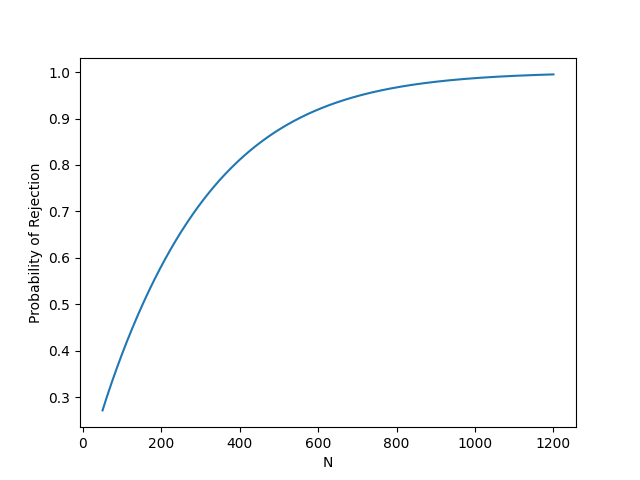
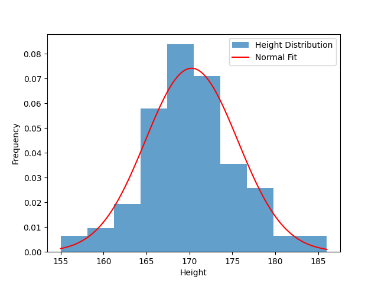
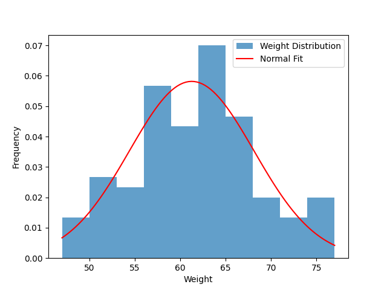
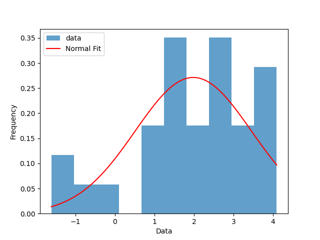
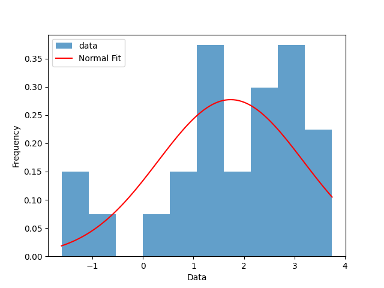
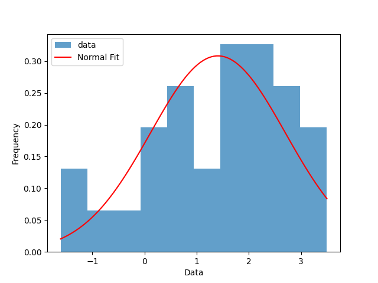

# 数学实验 Exp12

赵晨阳 计 06 2020012363

## 12.5

### 问题分析、模型假设与模型建立

为了方便考虑，假设每种产品只有两个可能性："合格"和"不合格"，并用二值随机变量$X$表示每个产品的合格情况，其中 $X=0$ 表示不合格，$X=1$ 表示合格。则 $X$ 服从伯努利分布。

设产品的真实合格率为 $P(X=1)=p$。记 $\mu=E[X]=p, \sigma^2=Var[X]=p(1-p)$。由于样本容量 $n=50$ 较大，根据中心极限定理，样本均值 $\overline{X}$ 近似服从正态分布 $N(\mu,(\frac{\sigma}{\sqrt{n}})^2)$，即 $\frac{\overline{X}-\mu}{\frac{\sigma}{\sqrt{n}}}$ 近似服从标准正态分布 $N(0,1)$。

假设甲方承诺的合格率为 $\mu_0$（题目中给出 $\mu_0=90\%=0.9$）。考虑对 $\mu=p$ 进行假设检验：$H_0:\mu\geq \mu_0$，$H_1:\mu<\mu_0$。若 $X$ 真的满足 $\mu=\mu_0$，记$\sigma_0=\sqrt{\mu_0(1-\mu_0)}$，$Z=\frac{\overline{X}-\mu_0}{\frac{\sigma_0}{\sqrt{n}}}$。取标准正态分布 $N(0,1)$ 的 $\alpha=1-0.95=0.05$ 分位数为 $\mu_{\alpha}$，则 $P[Z\geq \mu_{\alpha}]=P[\overline{X}\geq \frac{\sigma_0}{\sqrt{n}}\mu_{\alpha}+\mu_0]=1-\alpha=0.95$。因此，对于一组给定样本的统计量 $\overline{x}$，根据现有规则，乙方应当以 $\frac{\sigma_0}{\sqrt{n}}\mu_{\alpha}+\mu_0$为阈值与$\overline{x}$ 进行比较以决定是否接受，或者说以 $\mu_{\alpha}$ 为阈值与 $\frac{\overline{x}-\mu_0}{\frac{\sigma_0}{\sqrt{n}}}$ 进行比较，若比阈值大则认为假设 $H_0$ 成立。

如果乙方不想接受甲方的这批货品，就意味着需要在某种程度上“提高要求”。从数学的角度看，有三种可能的方法：

1. 增大双方约定的合格率 $\mu_0$；
2. 降低置信水平，增大阈值；
3. 假如甲方的产品真的不达标，根据大数定律，增大抽取检查；

由于本题有实际商业背景，（1）和（2）中的两个量应当均为交易双方提前约定好的，不能随意改变，因此这两个方法不可行；相比之下方法（3）是可行的，而且对双方也比较公平。

假设甲方的真实合格率是 $p=86\%$，当增大抽取检查货品数目为 $N$ 时，阈值变为 $\frac{\sigma_0}{\sqrt{N}}\mu_{\alpha}+\mu_0=T_N$。样本均值 $\overline{X}$ 近似服从正态分布 $N(\mu,(\frac{\sigma}{\sqrt{N}})^2)$，则甲被拒绝的概率为 $P[\overline{X}\leq T_N]=\Phi(\dfrac{T_N-\mu}{\dfrac{\sigma}{\sqrt{N}}})$，其中 $\Phi(\cdot)$ 表示标准正态分布的累积分布函数。

### 算法设计

我们使用 python.scipy 库中的 `norm` 方法进行相应的计算。做出抽样数量增大时，甲方被拒绝的概率变化曲线。

### 代码

代码位于 `./codes/12_5.py` 下，通过 `python3 12_5.py` 可以运行整个程序：

```python
import numpy as np
import matplotlib.pyplot as plt
from scipy.stats import norm


def calculate_rejection_probability(mu_0, mu, sigma_0, alpha, N):
    sigma = np.sqrt(mu * (1.0 - mu))
    threshold = sigma_0 / np.sqrt(N) * norm.ppf(alpha) + mu_0
    return norm.cdf((threshold - mu) / (sigma / np.sqrt(N)))


def main():
    mu_0 = 0.90
    sigma_0 = np.sqrt(mu_0 * (1.0 - mu_0))
    alpha = 1 - 0.95

    all_N = np.arange(50, 1201)
    mu = 0.86
    prob = np.zeros(len(all_N))

    for index, N in enumerate(all_N):
        prob[index] = calculate_rejection_probability(mu_0, mu, sigma_0, alpha, N)

    plt.plot(all_N, prob)
    plt.xlabel("N")
    plt.ylabel("Probability of Rejection")
    plt.show()


if __name__ == "__main__":
    main()

```

### 结果、分析与结论



根据题目所给的约定，$\frac{\sigma_0}{\sqrt{n}}\mu_{\alpha}+\mu_0=0.830215<0.86=\overline{x}$，因此乙方应当接受。观察到这个拒绝概率随着 $N$ 的增大而单调增加，当 $N$ 达到 1000 时，拒绝概率几乎为 1。因此，如果甲方确实不符合标准，增加抽检货品的数量可以增加甲方被拒绝的概率。增加抽检数量的本质是降低样本方差，从而使得样本更好地代表整体，提高在甲方不符合标准时被发现的概率。然而，在现实生活中，我们还需要权衡检查产品所带来的额外成本，即在合格率不符合标准时产生的损失和检查过多产品所带来的成本之间进行平衡。

## 12.6

### 问题分析、模型假设与模型建立

为了方便分析，假设学生身高（或体重）是一个随机变量 $X$，我们从中随机抽取了 100 名学生作为样本 $x$。首先，我们需要检验身高或体重的分布是否符合正态分布，可以考虑使用 Jarque-Bera 检验和 Lilliefors 检验来进行检验。

接下来，我们考虑对全校学生的平均身高或体重进行估计。点估计比较简单，根据正态分布性质，无论是使用矩估计还是最大似然估计，我们都可以使用样本均值 $\overline{x}$ 来估计平均身高或体重（也即正态分布的参数 $\mu$）。对于区间估计，假设显著性水平为 $\alpha$。由于总体方差未知，我们考虑使用样本方差 $S^2$ 进行区间估计。记自由度为 $n-1$ 的 $t$ 分布的 $1-\frac{\alpha}{2}$ 分位数为 $t_{1-\frac{\alpha}{2}}$，身高（或体重）的真实均值为 $\mu$。根据样本均值的分布，我们有 $\frac{\overline{X}-\mu}{\frac{S}{\sqrt{n}}}\sim t(n-1)$。这意味着 $P\left[\mu-t_{1-\frac{\alpha}{2}}\frac{S}{\sqrt{n}}\leq \overline{X} \leq \mu+t_{1-\frac{\alpha}{2}}\frac{S}{\sqrt{n}}\right]=1-\alpha, P\left[\overline{X}-t_{1-\frac{\alpha}{2}}\frac{S}{\sqrt{n}}\leq \mu \leq \overline{X}+t_{1-\frac{\alpha}{2}}\frac{S}{\sqrt{n}}\right]=1-\alpha$。因此，对于给定样本，我们可以取置信水平为 $1-\alpha$ 的置信区间为 $[\overline{x}-t_{1-\frac{\alpha}{2}}\frac{s}{\sqrt{n}}, \overline{x}+t_{1-\frac{\alpha}{2}}\frac{s}{\sqrt{n}}]$ 来进行平均值的区间估计。

假设题目中 10 年前学生的平均身高（或体重）记为 $\mu_0$，我们考虑对 $\mu$ 进行假设性检验：$H_0:\mu=\mu_0, H_1:\mu\neq \mu_0$，同时设定显著性水平为 $\alpha$。由于总体方差未知，我们使用样本均方差 $s$ 进行假设性检验。如果真的满足 $\mu=\mu_0$，则有 $T=\frac{\overline{X}-\mu_0}{\frac{S}{\sqrt{n}}}\sim t(n-1)$。记自由度为 $n-1$ 的 $t$ 分布的 $1-\frac{\alpha}{2}$ 分位数为 $t_{1-\frac{\alpha}{2}}$。那么在这种情况下，有 $P(\lvert T\rvert \leq t_{1-\frac{\alpha}{2}})=1-\alpha$。因此，对于得到的样本，我们可以计算 $t=\frac{\overline{x}-\mu_0}{\frac{s}{\sqrt{n}}}$，如果 $\lvert t \rvert \leq t_{1-\frac{\alpha}{2}}$，则可以认为 $\mu=\mu_0$ 假设成立，即学生的身高（或体重）没有明显变化。倘若不然，则学生的身高或者体重已经发生了明显变化。

### 算法设计

利用 python scipy 中的 `norm, ttest_lsamp, chi2, t` 等方法进行假设检验。

### 代码

代码位于 `./codes/12_6.py` 下，通过，`python3 12_6.py` 即可运行。

```py
import numpy as np
from scipy.stats import norm, ttest_1samp, t, chi2
import matplotlib.pyplot as plt


def shapiro_wilk_test(data):
    _, p_value = norm.fit(data)
    return p_value


def jarque_bera_test(data):
    _, p_value = norm.fit(data)
    n = len(data)
    skewness = (1 / n) * np.sum((data - np.mean(data)) ** 3) / np.std(data) ** 3
    kurtosis = (1 / n) * np.sum((data - np.mean(data)) ** 4) / np.std(data) ** 4 - 3
    jb_value = (n / 6) * (skewness**2 + (1 / 4) * kurtosis**2)
    p_value = 1 - chi2.cdf(jb_value, df=2)
    return p_value


def Confidence(data, confidence_level):
    n = len(data)
    t_value = t.ppf((1 + confidence_level) / 2, df=n - 1)
    margin_error = t_value * sample_std / np.sqrt(n)
    lower_bound = sample_mean - margin_error
    upper_bound = sample_mean + margin_error
    print(f"Confidence Interval[{confidence_level}]:", lower_bound, "-", upper_bound)


heights = np.array(
    [
        172,
        171,
        166,
        160,
        155,
        173,
        166,
        170,
        167,
        173,
        178,
        173,
        163,
        165,
        170,
        163,
        172,
        182,
        171,
        177,
        169,
        168,
        168,
        175,
        176,
        168,
        161,
        169,
        171,
        178,
        177,
        170,
        173,
        172,
        170,
        172,
        177,
        176,
        175,
        184,
        169,
        165,
        164,
        173,
        172,
        169,
        173,
        173,
        166,
        163,
        170,
        160,
        165,
        177,
        169,
        176,
        177,
        172,
        165,
        166,
        171,
        169,
        170,
        172,
        169,
        167,
        175,
        164,
        166,
        169,
        167,
        179,
        176,
        182,
        186,
        166,
        169,
        173,
        169,
        171,
        167,
        168,
        165,
        168,
        176,
        170,
        158,
        165,
        172,
        169,
        169,
        172,
        162,
        175,
        174,
        167,
        166,
        174,
        168,
        170,
    ]
)

weights = np.array(
    [
        75,
        62,
        62,
        55,
        57,
        58,
        55,
        63,
        53,
        60,
        60,
        73,
        47,
        66,
        60,
        50,
        57,
        63,
        59,
        64,
        55,
        67,
        65,
        67,
        64,
        50,
        49,
        63,
        61,
        64,
        66,
        58,
        67,
        59,
        62,
        59,
        58,
        68,
        68,
        70,
        64,
        52,
        59,
        74,
        69,
        52,
        57,
        61,
        70,
        57,
        56,
        65,
        58,
        66,
        63,
        60,
        67,
        56,
        56,
        49,
        65,
        62,
        58,
        64,
        58,
        72,
        76,
        59,
        63,
        54,
        54,
        62,
        63,
        69,
        77,
        76,
        72,
        59,
        65,
        71,
        47,
        65,
        64,
        57,
        57,
        57,
        51,
        62,
        53,
        66,
        58,
        50,
        52,
        75,
        66,
        63,
        50,
        64,
        62,
        59,
    ]
)

p_value_jb_heights = jarque_bera_test(heights)
p_value_sw_heights = shapiro_wilk_test(heights)
p_value_jb_weights = jarque_bera_test(weights)
p_value_sw_weights = shapiro_wilk_test(weights)

print("Check result:")
print("Jarque-Bera Test (heights):", p_value_jb_heights)
print("Shapiro-Wilk Test (heights):", p_value_sw_heights)
print("Jarque-Bera Test (weights):", p_value_jb_weights)
print("Shapiro-Wilk Test (weights):", p_value_sw_weights)

plt.figure(1)
plt.hist(heights, density=True, bins=10, alpha=0.7, label="Height Distribution")
mu_fit, sigma_fit = norm.fit(heights)
x = np.linspace(heights.min(), heights.max(), 100)
y = norm.pdf(x, mu_fit, sigma_fit)
plt.plot(x, y, "r", label="Normal Fit")
plt.xlabel("Height")
plt.ylabel("Frequency")
plt.legend()
plt.show()

plt.figure(2)
plt.hist(weights, density=True, bins=10, alpha=0.7, label="Weight Distribution")
mu_fit, sigma_fit = norm.fit(weights)
x = np.linspace(weights.min(), weights.max(), 100)
y = norm.pdf(x, mu_fit, sigma_fit)
plt.plot(x, y, "r", label="Normal Fit")
plt.xlabel("Weight")
plt.ylabel("Frequency")
plt.legend()
plt.show()


def hypothesis_test(data, popmean, alpha):
    t_stat, p_value = ttest_1samp(data, popmean)
    print("Hypothesis Test:", p_value)
    return p_value


print("\n=======heights=======")
sample_mean = np.mean(heights)
sample_std = np.std(heights, ddof=1)
print("Point Estimate (mean, std):", sample_mean, sample_std)
Confidence(heights, 0.99)
Confidence(heights, 0.97)
Confidence(heights, 0.95)
hypothesis_test(heights, popmean=167.5, alpha=0.05)

print("\n=======weights=======")
sample_mean = np.mean(weights)
sample_std = np.std(weights, ddof=1)
print("Point Estimate (mean, std):", sample_mean, sample_std)
Confidence(weights, 0.99)
Confidence(weights, 0.97)
Confidence(weights, 0.95)
hypothesis_test(weights, popmean=60.2, alpha=0.05)

```

### 结果、分析

程序输出如下：

```python
Check result:
Jarque-Bera Test (heights): 0.42908681416799177
Shapiro-Wilk Test (heights): 5.374709294464213
Jarque-Bera Test (weights): 0.674777470279029
Shapiro-Wilk Test (weights): 6.858359862241118
=======heights=======
Point Estimate (mean, std): 170.25 5.401786086961694
Confidence Interval[0.99]: 168.83127195469783 - 171.66872804530217
Confidence Interval[0.97]: 169.06062469378367 - 171.43937530621633
Confidence Interval[0.95]: 169.1781684477827 - 171.3218315522173
Hypothesis Test: 1.7003185736956772e-06

=======weights=======
Point Estimate (mean, std): 61.27 6.892911012208283
Confidence Interval[0.99]: 59.45964209071587 - 63.08035790928414
Confidence Interval[0.97]: 59.7523060347289 - 62.7876939652711
Confidence Interval[0.95]: 59.90229691243355 - 62.63770308756646
Hypothesis Test: 0.1237768678418777
```

### 结论





根据提供的结果，可以得出以下结论：

第一问：根据 Jarque-Bera 检验和 Shapiro-Wilk 检验的结果，身高和体重的 p 值较大，说明数据符合正态分布，假设成立。

第二问：根据计算得到的均值点估计、方差点估计和均值区间估计结果，可以得出不同显著性水平下的估计值。随着显著性水平的降低，均值区间估计的范围变大。在给定的显著性水平下，我们可以估计身高和体重的均值在一定范围内。实际上，这也与理论分析一致、：随着 $\alpha$ 增加，$1-\frac{\alpha}{2}$ 减小，意味着 $t_{1-\frac{\alpha}{2}}$ 减小。

第三问：进行了关于身高和体重的假设性检验。对于身高的检验，得到的 p 值非常小，因此拒绝了原假设，可以认为十年来学生的平均身高发生了显著变化。对于体重的检验，得到的 p 值较大，因此接受了原假设，可以认为十年来学生的平均体重没有发生显著变化。注意到 $167.5$ 远不在上面求出的两个身高均值的置信区间里，而 $60.2$ 总是在上面求出的两个体重均值的置信区间里，这也符合假设性检验的结果。

综上所述，根据正态性检验、区间估计和假设性检验的结果，我们得出结论：十年来学生的平均身高发生了显著变化，而平均体重没有发生显著变化，这与题目中的设定一致。

## 12.7

### 问题分析、模型假设与模型建立

考虑胃液中溶菌酶含量的问题，我们假设该含量满足正态分布，记为 "胃液中溶菌酶含量"。首先，我们需要进行正态性检验，以验证数据是否满足正态分布假设。

假设病人的胃液中溶菌酶含量的分布为 $X \sim N(\mu_1, \sigma_1^2)$，正常人的胃液中溶菌酶含量的分布为 $Y \sim N(\mu_2, \sigma_2^2)$。题目要求判断 "病人和正常人的溶菌酶含量是否存在显著差异"，根据前面的假设，我们假设 $\sigma_1^2 = \sigma^2 = \sigma_2^2$。因此，我们可以从平均含量的角度来考虑是否存在显著差异，并进行以下假设性检验：$H_0: \mu_1 = \mu_2$ 和 $H_1: \mu_1 \neq \mu_2$。

记从病人和正常人中抽取的样本分别为 $X_1, X_2, \ldots, X_{n_1}$ 和 $Y_1, Y_2, \ldots, Y_{n_2}$。病人的样本方差为 $S_1^2 = \frac{1}{n_1-1}\sum_{i=1}^{n_1}X_i^2$，正常人的样本方差为 $S_2^2 = \frac{1}{n_2-1}\sum_{i=1}^{n_2}Y_i^2$。记 $S^2 = \frac{(n_1-1)S_1^2 + (n_2-1)S_2^2}{n_1 + n_2 - 2}$，则根据 $H_0$ 的假设，我们有 $T = \frac{\overline{X} - \overline{Y}}{\sqrt{\frac{S^2}{n_1} + \frac{S^2}{n_2}}} \sim t(n_1 + n_2 - 2)$。其中，$\overline{X}$ 和 $\overline{Y}$ 分别是病人和正常人样本的平均值。 

设显著性水平为 $\alpha$，$t(n_1 + n_2 - 2)$ 的 $1-\frac{\alpha}{2}$ 分位数为 $t_{1-\frac{\alpha}{2}}$。则有 $P\left[\left|\frac{\overline{X} - \overline{Y}}{\sqrt{\frac{S^2}{n_1} + \frac{S^2}{n_2}}}\right| \leq t_{1-\frac{\alpha}{2}}\right] = 1-\alpha$。对于给定的样本，我们可以计算统计量 $t = \frac{\overline{x} - \overline{y}}{\sqrt{\frac{s^2}{n_1} + \frac{s^2}{n_2}}}$，如果 $|\,t\,| \leq t_{1-\frac{\alpha}{2}}$，则可以认为假设 $H_0$ 成立。

### 算法设计

### 代码

代码位于 `./codes/12_7.py` 下，通过，`python3 12_7.py` 即可运行。

```python
import numpy as np
from scipy.stats import norm, ttest_ind, levene, chi2
import matplotlib.pyplot as plt

patient = np.array(
    [
        0.2,
        10.4,
        0.3,
        0.4,
        10.9,
        11.3,
        1.1,
        2.0,
        12.4,
        16.2,
        2.1,
        17.6,
        18.9,
        3.3,
        3.8,
        20.7,
        4.5,
        4.8,
        24.0,
        25.4,
        4.9,
        40.0,
        5.0,
        42.2,
        5.3,
        50.0,
        60.0,
        7.5,
        9.8,
        45.0,
    ]
)

patient_del = np.array(
    [
        0.2,
        10.4,
        0.3,
        0.4,
        10.9,
        11.3,
        1.1,
        2.0,
        12.4,
        16.2,
        2.1,
        17.6,
        18.9,
        3.3,
        3.8,
        20.7,
        4.5,
        4.8,
        24.0,
        25.4,
        4.9,
        40.0,
        5.0,
        42.2,
        5.3,
    ]
)

normal = np.array(
    [
        0.2,
        5.4,
        0.3,
        5.7,
        0.4,
        5.8,
        0.7,
        7.5,
        1.2,
        8.7,
        1.5,
        8.8,
        1.5,
        9.1,
        1.9,
        10.3,
        2.0,
        15.6,
        2.4,
        16.1,
        2.5,
        16.5,
        2.8,
        16.7,
        3.6,
        20.0,
        4.8,
        20.7,
        4.8,
        33.0,
    ]
)


def shapiro_wilk_test(data):
    _, p_value = norm.fit(data)
    return p_value


def jarque_bera_test(data):
    _, p_value = norm.fit(data)
    n = len(data)
    skewness = (1 / n) * np.sum((data - np.mean(data)) ** 3) / np.std(data) ** 3
    kurtosis = (1 / n) * np.sum((data - np.mean(data)) ** 4) / np.std(data) ** 4 - 3
    jb_value = (n / 6) * (skewness**2 + (1 / 4) * kurtosis**2)
    p_value = 1 - chi2.cdf(jb_value, df=2)
    return p_value


def plot_and_hist(data):
    plt.figure(1)
    plt.hist(data, density=True, bins=10, alpha=0.7, label="data")
    mu_fit, sigma_fit = norm.fit(data)
    x = np.linspace(data.min(), data.max(), 100)
    y = norm.pdf(x, mu_fit, sigma_fit)
    plt.plot(x, y, "r", label="Normal Fit")
    plt.xlabel("Data")
    plt.ylabel("Frequency")
    plt.legend()
    plt.show()


p_patient = jarque_bera_test(patient)
p_patient_del = jarque_bera_test(patient_del)
p_normal = jarque_bera_test(normal)
print("Check result (before log transformation):", p_patient, p_patient_del, p_normal)

patient = np.log(patient)
patient_del = np.log(patient_del)
normal = np.log(normal)
p_patient = jarque_bera_test(patient)
p_patient_del = jarque_bera_test(patient_del)
p_normal = jarque_bera_test(normal)
print("Check result (after log transformation):", p_patient, p_patient_del, p_normal)

_, p_value_1 = levene(patient, normal)
_, p_value_2 = levene(patient_del, normal)
print("Var Check:", p_value_1, p_value_2)

plot_and_hist(patient)
plot_and_hist(patient_del)
plot_and_hist(normal)

t_1, p_1 = ttest_ind(patient, normal)
t_2, p_2 = ttest_ind(patient_del, normal)
print("Accept patient (with deletion):", p_1)
print("Accept patient (without deletion):", p_2)
```

### 结果、分析与结论

```python
Check result (before log transformation): 0.011066280056296507 0.02201395281786067 0.0009518898505554985
Check result (after log transformation): 0.21446850046961918 0.27270172282740845 0.39424901950098024
Var Check: 0.6586753593806446 0.6680817067976366
Accept patient (with deletion): 0.11850874520905379
Accept patient (without deletion): 0.3854559998328455
```

分别绘制出取对数后的病人数据、删除错误数据后的病人数据以及正常人数据直方与正态拟合图：







首先对三组数据直接进行正态性检验，结果显示三组数据本身均不满足正态分布。然后尝试对三组数据取对数后进行正态性检验，发现三组数据均通过检验，表明原始数据满足对数正态分布。此外，新旧病人数据也通过了方差相同的检验。后续基于对数转换后的数据进一步分析。

按照模型中的方法进行了假设性检验。对于原始对数数据，得到的 p 值为 0.12，大于显著性水平 0.05，因此无法拒绝零假设，可以认为病人数据与正常人数据在溶酶菌含量的均值上没有显著差异。对于删除后的对数数据，得到的 p 值为 0.39，同样大于显著性水平 0.05，说明在删除后的数据中，病人数据与正常人数据在均值上也没有显著差异，且更具有说服力。因此，无论是使用原始数据还是删除错误数据后的后的数据，都不能认为病人和正常人溶酶菌含量有显著差异。

此外，在给定的数据中，正常人的溶酶菌含量均值为 7.68，而删除前的病人数据均值为 15.33，删除后为 11.51。从直观上看，这些差异可能会导致我们得出存在显著差异的结论。然而，仅仅依靠样本均值进行判断是不够的。在本例中，尽管样本均值之间存在较大差异，但假设性检验的结果显示在均值上没有显著差异。

最后，还需要讨论原始数据的收集过程。在本题中，仅删除了五个数据就得到了置信度更高的结论。这说明在收集数据时必须准确且科学地进行操作，以获得可靠的结果。

这个实验的实际意义在于为医生和生物科研人员提供参考。最终的结论需要综合考虑其他专业知识来进行判断，而本研究的结果可作为决策的重要依据。

# 卡方

对于方差的假设检验，我们通常使用卡方分布。在这种情况下，我们的检验统计量是 $(n-1)s^2/\sigma_0^2$，其中 $s^2$ 是样本方差，$n$ 是样本大小，$\sigma_0^2$ 是假设的总体方差。这个统计量服从自由度为 $n-1$ 的卡方分布。

对于双侧检验，我们的原假设 $H_0: \sigma^2=\sigma_0^2$，备择假设 $H_1: \sigma^2 \neq \sigma_0^2$。在这种情况下，我们会查找卡方分布的 $\alpha/2$ 和 $1-\alpha/2$ 分位数，记作 $\chi_{\alpha/2}^2$ 和 $\chi_{1-\alpha/2}^2$。拒绝域：$s^2<\dfrac{\sigma_0^2\chi_{\alpha/2}^2}{n-1}$或者$s^2>\dfrac{\sigma_0^2\chi_{1-\alpha/2}^2}{n-1}$。

对于单侧检验，方法类似，但是我们只关心一个方向的偏离。

1. 对于 $H_0: \sigma^2 \geq \sigma_0^2$，备择假设 $H_1: \sigma^2 < \sigma_0^2$，我们查找卡方分布的 $\alpha$ 分位数，记作 $\chi_{1-{\alpha}^2}$，拒绝域：$s^2<\dfrac{\sigma_0^2\chi_{\alpha}^2}{n-1}$。

2. 对于 $H_0: \sigma^2 \leq \sigma_0^2$，备择假设 $H_1: \sigma^2 > \sigma_0^2$，我们查找卡方分布的 $1-\alpha$ 分位数，记作 $\chi_{1-\alpha}^2$。拒绝域：$s^2>\dfrac{\sigma_0^2\chi_{1-\alpha}^2}{n-1}$。

这就是方差的假设检验的基本方法。

