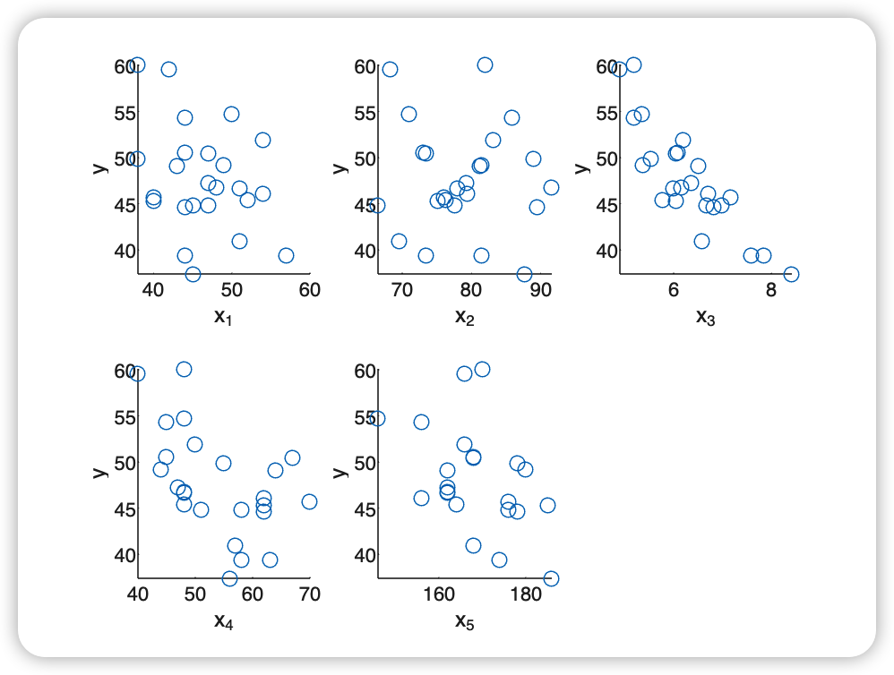
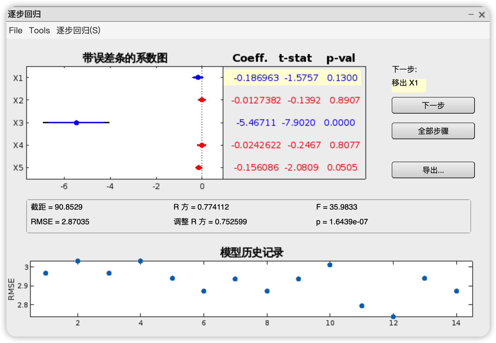
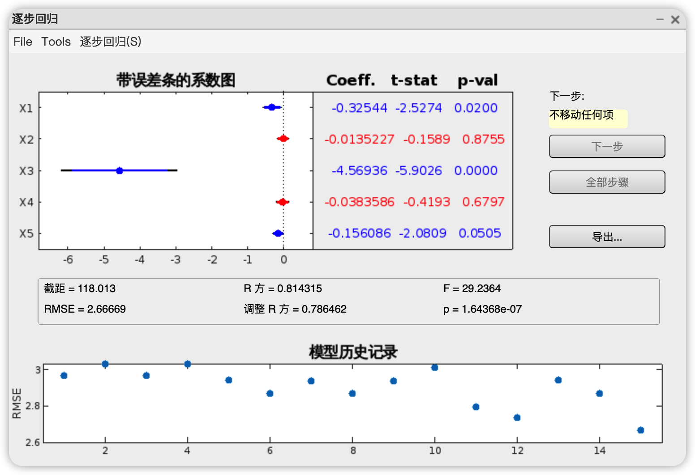
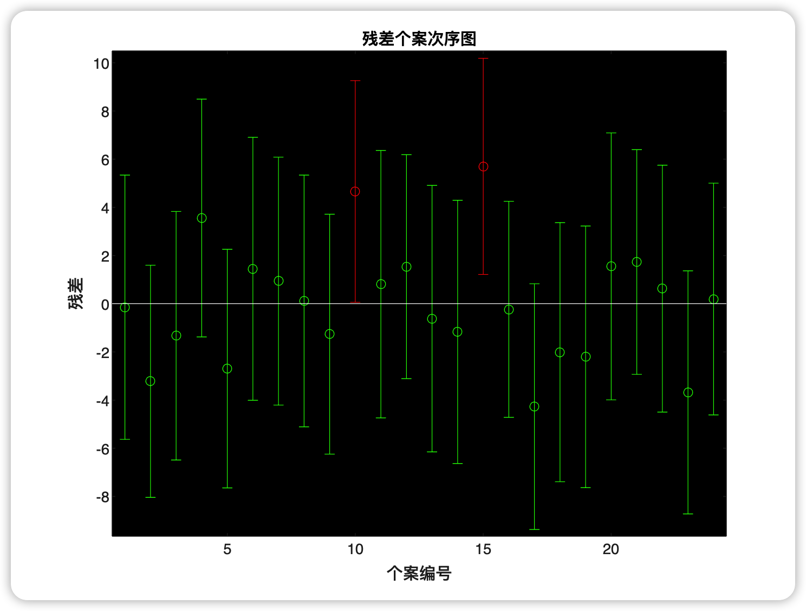
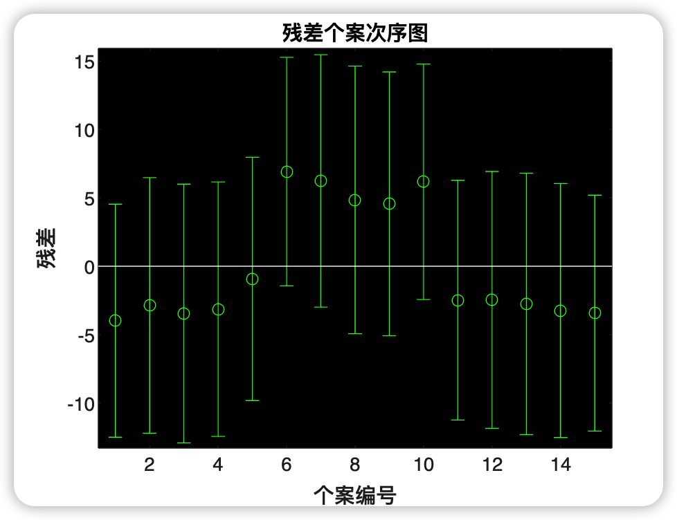
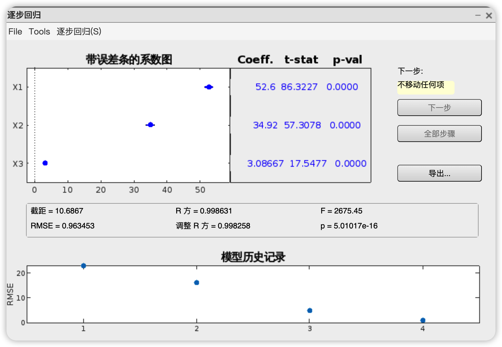
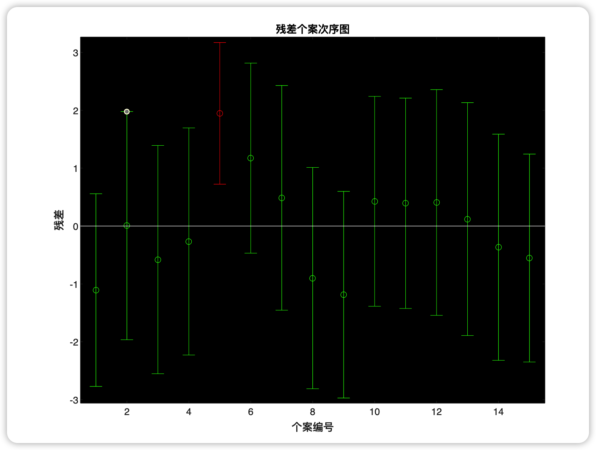
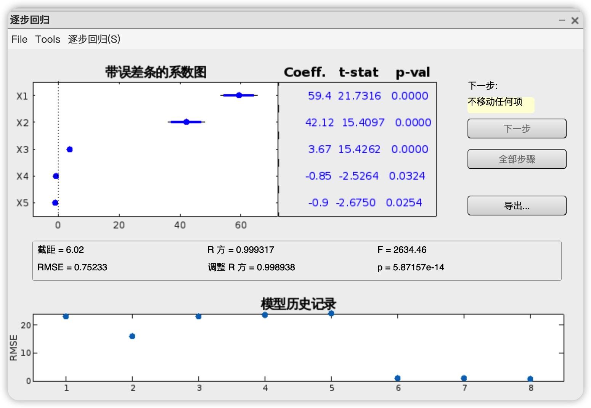
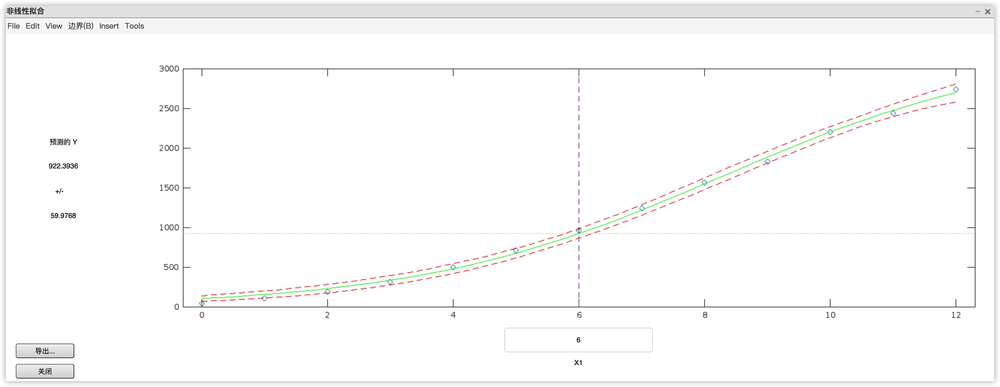

# 数学实验 Exp13

赵晨阳 计 06 2020012363

## 13.7

### 问题分析、模型假设与模型建立

使用线性回归模型进行建模，可以表示为 $y=\beta_0+\sum_{i=1}^{5}\beta_ix_i+\sum_{1\leq i \leq j \leq 5}\beta_{i,j}x_ix_j+\epsilon$。如果某个 $x_i$ 的信息没有被使用，相应的项将从原方程中删除。例如，假设我们只选择两个变量 $x_1$ 和 $x_3$ 进行建模，则模型可以表示为 $y=\beta_0+\beta_1x_1+\beta_3x_3+\beta_{1,1}x_1^2+\beta_{3,3}x_3^2+\beta_{1,3}x_1x_3$。

对于问题的不同部分，存在不同的限制。当只允许选择一个或两个变量时，可以尝试枚举所有可能的变量组合，并针对每种组合进行线性回归分析，以找到最合适的模型。当没有变量个数的限制时，可以采用交互式逐步分析方法。此外，对于最终选择的模型，我们可以通过检查残差和置信区间来识别异常值，并在剔除异常值后重新计算模型，以获得更准确的最终模型。

### 算法设计

对于第一问，我们将使用Matlab的for循环来枚举所有可能的方案，选择一个变量 $x_i$ 进行建模，并利用`regress`函数进行回归分析，从而比较不同方案的优劣。

对于第二问，我们将利用Matlab的`stepwise`函数进行逐步回归分析，并结合`rstool`函数来考虑交互项（即 $x_ix_j(i < j)$）和平方项 $x_i^2$ 的影响。

在回答第三问时，我们将直接使用Matlab的`stepwise`函数进行交互式逐步分析，以比较不同模型的优劣。

对于第四问，我们将使用Matlab的`rcplot`函数来排除异常点，并将其移除。然后，我们将重新计算模型，以得到更准确的最终模型。

### 代码

代码位于 `./codes/13_7.m` 下。

```matlab
format long
clear all

x = [44, 89.5, 6.82, 62, 178;
    40, 75.1, 6.04, 62, 185;
    44, 85.8, 5.19, 45, 156;
    42, 68.2, 4.90, 40, 166;
    38, 89.0, 5.53, 55, 178;
    47, 77.5, 6.98, 58, 176;
    40, 76.0, 7.17, 70, 176;
    43, 81.2, 6.51, 64, 162;
    44, 81.4, 7.85, 63, 174;
    38, 81.9, 5.18, 48, 170;
    44, 73.0, 6.08, 45, 168;
    45, 87.7, 8.42, 56, 186;
    45, 66.5, 6.67, 51, 176;
    47, 79.2, 6.36, 47, 162;
    54, 83.1, 6.20, 50, 166;
    49, 81.4, 5.37, 44, 180;
    51, 69.6, 6.57, 57, 168;
    51, 77.9, 6.00, 48, 162;
    48, 91.6, 6.15, 48, 162;
    47, 73.4, 6.05, 67, 168;
    57, 73.4, 7.58, 58, 174;
    54, 79.4, 6.70, 62, 156;
    52, 76.3, 5.78, 48, 164;
    50, 70.9, 5.35, 48, 146];

y = [44.6, 45.3, 54.3, 59.6, 49.9, 44.8, 45.7, 49.1, 39.4, 60.1, 50.5, 37.4, 44.8, 47.2, 51.9, 49.2, 40.9, 46.7, 46.8, 50.4, 39.4, 46.1, 45.4, 54.7];

% 第一问
disp('--------------第一问--------------')
for i = 1:5
    figure(1), subplot(2, 3, i), scatter(x(:, i), y), xlabel(sprintf('x_%d', i)), ylabel('y');
    [b, bint, r, rint, s] = regress(y', [ones(24, 1), x(:, i)]);
    disp(['变量 x_', num2str(i), ' 的线性回归结果：'])
    disp('系数 b：')
    disp(b)
    disp('系数的置信区间 bint：')
    disp(bint)
    disp('回归的标准误差 s：')
    disp(s)
end

% 第二问
disp('--------------第二问--------------')
stepwise(x, y');
[b, bint, r, rint, s] = regress(y', [ones(24, 1), x(:, 1), x(:, 3)]);
disp('逐步回归结果：')
disp('系数 b：')
disp(b)
disp('系数的置信区间 bint：')
disp(bint)
disp('回归的标准误差 s：')
disp(s)

% 第三问
disp('--------------第三问--------------')
[b, bint, r, rint, s] = regress(y', [ones(24, 1), x(:, 1), x(:, 3), x(:, 5)]);
disp('多变量回归结果：')
disp('系数 b：')
disp(b)
disp('系数的置信区间 bint：')
disp(bint)
disp('回归的标准误差 s：')
disp(s)

figure(2), rcoplot(r, rint);

% 第四问
disp('--------------第四问--------------')
new_x = [];
new_y = [];
index = 1;

for i = [1:9, 11:14, 16:24]
    new_x(index, :) = x(i, :);
    new_y(index) = y(i);
    index = index + 1;
end

[b, bint, r, rint, s] = regress(new_y', [ones(22, 1), new_x(:, 1), new_x(:, 3), new_x(:, 5)]);
disp('移除异常值后的回归结果：')
disp('系数 b：')
disp(b)
disp('系数的置信区间 bint：')
disp(bint)
disp('回归的标准误差 s：')
disp(s)

```

### 结果、分析与结论

**第一问**

每个单个 $x_i$ 与 $y$ 的散点图如下：



可以看到，仅有 $x_3$ 与 $y$ 有较为明显的负线性相关关系，其余的都没有看出特别强的线性相关。

具体的输出结果如下：

```markdown
--------------第一问--------------
变量 x_1 的线性回归结果：
系数 b：
  64.381169188445654
  -0.359917469050894

系数的置信区间 bint：
  42.391287792086231  86.371050584805076
  -0.830915990507775   0.111081052405987

回归的标准误差 s：
   0.102461670389581   2.511488004695245   0.127289588654244  31.248408903338756

变量 x_2 的线性回归结果：
系数 b：
  52.800837366796451
  -0.065124455692491

系数的置信区间 bint：
  23.626139362388592  81.975535371204302
  -0.434440136988714   0.304191225603733

回归的标准误差 s：
   0.006042299961207   0.133738688418401   0.718079531345796  34.605315025282415

变量 x_3 的线性回归结果：
系数 b：
  83.443781380492609
  -5.668212301959869

系数的置信区间 bint：
  74.164364778927705  92.723197982057513
  -7.125185182439936  -4.211239421479802

回归的标准误差 s：
   0.747404866939488  65.095898220373130   0.000000051257949   8.794271781456086

变量 x_4 的线性回归结果：
系数 b：
  67.109447300771222
  -0.359897172236504

系数的置信区间 bint：
  52.570619974795306  81.648274626747138
  -0.626190651214962  -0.093603693258046

回归的标准误差 s：
   0.263129097327409   7.855976019961154   0.010368204839109  25.654662888525355

变量 x_5 的线性回归结果：
系数 b：
  94.002395034256622
  -0.273923991333373

系数的置信区间 bint：
   1.0e+02 *

   0.541047168715665   1.339000731969467
  -0.005094645142887  -0.000383834683780

回归的标准误差 s：
   0.209114500169602   5.816921671617227   0.024660136426155  27.535217916708817
```

考虑做定量分析，对于每个 $y=\beta_0+\beta_ix_i$ 的线性回归模型，求出的 $R^2,F,p,s^2$ 结果如下：

| 自变量 |   $R^2$    |     $F$     |        $p$        |    $s^2$    |
| :----: | :--------: | :---------: | :---------------: | :---------: |
| $x_1$  | $0.102$    | $2.511$     |       $0.127$     | $31.248$    |
| $x_2$  | $0.006$    | $0.134$     |       $0.718$     | $34.605$    |
| $x_3$  | $0.747$    | $65.096$    | $5.126\times 10^{-8}$ | $8.794$     |
| $x_4$  | $0.263$    | $7.856$     |       $0.010$     | $25.655$    |
| $x_5$  | $0.209$    | $5.817$     |       $0.025$     | $27.535$    |

观察结果显示，$x_3$ 对应的 $R^2$ 和 $F$ 值明显高于其他变量，而 $s^2$ 明显低于其他变量。此外，$p=5.126\times 10^{-8}\ll 0.05=\alpha$。因此，我们可以确信在单变量情况下，仅使用 $x_3$ 构建的线性回归模型能够最好地反映 $y$ 的能力。这个定量分析结果与我们之前从图像上的定性分析一致。

进一步尝试加入平方项 $x_3^2$ 来考虑模型 $y=\beta_0+\beta_3x_3+\beta_{3,3}x_3^2$，然而通过观察得到的 $\beta_{3,3}$ 置信区间，我们发现其包含了 $0$，因此添加 $x_3^2$ 是没有必要的。因此，最终得到的最优模型是 $y=\beta_0+\beta_3x_3$，其中 $\beta_0$ 为 $83.444$，置信区间为 $[74.164, 92.723]$，$\beta_3$ 为 $-5.668$，置信区间为 $[-7.125, -4.211]$。

综上所述，我们可以得出结论，耗氧能力与 1500m 跑步用时之间存在一定的负线性相关关系。

**第二问**

在第一问的基础上，我们可以得出结论，由于 $x_3$ 对 $y$ 有显著影响，而其他变量对 $y$ 的影响不显著。因此，在只允许选择两个变量的情况下，我们仍然应该选择 $x_3$。使用 `stepwise` 函数从 $x_1$、$x_2$、$x_4$、$x_5$ 中再选择一个，得到的 $RMSE$ 结果如下：

| 新加入自变量 |  $x_1$  |  $x_2$  |  $x_4$  |  $x_5$  |
| :----------: | :-----: | :-----: | :-----: | :-----: |
|    $RMSE$    | $2.870$ | $3.033$ | $3.032$ | $2.989$ |

程序输出如下：

```markdown
逐步回归结果：
系数 b：
  90.852920358735545
  -0.186962843103062
  -5.467107833561182

系数的置信区间 bint：
   1.0e+02 *

   0.775587024936654   1.041471382238057
  -0.004337141486740   0.000597884624679
  -0.069059242899958  -0.040282913771266

回归的标准误差 s：
   0.774112202609644  35.983254612709104   0.000000164389507   8.238934712959841
```

利用交互式窗口可以看到，应该选择新加入的 $x_1$ 作为自变量。此时，回归界面的截图如下：



在基于前面的分析结果之上，我们使用了 `rstool` 进行交互项和平方项的检验。然而，我们发现在加入这些项时，最优的 $RMSE$ 结果仍然是不加入这些项的情况。因此，我们最终选择的模型是 $y=\beta_0+\beta_1x_1+\beta_3x_3$，其中 $\beta_0$ 为 $90.853$，置信区间为 $[77.559, 104.147]$，$\beta_1$ 为 $-0.187$，置信区间为 $[-0.434, 0.060]$，$\beta_3$ 为 $-5.467$，置信区间为 $[-6.906, -4.028]$。此时的 $R^2$ 为 $0.774$，$F$ 为 $35.983$，$p$ 为 $1.644\times 10^{-7}$，$s^2$ 为 $8.239$。

以上结果表明，加入交互项和平方项并没有改善模型的预测能力，而仅仅使用 $x_1$ 和 $x_3$ 可以更好地解释 $y$ 的变化。这进一步加强了我们之前的结论，即耗氧能力与年龄和1500m跑步用时之间存在负相关关系。需要注意的是，以上结果仅基于给定的数据集进行分析，如果我们希望得到更广泛适用的生物学结论，可能需要更多的数据和深入的研究。

**第三问**

在第一问和第二问的分析中，我们得出结论，在这个问题中，加入高次项并没有显著改善模型的表现。因此，我们可以简化线性回归模型为 $y=\beta_0+\sum_{i=1}^5\beta_ix_i$，其中如果某个 $x_i$ 的信息没有使用，就将对应的项从模型中删除。例如，如果我们只选择 $x_1$ 和 $x_3$ 作为自变量，则模型变为 $y=\beta_0+\beta_1x_1+\beta_3x_3$。

接下来，我们使用 `stepwise` 函数进行逐步回归分析。初始模型包括 $x_1$ 和 $x_3$，然后逐步加入其他变量。最终，当选择 $x_1$、$x_3$ 和 $x_5$ 作为自变量时，我们得到的模型具有最小的 $RMSE$ 值为 $2.667$，如下图所示：



程序输出结果如下：

```markdown
多变量回归结果：
系数 b：
   1.0e+02 *

   1.180134918314953
  -0.003254395762585
  -0.045693646357467
  -0.001560861891895

系数的置信区间 bint：
   1.0e+02 *

   0.881010330570742   1.479259506059163
  -0.005940333485373  -0.000568458039796
  -0.061841758460664  -0.029545534254270
  -0.003125506951407   0.000003783167617

回归的标准误差 s：
   0.814315093580259  29.236448967280658   0.000000164367957   7.111221282383447
```

经过逐步回归分析，最终得到的最优预选模型为 $y=\beta_0+\beta_1x_1+\beta_3x_3+\beta_5x_5$，其中 $\beta_0$ 为 $118.013$，置信区间为 $[88.101, 147.926]$，$\beta_1$ 为 $-0.325$，置信区间为 $[-0.594, -0.057]$，$\beta_3$ 为 $-4.569$，置信区间为 $[-6.184, -2.955]$，$\beta_5$ 为 $-0.156$，置信区间为 $[-0.313, +0.000]$。此时的 $R^2$ 为 $0.814$，$F$ 为 $29.236$，$p$ 为 $1.644\times 10^{-7}$，$s^2$ 为 $7.111$。

以上结果表明，在考虑了变量 $x_1$、$x_3$ 和 $x_5$ 的情况下，模型能够更好地解释因变量 $y$ 的变化。这意味着年龄、1500m跑步用时和跑步后心率对耗氧能力有显著影响。此外，$R^2$ 值较高，说明模型能够解释 $y$ 变量的大部分方差。

**第四问**

第四问考虑排除异常点，将模型的残差进行可视化，结果如下图所示：



通过观察残差图，我们发现第10号和第15号数据点明显异常。因此，我们将这两个数据点移除后重新计算模型。然而，即使剔除了这些异常点，我们仍然观察到模型产生了新的异常点。由于我们只移除了一次异常点，这可能是由于其他异常值的存在。最终得到的结果是 $y=\beta_0+\beta_1x_1+\beta_3x_3+\beta_5x_5$，其中 $\beta_0$ 为 $119.496$，置信区间为 $[94.683, 144.308]$，$\beta_1$ 为 $-0.362$，置信区间为 $[-0.599, -0.125]$，$\beta_3$ 为 $-4.041$，置信区间为 $[-5.362, -2.720]$，$\beta_5$ 为 $-0.177$，置信区间为 $[-0.303, -0.052]$。此时的 $R^2$ 为 $0.862$，$F$ 为 $37.627$，$p$ 为 $0.581\times 10^{-7}$，$s^2$ 为 $4.440$。

与剔除异常点之前的模型相比，我们可以观察到模型的相关系数显著提升，预测结果更加准确。

最终的结果显示，年龄、1500m跑步用时（可以视为速度的反比）、跑步后心率对耗氧能力有负面影响，这与我们的直观认识是相符的。例如，年龄的增加意味着新陈代谢能力的下降，从而导致耗氧能力的降低。这些结果可以直接应用于对该小群体的科学研究。然而，如果我们想得出更普遍适用的生物学结论，题目提供的数据是远远不够的。我们需要收集更多的数据，并进行更精细的建模分析。

总之，通过线性回归模型的建立和分析，我们获得了关于耗氧能力的有价值的信息。这些结果对于进一步的研究和探索具有重要意义。然而，我们也要注意数据的局限性，并意识到在得出普适生物学结论之前，需要进行更广泛的数据收集和深入的研究。

## 13.9

### 问题分析、模型假设与模型建立

在进行线性回归建模时，我们考虑了两种情况，根据题目给出的记号进行分析。

情况一：将搅拌程度 $x_1$ 视为普通变量。我们建立了回归模型 $y=\beta_0+\beta_1x_1+\beta_2x_2+\beta_3x_1x_2+\epsilon$。在算法设计过程中，我们需要考虑是否需要加入交互项 $\beta_3x_1x_2$。

情况二：将搅拌程度 $x_1$ 视为三个水平的无定量关系变量。为此，我们引入了两个新的虚拟变量 $z_0$ 和 $z_1$。具体地，当 $x_1=1$ 时，$z_0=z_1=0$；当 $x_1=2$ 时，$z_0=0$ 且 $z_1=1$；当 $x_1=3$ 时，$z_0=1$ 且 $z_1=0$。在这种情况下，我们建立了回归模型 $y=\beta_0+\beta_1z_0+\beta_2z_1+\beta_3x_2+\beta_4z_0x_2+\beta_5z_1x_2+\epsilon$。同样地，我们需要考虑是否需要加入交互项 $\beta_4z_0x_2$ 和 $\beta_5z_1x_2$。此外，如果某些变量不需要使用，我们可以直接删除相应的项。

对于这两个模型，算法设计的过程可能较为复杂。下面我们将详细讨论算法设计的细节。

### 算法设计

在设计不需要加入交互项的算法时，我们可以使用MATLAB中的`regress`函数进行线性回归分析，并利用`rcoplot`函数进行残差分析。对于第二个线性回归模型，我们可以先使用`stepwise`函数进行交互式逐步回归分析，确定哪些自变量应被采用，然后进行回归分析。当需要引入交互项时，我们可以直接将相应的项添加到模型中进行计算。

下面是算法的基本步骤：

1. 对于情况一（将搅拌程度$x_1$视为普通变量）：
   - 使用`regress`函数进行线性回归分析，构建回归模型。
   - 使用`rcoplot`函数进行残差分析，观察模型的拟合情况和异常值。

2. 对于情况二（将搅拌程度$x_1$视为三个水平的无定量关系变量）：
   - 使用`stepwise`函数进行逐步回归分析，确定哪些自变量应被采用。
   - 根据确定的自变量，使用`regress`函数构建回归模型。
   - 使用`rcoplot`函数进行残差分析，观察模型的拟合情况和异常值。

对于需要引入交互项的情况，我们只需在构建回归模型时，将交互项加入即可。

在算法设计的过程中，还需要考虑一些其他因素，如异常值的处理、变量选择的依据等。这些因素可能需要根据具体问题进行进一步的调整和优化。

### 代码

代码位于 `./codes/13_9.m` 下：

```matlab
format long
clear all

% 情况一：搅拌程度 x1 视为普通变量
x1 = [1, 1, 1, 1, 1, 2, 2, 2, 2, 2, 3, 3, 3, 3, 3];
x2 = [6, 7, 8, 9, 10, 6, 7, 8, 9, 10, 6, 7, 8, 9, 10];
y = [28.1, 32.3, 34.8, 38.2, 43.5, 65.3, 67.7, 69.4, 72.2, 76.9, 82.2, 85.3, 88.1, 90.7, 93.6];

% 使用 regress 函数进行线性回归分析，构建回归模型
[b, bint, r, rint, s] = regress(y', [ones(15,1), x1', x2']);
b
bint
s

% 使用 rcoplot 函数进行残差分析，观察模型的拟合情况和异常值
figure(1), rcoplot(r, rint);

% 情况二：搅拌程度 x1 视为三个水平的无定量关系变量
z = [0, 0; 0, 0; 0, 0; 0, 0; 0, 0; 0, 1; 0, 1; 0, 1; 0, 1; 0, 1; 1, 0; 1, 0; 1, 0; 1, 0; 1, 0];

% 使用 stepwise 函数进行逐步回归分析，确定哪些因变量应被采用
stepwise([z, x2'], y);

% 根据确定的因变量，使用 regress 函数构建回归模型
[b, bint, r, rint, s] = regress(y', [ones(15,1), z, x2']);
b
bint
s

% 使用 rcoplot 函数进行残差分析，观察模型的拟合情况和异常值
figure(2), rcoplot(r, rint);

% 引入交互项的情况
rstool([x1', x2'], y, 'interaction');

% 使用 stepwise 函数进行逐步回归分析，确定哪些因变量应被采用
stepwise([z, x2', (z(:, 1) .* x2'), (z(:, 2) .* x2')], y);

% 根据确定的因变量，使用 regress 函数构建回归模型
[b, bint, r, rint, s] = regress(y', [ones(15,1), z, x2', (z(:, 1) .* x2'), (z(:, 2) .* x2')]);
b
bint
s

```

### 结果、分析

**第一问**

```matlab
format long
clear all
x1 = [1, 1, 1, 1, 1, 2, 2, 2, 2, 2, 3, 3, 3, 3, 3];
x2 = [6, 7, 8, 9, 10, 6, 7, 8, 9, 10, 6, 7, 8, 9, 10];
y = [28.1, 32.3, 34.8, 38.2, 43.5, 65.3, 67.7, 69.4, 72.2, 76.9, 82.2, 85.3, 88.1, 90.7, 93.6];

[b, bint, r, rint, s] = regress(y', [ones(15,1), x1', x2']);
b
bint
s
figure(1), rcoplot(r, rint);
```

根据上述代码，我们得到了模型 $y=\beta_0+\beta_1x_1+\beta_2x_2$ 的回归分析结果。其中，$\beta_0$ 为 $-12.74$，置信区间为 $[-29.027,3.547]$；$\beta_1$ 为 $26.30$，置信区间为 $[23.106,29.494]$；$\beta_2$ 为 $3.087$，置信区间为 $[1.243,4.931]$。$R^2=0.965$，$F=167.575$，$p=1.706\times 10^{-9}$，$s^2=0.215$。

我们还使用 `rcoplot` 函数对模型的残差进行了可视化分析，结果如下图所示：



根据观察结果，我们可以注意到对于 $x_1=2$ 的样本，其残差与 $x_1\in\{1,3\}$ 的样本存在明显的差异。这表明在当前的线性回归模型中，将 $x_1$ 视为一个连续变量可能存在问题，因此需要考虑将其视为没有定量关系的三个水平。

这个例子提醒我们，即使线性回归模型在 $R^2$、$F$、$p$、$s^2$ 等方面表现良好，仍然需要回归到原始数据中进行仔细的分析，以确保模型的合理性。在建模过程中，我们应该保持对数据的敏感性，并且不仅仅依赖于统计指标来评估模型的准确性和适用性。

**第二问**

通过逐步回归分析，我们确定了将 $z_0$、$z_1$ 和 $x_2$ 作为因变量时，线性回归模型的 $RMSE$ 达到了最小值为 $0.963453$，如下图所示：



得到的结果是 $y=\beta_0+\beta_1z_0+\beta_2z_1+\beta_3x_2$，其中 $\beta_0$ 的估计值为 $10.686667$，置信区间为 $[7.447478, 13.925855]$；$\beta_1$ 的估计值为 $52.6$，置信区间为 $[51.258849, 53.941151]$；$\beta_2$ 的估计值为 $34.92$，置信区间为 $[33.578849, 36.261151]$；$\beta_3$ 的估计值为 $3.086667$，置信区间为 $[2.699510, 3.473824]$。此外，模型的 $R^2$ 为 $0.998631$，$F$ 值为 $2675.452903$，$p$ 值为 $0$，$s^2$ 为 $0.928242$。与之前的模型相比，这些数据明显有所改善。

另外，我们进行了残差分析，如下图所示：



经过观察发现存在一个异常点，我们可以考虑将其剔除后重新计算线性回归模型，以获得更准确的结果。

此外，我们还可以尝试使用第三问提到的方法，加入交互项，以进一步改进模型的性能。通过考虑更多因素之间的相互作用对因变量的影响，我们可以获得更准确和可靠的预测结果。

综上所述，通过剔除异常点和引入交互项的方法，我们可以进一步优化线性回归模型，以获得更准确和可靠的预测结果。这些步骤是在建立模型时必要的，以确保我们得到的模型具有较高的预测能力和解释力。

**第三问**

对于第一问的模型，在引入交互项后，如果发现 $RMSE$ 增大，说明交互项并没有对模型的性能产生改进作用，因此不需要引入交互项。

在第二问的模型下，通过逐步回归分析，我们发现引入交互项 $z_0x_2$ 和 $z_1x_2$ 后，$RMSE$ 达到了最小值为 $0.75233$，如下图所示：



得到的模型为 $y=\beta_0+\beta_1z_0+\beta_2z_1+\beta_3x_2+\beta_4z_0x_2+\beta_5z_1x_2$，其中 $\beta_0=6.02$，$\beta_1=59.4$，$\beta_2=42.12$，$\beta_3=3.67$，$\beta_4=-0.85$，$\beta_5=-0.9$。模型的 $R^2=0.999317$，$F=2634.460542$，$p=0$，$s^2=0.566$。根据残差分析的结果，即使不进行异常点剔除处理，该模型仍然是一个优秀的模型。

这道题给了我一个重要的启示，即在验证线性回归模型的可靠性时，不能仅仅依赖于定量的数据指标（如 $R^2$、$F$、$p$、$s^2$），还需要进行残差分析等偏定性的分析，并结合实际背景和意义进行综合验证。只有在综合考虑多个因素的情况下，才能更全面地评估模型的质量和适用性，从而得出准确可靠的结论。

## 13.13

### 问题分析、模型假设与模型建立

**Logistic模型**

Logistic模型可以表示为 $y_t=\frac{L}{1+ae^{-kt}}$。当 $L$ 不固定时，这个模型并不是可线性化的。然而，当 $L$ 固定时，我们可以进行一些变换，将其转化为线性模型。

通过变换 $\frac{L}{y_t}-1=ae^{-kt}$，我们可以取对数得到 $\ln(\frac{L}{y_t}-1)=-kt+\ln a$。将 $\ln(\frac{L}{y_t}-1)$ 视为一个新的因变量，并记作 $z=\ln(\frac{L}{y_t}-1)$，我们可以将其表示为线性模型 $z=\beta_0+\beta_1t$。在这个线性模型中，我们有 $\beta_0=\ln a$ 和 $\beta_1=-k$。因此，通过线性回归分析，我们可以得到模型参数 $a$ 和 $k$ 的估计值，并最终得到 Logistic 模型的结果。

**Gompertz模型**

Gompertz模型可以表示为 $y_t=Le^{-be^{-kt}}$。当 $L$ 不固定时，这个模型也不是可线性化的。然而，当 $L$ 固定时，我们可以进行一些变换，将其转化为线性模型。

通过变换 $\ln(\frac{y_t}{L})=-be^{-kt}$，我们可以再次取对数得到 $\ln(\ln(\frac{y_t}{L}))=\ln(-b)-kt$。将 $\ln(\ln(\frac{y_t}{L}))$ 视为一个新的因变量，并记作 $z=\ln(\ln(\frac{y_t}{L}))$，我们可以将其表示为线性模型 $z=\beta_0+\beta_1t$。在这个线性模型中，我们有 $\beta_0=\ln(-b)$ 和 $\beta_1=-k$。因此，通过线性回归分析，我们可以得到模型参数 $b$ 和 $k$ 的估计值，并最终得到 Gompertz 模型的结果。

**线性回归与非线性回归**

在将模型转换为线性模型之后，我们可以直接应用线性回归方法来估计参数 $a$、$b$、$k$ 的值。通过线性回归分析，我们可以得到这些参数的估计值作为初值，然后进行非线性回归分析，以获得更准确的模型结果。这种方法充分利用了线性回归和非线性回归的优势，将非线性模型转化为线性模型进行参数估计，然后进一步进行非线性优化，提高了模型的准确性和可靠性。

### 算法设计

将模型转化为线性模型后，可以利用MATLAB提供的`regress`函数进行线性回归分析。该函数可以用于估计线性模型的参数，并计算相关的统计量。

在给定初值的情况下，可以使用MATLAB提供的`nlinfit`函数或`nlintool`工具箱进行非线性回归分析。这些工具可以帮助拟合非线性模型，并估计模型参数的值。`nlinfit`函数可以通过最小二乘法拟合非线性模型，并返回参数估计值以及其他相关统计量。`nlintool`工具箱提供了一个交互式界面，可用于调整模型的初值、选择拟合算法等，以获得更准确的非线性回归结果。

通过结合线性回归和非线性回归分析，我们可以充分利用这两种方法的优势，将非线性模型转化为线性模型进行参数估计，然后使用非线性回归分析来优化模型，提高模型的准确性和可靠性。MATLAB提供的函数和工具为这一过程提供了方便且有效的实现方式。

### 代码

代码位于 `./codes/13_13.m` 下：

```matlab
format long
clear all
t = 0 : 12;
y = [43.65, 109.86, 187.21, 312.67, 496.58, 707.65, 960.25, 1238.75, 1560.00, 1824.29, 2199.00, 2438.89, 2737.71];

% Logistic模型拟合
[b, bint, r, rint, s] = regress(log(3000 ./ y - 1)', [ones(13,1), t']);
b
s
a = exp(b(1)) % 参数a的估计值
k = -b(2) % 参数k的估计值

nlintool(t, y, @Logistic, [3000, a, k]);
[beta, R, J, CovB, MSE, ErrorModelInfo] = nlinfit(t, y, @Logistic, [3000, a, k]);
beta % 参数估计值
sqrt(MSE) % 均方根误差

% Gompertz模型拟合
nlintool(t, y, @Gompertz, [3000, a, k]);
[beta, R, J, CovB, MSE, ErrorModelInfo] = nlinfit(t, y, @Gompertz, [3000, 30, 0.4]);
beta % 参数估计值
sqrt(MSE) % 均方根误差

function y = Logistic(b, t)
    y = b(1) ./ (1 + b(2) * exp(-b(3) .* t));
end

function y = Gompertz(b, t)
    y = b(1) .* exp(-b(2) .* exp(-b(3) .* t));
end
```

上述代码通过使用MATLAB的`regress`函数和`nlinfit`函数实现了Logistic模型和Gompertz模型的拟合。

通过上述分析，我们可以得到Logistic模型和Gompertz模型的参数估计值和模型的拟合效果。这些结果可以用于进一步分析和应用。

### 结果、分析与结论

**第一问**

根据第一问的分析，通过线性回归拟合得到的模型为 $y=\beta_0+\beta_1t$，其中 $\beta_0=3.803242$，$\beta_1=-0.494123$。该模型的拟合效果良好，$R^2=0.990532$，$F=1150.754517$，$p=0$，$s^2=0.038615$。模型转换得到的参数估计值为 $a=44.846335$，$k=0.494123$。

这说明将Logistic模型线性化后的线性回归模型能很好地拟合数据，$R^2$ 接近于1，拟合优度高。模型的参数估计值具有解释性和实际意义。因此，可以用线性回归模型进行进一步的分析和预测。

**第二问**

根据第一问得到的初始值 $a=44.846335$ 和 $k=0.494123$，以及已知的 $L=3000$，我们使用Logistic模型进行非线性回归。通过迭代，得到的最优参数估计值为 $L=3260.418501$，$a=30.53511$，$k=0.414798$。该模型的 $RMSE=42.013437$，预测误差相对较小。



这表明通过非线性回归得到的Logistic模型能很好地拟合数据，参数估计值能更准确地描述数据特征。与线性化模型相比，非线性回归模型更能适应数据变化趋势，预测精度更高。

综上所述，通过线性回归和非线性回归分析，得到了适用于Logistic模型的最优参数估计值，并评估了模型的拟合优度和预测精度。这些结果对于进一步的数据分析和预测任务具有重要意义。

**第三问**

根据给定的初值 $a=44.846335$、$k=0.494123$，以及已知的 $L=3000$，我们使用Gompertz模型进行非线性回归。通过迭代，得到的最优参数估计值为 $L=4810.12685$，$b=4.591978$，$k=0.174723$。该模型的 $RMSE=17.553853$，预测误差相对较小。


与Logistic模型相比，Gompertz模型的拟合效果更好，预测精度更高。从图像上观察，可以明显看出Gompertz模型更准确地描述了数据特征，与实际观测值更接近。

综上所述，通过使用Gompertz模型进行非线性回归，得到了更优的参数估计值，并验证了模型的拟合优度和预测精度。这些结果为进一步的数据分析和预测提供了可靠的依据。

通过进一步研究和资料查阅，了解到在经济学领域，Logistic模型和Gompertz模型都是常用的经典模型。然而，在本题的具体条件下，Gompertz模型表现更好，并不能一概而论地认为它在任何情况下都优于Logistic模型。实际上，在不同的场景和数据集中，不同的模型可能展现出不同的优势和适用性。

此外，通过对比第一问和第二问的结果，观察到在线性化模型中，如果我们给定的参数$L$和最终非线性回归得到的参数$L$较为接近，那么参数$a$和$k$的数值也会相对接近。尽管在表面上看，参数$a$的差距可能较大，但需要注意的是，它在分母上的位置，因此这种差距并不一定代表实质上的显著差异。

因此，在实际应用中，需要根据具体的场景和数据集选择合适的模型，并进行详细的分析和讨论。不同的模型有不同的假设和适用范围，需要综合考虑各种因素来做出准确的决策和预测。

总结起来，本题中Gompertz模型在给定条件下表现较好，但需要注意在不同情况下选择合适的模型，并对模型结果进行综合分析和解释，以获得准确可靠的结论。