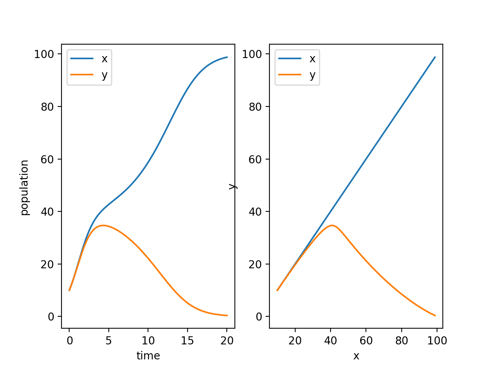

# 数学实验 Exp 04

赵晨阳 计 06 2020012363

## 实验目的

- 掌握求微分方程数值解的方法，并对结果作初步分析； 
- 通过实例学习用微分方程模型解决简化的实际问题。

## 4.5

首先用国际单位制表示题目中的数据。重力与浮力的数值差为 $F=(527.436-470.327)\text{ lbf}=57.109\text{ lbf}=253.86549552\text{ N}$。比例系数是 $c=0.08\text{ lbf } \text{ s/ft}=0.08\text{ lbf } \text{s/}(0.3048\text{ m})\approx 1.16674  \text{ N s/m}$。本题中我取重力常数 $g=9.8\text{m/s}^2$，圆筒的质量约为 $m=239.245\text{kg}$。

### 问题分析、模型假设与模型建立

假定在水中，圆筒仅受到三个力：重力、浮力和海水阻力，而且圆筒在水平面上时为静止状态，那么圆筒在水中的运动可以视为竖直方向上的直线运动；因为是直线运动可以直接用速率表示速度，记向下为正方向（即向上为负方向），再记 $t$ 时刻（在水平面上时记为 $0$ 时刻）的速率为 $v(t)$，那么 $t(t \geq0)$ 时刻的加速度 $a(t)=v'(t)$。下面记海平面的横坐标为 $x=0$，和速度一样向下为正方向。

在宏观低速的情况下，相对论效应影响轻微，可以用**牛顿第二定律**建模。根据问题的实际背景， $a(t)\geq 0$ 应该恒成立，所以海水阻力始终是向上（即数值为负数），对于任意时刻都满足：
$$
ma(t)=mv'(t)=F-cv(t) \Leftrightarrow \frac{dv}{dt}=\frac{F-cv}{m}
$$
由于题目关心的是在特定距离时的速度，所以考虑把左式变成 $\dfrac{dv}{dx}$，得：
$$
\frac{dv}{dx}v=\frac{F}{m}-\frac{c}{m}v
$$
这是一个典型的常微分方程，根据实际意义有初值条件 $x=0$ 时 $v=0$。问题转化为求当 $x=300\text{ft}=91.44\text{m}$ 时的 $v$。

### 算法设计

下面记常数 $\alpha=\frac{F}{m}$，$\beta=\frac{c}{m}$，则模型中的微分方程写为：
$$
\frac{dv}{dx}v=\alpha -\beta v
$$
**数值解**

该微分方程进一步转化为 $\dfrac{dv}{dx}=\dfrac{\alpha}{v}-\beta$，此时无法直接带入初值条件 $x=0$ 时 $v=0$。考虑 $\dfrac{dv}{dx}v=\dfrac{d(\dfrac{v^2}{2})}{dx}$，于是令 $V=\dfrac{v^2}{2}$，那么有 $\dfrac{dV}{dx}=\dfrac{dv}{dx}v$，同时由于在模型中 $v\geq 0$ 恒成立故有 $v=\sqrt{2V}$，因此原微分方程可转化为 $\dfrac{dV}{dx}=\alpha-\beta \sqrt{2V}$，当 $x=0$ 时 $V=0$ 故 $\dfrac{dV}{dx}|_{x=0}=\alpha$。有了初值条件和 $\dfrac{dV}{dx}$ 的显式表达式，可以直接用求该方程的数值解（容易观察该微分方程不是刚性方程），得到 $x=91.44$ 时的 $V$ 进而得到 $v$。

**解析解**

手动求解，可以得到关于 $x$ 和 $v$ 的方程：
$$
\alpha x+\frac{\alpha}{\beta}v+\frac{\alpha^2}{\beta^2}\ln(1-\frac{\beta}{\alpha}v)=0
$$
代入 $x=91.44$ 之后，只余下有 $v$ 一个变量，求解该方程，同时再手动舍去不符合实际意义的解即可。

### 代码

位于 `./code/4_5.py` 下：

```python
from scipy.integrate import odeint
from sympy import symbols, Function, dsolve, solve, log
import numpy as np

F = 253.86549552
c = 1.16674
m = 239.245
alpha = F / m
beta = c / m

xspan = np.linspace(0, 91.44, 100)
V0 = 0

def dV_dx(V, x):
    return alpha - beta * np.sqrt(2.0 * V)

V = odeint(dV_dx, V0, xspan)
Answer1 = np.sqrt(2.0 * V[-1])[0]
print(Answer1)

x = symbols('x')
v = Function('v')(x)
eqn = v.diff(x) * v - alpha + beta * v
cond = {v.subs(x, 0): 0}
vSol = dsolve(eqn, ics=cond)
Answer2 = float(vSol.rhs.subs(x, 91.44))
print(Answer2)

v = symbols('v')
eqn = alpha * 91.44 + alpha / beta * v + (alpha**2.0) / (beta**2.0) * log(1 - beta / alpha * v)
Answer3 = float(solve(eqn, v)[0])
print(Answer3)
```

由于解析解的计算利用 Python 较为缓慢，计算量较大，故而下方程序给出对应的 Matlab 代码，位于 `./code/4_5.m` 下：

```matlab
format long
F = 253.86549552;
c = 1.16674;
m = 239.245;
alpha = F / m;
beta = c / m;

xspan = [0 91.44];
[x, V] = ode45(@(x, V) alpha - beta * sqrt(2.0 * V), xspan, 0);
Answer1 = sqrt(2.0 * V(end))

syms v(x);
eqn = diff(v, x) * v == alpha - beta * v;
cond = v(0) == 0;
vSol(x) = dsolve(eqn, cond);
Answer2 = double(vSol(91.44))

syms v;
eqn = alpha * 91.44 + alpha / beta * v + (alpha^2.0) / (beta^2.0) * log(1 - beta / alpha * v) == 0;
Answer3 = double(solve(eqn, v))
```

### 结果、分析与结论

`Answer1`求得的结果为`13.634709965823346`，`Answer2`求得的结果为`13.634710040497453`，`Answer3`求得的结果为`13.634710040497746`，这三者都可四舍五入保留五位小数得到同样的结果`13.63471`，因此该结果可以被视为一个相对可靠的答案。而为了让桶不破裂的速度上限 $40\text{ ft/s}=12.192\text{ m/s}$，无论如何都小于最终的速度，因此桶会破裂。

可以看到，在本例中数值方法求解常微分方程的结果是可靠的。事实上在本例中，求解析解的时候也不可避免地使用一些数值方法。

## 4.6

### 问题分析、模型假设与模型建立

把 $A$ 的正右方向视为 $x$ 轴的正方向（也即水流方 向），正对着 $B$ 点的方向视为 $y$ 轴的正方向，可以建立一个原点为起点 $A$ 、终点为 $(0,d)$ 的平面直角坐标系。当小船在 $(x,y)$ 点时（根据问题背景，必有 $x\geq 0$ 且 $y\geq 0$）， 它的速度由自身船速，指向 $(0,d)$，速率为 $v_2$和水流速度，指向 $x$ 轴正方向，速率为 $v1$ 构成。把其做平行于 $x$ 轴和 $y$ 轴的正交分解，记以 $(x,y)$ 与 $(0,d)$ 为两端点的线段相对于 $x$ 轴的夹角为 $\theta$，满足 $\tan \theta =\dfrac{d-y}{x}$，可以得到方程组：
$$
\begin{cases} \dfrac{dx}{dt}=v_1-v_2\cos\theta \\ \dfrac{dy}{dt}=v_2 \sin \theta \end{cases}
$$


把里面涉及到 $\theta$ 的表达式消去，再考虑上 $v_1$ 和 $v_2$ 的关系，可以得到常微分方程组：
$$
\begin{cases}\dfrac{dx}{dt}=v_1-v_2\dfrac{x}{\sqrt{x^2+(d-y)^2}} \\ \dfrac{dy}{dt}=v_2 \dfrac{d-y}{\sqrt{x^2+(d-y)^2}} \\ v_1=kv_2(k\geq 0)\end{cases}
$$
其初值条件为 $t=0$ 时 $x=0$ 且 $y=0$。

### 算法设计

**解析解**

求解小船轨迹的解析表达，即 $x$ 和 $y$ 的关系式。

首先由方程组的前两个方程相除可以得到：
$$
\dfrac{dx}{dy}=\frac{v_1\sqrt{x^2+(d-y)^2}-v_2x}{v_2(d-y)}
$$
令 $p=\dfrac{x}{d-y}$，有：
$$
(d-y)\dfrac{dp}{dy}=k\sqrt{1+p^2}
$$
同时初值条件为 $p=0$（当 $x=0$ 时） 时 $y=0$，用分离变量法可以得到：
$$
k\ln(\frac{d}{d-y})=\ln(\sqrt{1+p^2}+p)\\(\frac{d}{d-y})^k=\sqrt{1+p^2}+p
$$
 进一步化简得到：
$$
x=\frac{d-y}{2}(d^k(d-y)^{-k}-d^{-k}(d-y)^k)(0\leq y <d,k>=0)
$$

事实上通过这个解可以得到，当 $k>1$ 时（即水速大于船速时），$\lim_{y\rightarrow d^-}x=+\infin$，说明小船永远无法到达 $B$ 点；当 $k=1$ 时（即水速等于船速时），$\lim_{y\rightarrow d^-}x=\frac{d}{2}$，同样无法达到 $B$ 点；当 $0\leq k<1$ 时，$\lim_{y\rightarrow d^-}x=0$，说明小船可以到达 $B$ 点。这个简单分析的结果和实际情况是完全符合的。

**数值解**

对于模型中的常微分方程组，可以直接用 Python 求数值解。这里涉及到 $t$ 的求解范围上界（事先不知道），可以先手动估算、再实验验证一个上界进行微分方程的数值求解，我设定 $t$ 上界 $120$，然后在求解得到的函数里对 $x,y$ 进行归约，并且找到第一个 $y(t)=d$ 的点。

### 代码

代码位于 `codes/4_6.py`中，其中 $d$、$v_1$、$v_2$ 的具体数值可以手动调整。

```python
import numpy as np
from scipy.integrate import odeint
import matplotlib.pyplot as plt

d = 100
v1 = 2.0
v2 = 2.0
k = v1 / v2


def calc(pos, t):
    len = np.sqrt(pos[0] ** 2.0 + (d - pos[1]) ** 2.0)
    dpos_dt = [v1 - v2 * pos[0] / len, v2 * (d - pos[1]) / len]
    return dpos_dt


t = np.linspace(0, 120, 1000)
pos0 = [0, 0]
pos = odeint(calc, pos0, t)
pos[:, 0] = np.maximum(pos[:, 0], 0.0)
pos[:, 1] = np.minimum(pos[:, 1], d)

index = None

for i in range(len(t)):
    if d - pos[i, 1] < 1e-6:
        index = i
        print(i)
        print(t[i])
        break

if index is not None:
    pos[index:1000, 1] = d

x = pos[:, 0]
y = pos[:, 1]
plt.subplot(1, 2, 1)
plt.plot(t, x, t, y)
plt.legend(["x", "y"])

analytic_x = (d - y) / 2.0 * (d ** k * (d - y) ** (-k) - d ** (-k) * (d - y) ** k)
plt.subplot(1, 2, 2)
plt.plot(x, y, analytic_x, y, "r--", linewidth=2)
plt.xlabel("x")
plt.ylabel("y")
plt.legend(["numerical solution", "analytic solution"])
plt.show()
```

此代码将解析方法和数值方法分别求得的航行曲线放在了同一张图上，把任意时刻小船的位置用图像表示（横轴为时间，纵轴为距离）、两条曲线分别表示横坐标和纵坐标的变化。

最后，这里有个问题，当解已经到达极限后，也即小船到达对岸后，基于 `scipy` 的解会塌缩（$x$ 和 $y$ 都到达对岸后恒等于 0 ），故而需要通过 `pos[index:1000, 1] = d` 对其进行修复。

另外，如果考虑直接对 $\dfrac{dx}{dy}=\frac{v_1\sqrt{x^2+(d-y)^2}-v_2x}{v_2(d-y)}$ 求解也可，这一思路无需考虑基于 `scipy` 的解塌缩问题。相应代码位于 `4_6_func2.py`。

```python
import numpy as np
from scipy.integrate import odeint
import matplotlib.pyplot as plt

d = 100
v1 = 1.0
v2 = 2.0
k = v1 / v2

def dx_dy(pos, y):
    x, y = pos
    dx_dy = [(v1 * np.sqrt(x ** 2 + (d - y) ** 2) - v2 * x) / (v2 * (d - y)), 1]
    return dx_dy

y = np.linspace(0, 100, 1000)
pos_init = [0, 0]
pos_new = odeint(dx_dy, pos_init, y)
x_pos = pos_new[:, 0]

analytic_x = (d - y) / 2.0 * (d ** k * (d - y) ** (-k) - d ** (-k) * (d - y) ** k)
plt.plot(x_pos, y, analytic_x, y, "r--", linewidth=2)
plt.xlabel("x")
plt.ylabel("y")
plt.legend(["numerical solution", "analytic solution"])
plt.show()
```

### 结果、分析与结论

**第二问**

此时 $d=100,v_1=1,v_2=2$，数值解求得的渡河时间为 $66.44s$。

下图左边是任意时刻小船的位置，右图是用解析方法和数值方法分别求得的航行曲线：


可以发现，解析解和数值解的重合程度极高。

**第三问**

1. 当 $v_1=0$ 时，数值解求得的渡河时间为 $50s$，结果如下图：


由于这是在静水中的情形，船一直垂直向上运动，所以容易验证结果和图像都非常准确。

2. 当 $v_1=0.5$ 时，数值解求得的渡河时间为 $53.33s$，结果如下图：


3. 当 $v_1=1.5$ 时，数值解求得的渡河时间为 $103.99s$，结果如下图：


4. 当 $v_1=2.0$ 时，其永远无法到达 $B$ 点，结果如下图：


可以看到，数值方法计算出的轨迹里，每当小船越靠近岸边，它在水平方向的速度就会越慢，因为几乎所有的自身速度将用于平衡水流速度。同时，最终到达对岸时的横坐标（严格来说，无法到达对岸，求得的 $x$ 是一个极限）约为 $50$，也即 $\dfrac{d}{2}$，这与通过解析方法求出的理论值完全一致。

**结论**

使用 Runge-Kutta 方法可以对该小船过河的经典模型求得一个很精确的数值解，该解的计算结果与解析解达到了很高的重合度。当然，需要额外注意到 scipy 解决微分方程可能会塌缩的现象，对其要进行额外处理。

## 4.9

### 问题分析、模型假设与模型建立

题目已经建立好了两种群相互竞争的模型：
$$
\begin{cases}\frac{dx}{dt}=r_1x(1-\frac{x}{n_1}-s_1\frac{y}{n_2}) \\ \frac{dy}{dt}=r_2y(1-s_2\frac{x}{n_1}-\frac{y}{n_2})\end{cases}
$$

### 算法设计

题目已经指出模型中的微分方程组无解析解，所以只能通过数值方法求解。同时题目给定了初值条件，即 $t=0$ 时的 $x(0)=x_0$ 和 $y(0)=y_0$。我直接使用 scipy 实现的 Runge-Kutta 方法。这里和上一题类似，事先不知道达到稳态的时间（为了确定数值求解的时间范围）。经过先手动估算与实验验证，最后采用的范围是 $[0,20]$。

### 代码

代码位于 `codes/4_9.py` 中，其中 $r_1$、$r_2$、$n_1$、$n_2$、$s_1$、$s_2$、$x_0$、$y_0$ 的具体数值可以手动调整。

```python
from scipy.integrate import odeint
import matplotlib.pyplot as plt
import numpy as np

r1 = 1.0
r2 = 1.0
n1 = 100.0
n2 = 100.0
s1 = 0.5
s2 = 2.0
x0 = 10.0
y0 = 10.0


def diff(xy, t):
    dxy_dt = [
        r1 * xy[0] * (1 - xy[0] / n1 - s1 * xy[1] / n2),
        r2 * xy[1] * (1 - s2 * xy[0] / n1 - xy[1] / n2),
    ]
    return dxy_dt


t = np.linspace(0, 20, 1000)
xy = odeint(diff, [x0, y0], t)
x = xy[:, 0]
y = xy[:, 1]

_, axs = plt.subplots(1, 2)
axs[0].plot(t, x, t, y)
axs[0].set_xlabel("time")
axs[0].set_ylabel("population")
axs[0].legend(["x", "y"])
axs[1].plot(x, x, x, y)
axs[1].set_xlabel("x")
axs[1].set_ylabel("y")
axs[1].legend(["x", "y"])
plt.show()
```

### 结果、分析与结论

**不同情形的结果**

1. $r_1=r_2=1$，$n_1=n_2=100$，$s_1=0.5$，$s_2=2$，初值 $x_0=y_0=10$，结果如下：


两者的 $r$、$n$ 和初值均相同，相当于说若没有竞争两物种情形一模一样。但是 $s_2>1$ 而 $s_1<1$，相当于甲的竞争优势大很多，所以乙物种最终走向了灭绝。观察左图，随着时间的变化，甲物种的数量一直稳定上升，达到稳态时数量达到了最大承载量 $100$；而乙达到稳态时数量为 $0$。观察右图，当甲数量增加到一定程度后，乙数量开始稳定下滑，说明乙在最后的竞争中处于劣势。最终，甲占据了所有资源并达到稳态，数量稳定。

2. 在 1. 的基础上，把 $r_2$ 改成 $5$，把 $n_2$ 改成 $200$，结果如下：


以看出，当初期竞争尚不激烈时，由于甲增长率比乙显著更低，乙快速繁殖，占据了一定优势。但是后期，甲仍然能超过乙，最终达到稳态时仍然是甲的数量达到最大承载量，而乙灭绝。也就是说，乙的自身优势只能维持初期的短期增长，下仍然无法在最终胜出。另外可以看到的是，由于前期甲的相对劣势，达到稳态所用的时间也比 1. 增加了。

3. 在 1. 的基础上，改成 $n_1=50$，结果如下：


首先，基本结论和 1. 中的情况一致，最终乙灭绝，而甲达到最大容量。其次，甲的最大承载量减少，乙能够抢夺的甲的资源也下降，所以乙的峰值相较于 1. 中的峰值也有降低。

4. 在 1. 的基础上，改成 $x_0=1$，结果如下：


情况与 2. 类似，即乙的快速繁殖优势导致乙初期快速增长，然而，最终还是甲的强大竞争力让乙直接灭绝。

5. 在 1. 的基础上，改成 $s_1=1.5$，$s_2=0.7$，结果如下：


这个情况是 1. 的对偶情况。两个物种的发展态势扭转，最终达到稳态时乙达到最大承载量，而甲灭绝。需要注意到，第二个子图看上去 y 是关于 x 的多值曲线。实际上，这是应为 x 先增后减，而第二个子图以 x 为参考系所致。

6. 在 1. 的基础上，改成 $s_1=0.8$、$s_2=0.7$，结果如下：


在这一情况下，彼此的竞争力没有显著优势。甲乙均未灭绝，实现了共存，且竞争力更强的乙在达到稳态时数量更多。

7. 在 1. 的基础上，改为 $s_1=1.5$、$s_2=1.7$，结果如下：


此时两个物种都具有很强的竞争性（$s$ 值均大于 $1$），竞争烈度较高。最终竞争性更强的甲获得胜利，在稳态下达到了最大承载量，而乙灭绝。

8. 在 7. 的基础上，改为 $s_2=1.6$，结果如下：



可以见得，在这一情况下，尽管甲的竞争力相对下降，然而由于过于激烈的物种竞争（$s$ 值均大于 $1$），最终乙仍旧灭绝，然而甲到达稳定花费时间更长。

9. 在 7. 的基础上，改为 $y_0=17$，结果如下：


此时乙最终获得了胜利，甲完全灭绝。注意到此时乙的初始优势更大，但是竞争性更弱；甲未能及时发挥其在竞争性上的优势，就因为在初始状态下的劣势而最终灭绝。

10. 在 9. 的基础上，改为 $s_2=1.9$，结果如下：


可以发现，当甲的竞争优势进一步扩大，抵消了乙的初始优势，最终反败为胜。

**分析和结论**

总结以上各个情形可以得出，在本题的相互竞争模型中，起到最关键决定结果的是 $s$，即每个物种竞争其它物种资源的能力。

1. 若 $s_1<1$ 且 $s_2<1$，则两者均没有极强的竞争力，稳态时二者可以共存，而竞争能力更强的物种会稍有优势。
2. 当 $s_1<1$ 且 $s_2>1$ 时（对称情况同理），甲相对乙具有压倒性优势，最终甲会消灭乙，即便在初始乙占优的情况下也是如此。
3. 当 $s_1>1$ 且 $s_2>1$ 时，竞争的结果并不不稳定，初始条件的改变会导致最终稳态时甲乙的生存情况反转。两个种群都有获胜的可能，这同时取决于 $s_2$ 和 $s_1$ 的相对大小以及其它因素。
