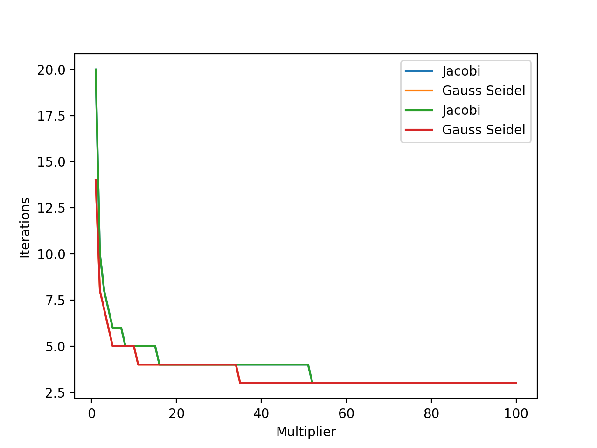

# 数学实验 Exp 05

赵晨阳 计 06 2020012363

## 实验目的

- 掌握将许多实际问题归结为线性（代数）方程组的方法
- 掌握大型方程组有效的数值解法

## 5.1

### 问题分析、模型假设与模型建立

针对所提供的方程（在没有任何扰动的情况下），很明显，其精确解为 $x=(1,1,\cdots,1)^T$。这里的 $x$ 为一个 $n\times 1$ 的列向量。针对这个问题，我们可以使用直接法来解决。通过利用 `np.linalg.solve()` 可以轻松地实现该方法。

### 算法设计

对于扰动问题，需要考虑 $A$ 的条件数。扰动 $A$ 时，如果 $\Vert A^{-1}\Vert \Vert \delta A\Vert < 1$，有：
$$
\dfrac{\Vert \delta x\Vert}{\Vert x\Vert}\leq\dfrac{cond(A)}{1-cond(A)\dfrac{\Vert \delta A\Vert}{\Vert A\Vert}}\dfrac{\Vert \delta A\Vert}{\Vert A\Vert}
$$
如果 $\Vert A^{-1}\Vert \Vert \delta A\Vert \ge 1$，则可以用 $cond(A)\dfrac{\Vert \delta A\Vert}{\Vert A\Vert}$ 估计 $\dfrac{\Vert \delta x\Vert}{\Vert x\Vert}$ 上界。当扰动 $b$ 时，有 $\dfrac{\Vert \delta x\Vert}{\Vert x\Vert}\leq cond(A)\dfrac{\Vert \delta b\Vert}{\Vert b\Vert}$ 。条件数的计算可以直接用 `np.linalg.cond` 接口，矩阵和向量范数的计算可以直接用``np.linalg.norm``接口。

### 代码

代码位于 `./codes/5_1.py` 下，通过 `python3 5_1.py > 5_1.txt` 可以运行整个程序，并且将完整的输出存储于 `5_1.txt` 中：

```python
import numpy as np

np.set_printoptions(precision=15)


def main(n):

    A_Vandermonde = np.zeros((n, n))
    A_Vandermonde[:, 0] = 1
    b_Vandermonde = np.zeros((n, 1))

    for i in range(n):
        for j in range(1, n):
            A_Vandermonde[i, j] = (1 + 0.1 * i) ** j

    for i in range(n):
        for j in range(n):
            b_Vandermonde[i, 0] += A_Vandermonde[i, j]

    A_Hilbert = np.array(
        [[1 / (i + j - 1) for j in range(1, n + 1)] for i in range(1, n + 1)]
    )
    b_Hilbert = np.zeros((n, 1))
    for i in range(n):
        for j in range(n):
            b_Hilbert[i, 0] += A_Hilbert[i, j]

    x_Vandermonde = np.linalg.solve(A_Vandermonde, b_Vandermonde)
    x_Hilbert = np.linalg.solve(A_Hilbert, b_Hilbert)
    x = np.ones((n, 1))
    print("x_Vandermonde:", x_Vandermonde)
    print("x_Hilbert:", x_Hilbert)

    cond_Vandermonde = np.linalg.cond(A_Vandermonde)
    cond_Hilbert = np.linalg.cond(A_Hilbert)
    print("cond_Vandermonde:", cond_Vandermonde)
    print("cond_Hilbert:", cond_Hilbert)

    print("pertub A")
    for epsilon in [10 ** (-10.0), 10 ** (-8.0), 10 ** (-6.0)]:
        print("epsilon:", epsilon)
        A1 = A_Vandermonde.copy()
        A1[n - 1, n - 1] += epsilon
        x1 = np.linalg.solve(A1, b_Vandermonde)
        true_error1 = np.linalg.norm(x1 - x) / np.linalg.norm(x)
        frac = epsilon / np.linalg.norm(A_Vandermonde, 2)
        if cond_Vandermonde * frac < 1:
            upper_error1 = cond_Vandermonde * frac / (1 - cond_Vandermonde * frac)
        else:
            upper_error1 = cond_Vandermonde * frac
        A2 = A_Hilbert.copy()
        A2[n - 1, n - 1] += epsilon
        x2 = np.linalg.solve(A2, b_Hilbert)
        true_error2 = np.linalg.norm(x2 - x) / np.linalg.norm(x)
        frac = epsilon / np.linalg.norm(A_Hilbert, 2)
        if cond_Hilbert * frac < 1:
            upper_error2 = cond_Hilbert * frac / (1 - cond_Hilbert * frac)
        else:
            upper_error2 = cond_Hilbert * frac
        print("True error in x_Vandermonde:", true_error1)
        print("Upper bound on error in x_Vandermonde:", upper_error1)
        print("True error in x_Hilbert:", true_error2)
        print("Upper bound on error in x_Hilbert:", upper_error2)

    print("pertub b")
    for epsilon in [10 ** (-10.0), 10 ** (-8.0), 10 ** (-6.0)]:
        print(epsilon)
        # Perturb b_Vandermonde
        b1 = b_Vandermonde.copy()
        b1[-1, 0] += epsilon
        # Solve system for x1
        x1 = np.linalg.solve(A_Vandermonde, b1)
        # Compute true and upper error for x1
        true_error1 = np.linalg.norm(x1 - x) / np.linalg.norm(x)
        upper_error1 = cond_Vandermonde * epsilon / np.linalg.norm(b_Vandermonde, 2)
        # Perturb b_Hilbert
        b2 = b_Hilbert.copy()
        b2[-1, 0] += epsilon
        # Solve system for x2
        x2 = np.linalg.solve(A_Hilbert, b2)
        # Compute true and upper error for x2
        true_error2 = np.linalg.norm(x2 - x) / np.linalg.norm(x)
        upper_error2 = cond_Hilbert * epsilon / np.linalg.norm(b_Hilbert, 2)
        print("True error in x_Vandermonde:", true_error1)
        print("Upper bound on error in x_Vandermonde:", upper_error1)
        print("True error in x_Hilbert:", true_error2)
        print("Upper bound on error in x_Hilbert:", upper_error2)


if __name__ == "__main__":
    for i in [5, 7, 9, 11]:
        print("n =", i)
        main(i)
```

### 结果、分析与结论

**数值解**

取 $n=5$ ：

```python
x_Vandermonde = np.linalg.solve(A_Vandermonde, b_Vandermonde)
x_Hilbert = np.linalg.solve(A_Hilbert, b_Hilbert)
x = np.ones((n, 1))
print("x_Vandermonde:", x_Vandermonde)
print("x_Hilbert:", x_Hilbert)
```

根据上方方法，我们得到的数值解为：
$$
x_1=\begin{bmatrix}1.000000000001853 \\0.999999999993717 \\ 1.000000000007939 \\0.999999999995568 \\1.000000000000922 \end{bmatrix}, x_2=\begin{bmatrix}0.999999999999988 \\1.00000000000007 \\ 1.000000000000118 \\0.999999999999383 \\1.000000000000459 \end{bmatrix}
$$
观察到当 $n=5$ 时，由于存在舍入误差，在一定数位后计算结果可能会出现误差。然而，若保留足够的有效数字，则这些误差可以被忽略不计。因此，即使存在误差，通过保留足够的有效数字，我们仍然能够得到相当精确的计算结果。

**条件数**

不断调用如下方法可以得到不同 $n$ 取值下的条件数。

```python
cond_Vandermonde = np.linalg.cond(A_Vandermonde)
cond_Hilbert = np.linalg.cond(A_Hilbert)
print("cond_Vandermonde:", cond_Vandermonde)
print("cond_Hilbert:", cond_Hilbert)
```

当 $n$ 增大时，$A_1$ 和 $A_2$ 的条件数如下表：

|     $n$     |         $5$          |         $7$          |          $9$          |          $11$          |
| :---------: | :------------------: | :------------------: | :-------------------: | :--------------------: |
| $cond(A_1)$ | $3.574\times 10^{5}$ | $8.738\times 10^{7}$ | $2.274\times 10^{10}$ | $ 6.518\times 10^{12}$ |
| $cond(A_2)$ | $4.766\times 10^{5}$ | $4.754\times 10^{8}$ | $4.932\times 10^{11}$ | $5.220\times 10^{14}$  |

随着方阵维度 $n$ 的线性增长，我们可以观察到 Hilbert 矩阵和 Vandermonde 矩阵的条件数呈指数级增长，这表明这两个矩阵都是极其病态的。在所选取的几个 $n$ 值下比较，Hilbert 矩阵的条件数比 Vandermonde 矩阵更大，例如当 $n=11$ 时，前者是后者的大约 $10^2$ 倍，因此 Hilbert 矩阵相对于 Vandermonde 矩阵来说更加病态。

**误差和理论上界**

当 $n=5,7,9,11$ 时，扰动 $A$ 和 $b$ 后解的误差 $\dfrac{\Vert \delta x\Vert}{\Vert x\Vert}$ 和估计值的完整结果被放在了`codes/5_1.txt`里面，直接通过 `python3 5_1.py` 也可得到对应的结果。

通过如下方法，我们能够计算得到 $A$ 被扰动之后的 `x1` 的解：

```python
print("pertub A")
for epsilon in [10 ** (-10.0), 10 ** (-8.0), 10 ** (-6.0)]:
    print("epsilon:", epsilon)
    A1 = A_Vandermonde.copy()
    A1[n - 1, n - 1] += epsilon
    x1 = np.linalg.solve(A1, b_Vandermonde)
```

**下面以 $n=7$ 时为例进行分析**

- 当扰动 $A$ 时（$A_{nn}$ 直接加上 $\epsilon$），结果如下（为了表达简洁，取三位有效数字）：

|                       $\epsilon$                       |      $10^{-10}$       |       $10^{-8}$       |        $10^{-6}$        |
| :----------------------------------------------------: | :-------------------: | :-------------------: | :---------------------: |
| $\dfrac{\Vert \delta x_1\Vert}{\Vert x_1\Vert}$ 实际值 | $3.190\times 10^{-6}$ | $3.193\times 10^{-4}$ | $3.18873\times 10^{-2}$ |
| $\dfrac{\Vert \delta x_1\Vert}{\Vert x_1\Vert}$ 估计值 | $2.915\times 10^{-4}$ | $3.002\times 10^{-2}$ |  $2.914\times 10^{0}$   |
| $\dfrac{\Vert \delta x_2\Vert}{\Vert x_2\Vert}$ 实际值 | $2.101\times 10^{-3}$ | $1.89\times 10^{-1}$  | $1.73835\times 10^{0}$  |
| $\dfrac{\Vert \delta x_2\Vert}{\Vert x_2\Vert}$ 估计值 | $2.946\times 10^{-2}$ | $2.862\times 10^{0}$  |  $2.862\times 10^{2}$   |

同样，通过如下方法，我们能够得到 $b$ 被扰动后 `x1` 的解：

```python
print("pertub b")
for epsilon in [10 ** (-10.0), 10 ** (-8.0), 10 ** (-6.0)]:
    print(epsilon)
    b1 = b_Vandermonde.copy()
    b1[-1, 0] += epsilon
    x1 = np.linalg.solve(A_Vandermonde, b1)
```

- 当扰动 $b$ 时（$b_{n}$ 直接加上 $\epsilon$），结果如下（为了表达简洁，取三位有效数字）：

|                       $\epsilon$                       |      $10^{-10}$       |       $10^{-8}$       |       $10^{-6}$       |
| :----------------------------------------------------: | :-------------------: | :-------------------: | :-------------------: |
| $\dfrac{\Vert \delta x_1\Vert}{\Vert x_1\Vert}$ 实际值 | $3.193\times 10^{-6}$ | $3.193\times 10^{-4}$ | $3.193\times 10^{-2}$ |
| $\dfrac{\Vert \delta x_1\Vert}{\Vert x_1\Vert}$ 估计值 | $1.369\times 10^{-4}$ | $1.369\times 10^{-2}$ | $1.369\times 10^{0}$  |
| $\dfrac{\Vert \delta x_2\Vert}{\Vert x_2\Vert}$ 实际值 | $2.103\times 10^{-3}$ | $2.103\times 10^{-1}$ | $2.103\times 10^{1}$  |
| $\dfrac{\Vert \delta x_2\Vert}{\Vert x_2\Vert}$ 估计值 | $1.239\times 10^{-2}$ | $1.239\times 10^{0}$  |  $1.239\times 10^2$   |

观察上述两个表格：

1. 从先前计算出的条件数可以看出，Hilbert 矩阵的病态程度高于 Vandermonde 矩阵。这一点也可以通过比较 $\dfrac{\Vert \delta x\Vert}{\Vert x\Vert}$ 来体现。
2. Hilbert 矩阵非常病态。当 $\epsilon$ 达到 $10^{-6}$ 时，无论是扰动矩阵 $A$ 还是扰动向量 $b$，其解的误差扰动都非常显著，几乎失去了实际意义。
3. 实际误差值总是不超过误差估计值，因为估计值是按照上界进行估计的。

## 5.3

### 问题分析、模型假设与模型建立

由于 MatLab 和 Numpy 中均没有直接实现的迭代法，故而需要单独编写函数。Jacobi 迭代法和 Gauss-Seidel 迭代法的求解步骤基本相同，首先需要将系数矩阵 $A$ 分解为 $A=D-L-U$ 的形式，其中 $D$ 是对角元素构成的对角矩阵，$L$ 是去掉对角线及以上元素的下三角矩阵，$U$ 是去掉对角线及以下元素的上三角矩阵。可以使用 Numpy 中的 `diag(diag(A))`、`-tril(A, -1)`、`-triu(A, +1)` 等函数来获取这些矩阵。

### 算法设计

概括而言，Jacobi 迭代法和 Gauss-Seidel 迭代法都是通过取一个初始向量 $x^{0}$，然后迭代得到 $x^{k+1}$ 直到迭代误差 $\Vert x^{(k+1)}-x^{(k)}\Vert$ 小于预先给定的误差 $error$。Jacobi 迭代法的迭代公式为 $x^{(k+1)}=D^{-1}((L+U)x^{(k)}+b)$，Gauss-Seidel 迭代法的迭代公式为 $x^{(k+1)}=(D-L)^{-1}(Ux^{(k)}+b)$。这两个方法都可以写成 $x^{(k+1)}=Bx^{(k)}+f$ 的形式，因此在实现时可以写一个通用的框架。在本次实现中，我分别实现了这两种迭代方法。

从理论上分析，题目中给定的矩阵 $A$ 满足**严格对角占优**，即 $\forall i\geq1,\vert A_{ij}\vert>\sum_{j\neq i}\vert A_{ij}\vert$。因此， Jacobi 迭代法和 Gauss-Seidel迭代法都收敛。

### 代码

代码位于 `./codes/5_3.py` 下，通过，`python3 5_3.py` 即可运行。

```py
import numpy as np
import matplotlib.pyplot as plt


def split_matrix(A):
    n = A.shape[0]  # 方阵的维度
    D = np.diag(np.diag(A))  # 对角矩阵
    L = -np.tril(A, k=-1)  # 严格下三角矩阵
    U = -np.triu(A, k=1)  # 严格上三角矩阵
    
    return D, L, U


def jacobi(A, x_0, b, error):
    D, L, U = split_matrix(A)
    inv_D = np.linalg.inv(D)
    k = 0
    xk = x_0
    while True:
        xk_1 = inv_D @ ((L + U) @ xk + b)
        if np.linalg.norm(xk - xk_1, np.inf) < error:
            return xk_1, k + 1
        k += 1
        xk = xk_1


def gauss_seidel(A, x_0, b, error):
    D, L, U = split_matrix(A)
    inv_D_minus_L = np.linalg.inv(D - L)
    k = 0
    xk = x_0
    while True:
        xk_1 = inv_D_minus_L @ (U @ xk + b)
        if np.linalg.norm(xk - xk_1, np.inf) < error:
            return xk_1, k + 1
        k += 1
        xk = xk_1

n = 20
A = (
    3 * np.eye(n)
    + np.diag(np.ones(n - 1) * -0.5, 1)
    + np.diag(np.ones(n - 1) * -0.5, -1)
    + np.diag(np.ones(n - 2) * -0.25, 2)
    + np.diag(np.ones(n - 2) * -0.25, -2)
)

D = np.diag(np.diag(A))
L = -np.tril(A, -1)
U = -np.triu(A, 1)
error = 1e-8

b = np.zeros((20, 1))
x_0 = np.zeros((20, 1))
result, iteration = jacobi(A, x_0, b, error)
print("jacobi      ", iteration)
result, iteration = gauss_seidel(A, x_0, b, error)
print("gauss_seidel", iteration)

x_0 = np.ones((20, 1))
result, iteration = jacobi(A, x_0, b, error)
print("jacobi      ", iteration)
result, iteration = gauss_seidel(A, x_0, b, error)
print("gauss_seidel", iteration)

b = np.arange(1, 21).reshape(20, 1)
x_0 = np.linalg.solve(A, b)
result, iteration = jacobi(A, x_0, b, error)
print("jacobi      ", iteration)
result, iteration = gauss_seidel(A, x_0, b, error)
print("gauss_seidel", iteration)

for perturb in [1e-6, 1e-5, 1e-4, 1e-3, 1e-2, 1e-1]:
    x_0 += perturb * np.ones((20, 1))
    result, iteration = jacobi(A, x_0, b, error)
    print("jacobi      ", perturb, iteration)
    result, iteration = gauss_seidel(A, x_0, b, error)
    print("gauss_seidel", perturb, iteration)

x_0 = np.zeros((20, 1))
result, iteration = jacobi(A, x_0, b, error)
print("jacobi      ", iteration)
result, iteration = gauss_seidel(A, x_0, b, error)
print("gauss_seidel", iteration)

jacobi_iterations = np.zeros(100)
gauss_seidel_iterations = np.zeros(100)
error = 1e-5
x_0 = np.zeros((20, 1))

for d in range(1, 101):
    A = (
        (3 * d) * np.eye(n)
        + np.diag(np.ones(n - 1) * -0.5, 1)
        + np.diag(np.ones(n - 1) * -0.5, -1)
        + np.diag(np.ones(n - 2) * -0.25, 2)
        + np.diag(np.ones(n - 2) * -0.25, -2)
    )
    D = np.diag(np.diag(A))
    result, iteration = jacobi(A, x_0, b, error)
    jacobi_iterations[d - 1] = iteration
    result, iteration = gauss_seidel(A, x_0, b, error)
    gauss_seidel_iterations[d - 1] = iteration

plt.plot(range(1, 101), jacobi_iterations, label="Jacobi")
plt.plot(range(1, 101), gauss_seidel_iterations, label="Gauss Seidel")
plt.xlabel("Multiplier")
plt.ylabel("Iterations")
plt.legend()
# plt.show()
```

### 结果、分析

**不同的 $b$ 和 $x_0$**

在本节中，我将固定误差 $error$ 的值为 $10^{-8}$，首先令 $b$ 为零向量。当 $x^{(0)}$ 也为零向量时，两个方法的迭代次数均为 $1$。当 $x^{(0)}$ 取 $(1,1,\cdots,1)^T$ 时，Jacobi 迭代法的迭代次数为 27，而 Gauss-Seidel 迭代法的迭代次数为 18。

然后，我取 $b$ 为 `np.arange(1, 21).reshape(20, 1)`，也即 $(1,2,3,\cdots,20)^T$，同时用 `np.linalg.solve` 计算出一个解 $x_0$，然后取不同的 $\epsilon$ (perturb) 用 $x_0+(\epsilon,\epsilon,\cdots,\epsilon)^T$ 作为 $x^{(0)}$。

```python
b = np.arange(1, 21).reshape(20, 1)
x_0 = np.linalg.solve(A, b)
result, iteration = jacobi(D, L, U, x_0, b, error)
print("jacobi      ", iteration)
result, iteration = gauss_seidel(D, L, U, x_0, b, error)
print("gauss_seidel", iteration)

for perturb in [1e-6, 1e-5, 1e-4, 1e-3, 1e-2, 1e-1]:
    x_0 += perturb * np.ones((20, 1))
    result, iteration = jacobi(D, L, U, x_0, b, error)
    print("jacobi      ", perturb, iteration)
    result, iteration = gauss_seidel(D, L, U, x_0, b, error)
    print("gauss_seidel", perturb, iteration)
```

计算得到的迭代次数如下：

| 方法 / $\epsilon$ | $0$  | $10^{-6}$ | $10^{-5}$ | $10^{-4}$ | $10^{-3}$ | $10^{-2}$ | $10^{-1}$ |
| :---------------: | :--: | :-------: | :-------: | :-------: | :-------: | :-------: | :-------: |
|      Jacobi       |  1   |     7     |    11     |    14     |    17     |    20     |    24     |
|   Gauss-Seidel    |  1   |     5     |     8     |    10     |    12     |    14     |    16     |

我还取了 $x^{(0)}$ 为零向量，得到 Jacobi 迭代法和 Gauss-Seidel 的迭代次数分别为 29 次与 19 次。

观察以上所有实验中的迭代向量序列，可以发现两种迭代方法在 $A$ 矩阵绝对对角占优的前提下始终收敛，这与理论分析的结论是一致的。可以得到如下结论：

1. 方程相同且初值相同时，Gauss-Seidel 的迭代次数不劣于 Jacobi 的迭代次数；

2. 不同的初值对迭代次数有着显著的影响；

3. 一定程度内，初值 $x^{(0)}$ 与最终的解越接近，两种方法所需要的迭代次数都越少。实际上初始化问题无论是在数值分析中还是在深度学习当中都是非常值得关注的问题。

**主对角线成倍增长**

修改 $A$ 的构造方法即可满足条件：

```python
for d in range(1, 101):
    A = (
        (3 * d) * np.eye(n)
        + np.diag(np.ones(n - 1) * -0.5, 1)
        + np.diag(np.ones(n - 1) * -0.5, -1)
        + np.diag(np.ones(n - 2) * -0.25, 2)
        + np.diag(np.ones(n - 2) * -0.25, -2)
    )
```

下图展示了在固定 $b=(1,2,3,\cdots,20)^T$、 $x^{(0)}$ 为零向量，误差 $error$ 为 $10^{-5}$ 的情况下。针对不同的 $d$（从 1 到 100），将矩阵 $A$ 的主对角线元素乘以 $d$ 倍（即全部变为 $3d$）所得到的迭代次数。



根据图中的数据，可以得出以下结论：

- 首先，随着主对角线元素（绝对值）的增大，即使其中一种方法相对于另一种方法开始占优，两种方法的迭代次数仍然单调不增。

- 其次，当方程相同时，Gauss-Seidel 的迭代次数不劣于 Jacobi 的迭代次数，这与之前得出的结论相同。

- 最后，值得注意的是，两种方法最终的迭代次数均收敛于 4。

### 结论

针对对角占优矩阵 $A$，使用 Jacobi 迭代法或 Gauss-Seidel 迭代法都能够收敛，而且当方程和初始值相同时，Gauss-Seidel 的迭代次数不劣于 Jacobi。

在固定右端向量和初始值的情况下，对角占优矩阵的对角元绝对值越大（即越占优），使用这两种迭代法所需的迭代次数越少。随着对角元绝对值的增大，两种方法所需的迭代次数会收敛到一个定值。

对于同一个方程，不同的初始值会显著影响到这两种方法的迭代次数。通常情况下，初始值越接近最终答案，迭代次数就越少。

## 5.9

### 问题分析、模型假设与模型建立

设某年的种群个数向量为 $x$（这是一个 $n\times 1$ 的列向量，其中 $x_k$ 表示年龄为 $k$ 的种群数量），记其次年的种群个数向量为 $\widetilde{x}$，则由题意可得满足 $\widetilde{x}=Ax-h$，其中：
$$
A=\begin{bmatrix} {b_1} & {b_2} & {\cdots} & {b_{n-1}} & {b_n} \\ {s_1} & {0} & {\cdots} & {0} & {0} \\ {0} & {s_2}  & {\cdots} & {0} & {0} \\ {\vdots} & {\vdots} & {\ddots} & {\vdots} & {\vdots} \\ {0} & {0} & {\cdots} & {s_{n-1}} & {0} \end{bmatrix}, h = \begin{bmatrix} 0 \\ h_1 \\ h_2 \\ \vdots \\ h_{n-1}\end{bmatrix}
$$
当种群个数稳定即 $\widetilde{x}=x$ 时有 $x=Ax-h$，也即 $(A-I)x=h$。

### 算法设计

给定 $A$ 和 $h$，求稳定时的种群个数即等价于求解该线性方程组。首先，需要计算 $A-I$ 的条件数以判断病态性。而对于具体的求解，可以用 `np.linalg.solve` 实现。在求得解之后，可以计算 $\Vert x-(Ax-h) \Vert$ 以判断解的精确程度。

### 代码

```python
import numpy as np

np.set_printoptions(precision=15)

n = 5
b = np.array([0, 0, 5, 3, 0])
s = np.array([0.4, 0.6, 0.6, 0.4])
h = np.array([0, 500, 400, 200, 100]).reshape((n, 1))

A = np.zeros((n, n))

for i in range(n):
    A[0, i] = b[i]

for i in range(1, n):
    A[i, i-1] = s[i-1]

print(np.linalg.cond(A - np.eye(n)))
x = np.linalg.solve(A - np.eye(n), h)
print(np.linalg.norm(x - (A.dot(x) - h)))
```

### 结果、分析与结论

根据第二个问题的条件，$cond(A-I)\approx 87.19$，这表明$A-I$ 矩阵的病态程度相对较高。根据实际含义，我们取 h 为 `np.array([0, 500, 400, 200, 100]).reshape((n, 1))`，将最终的解四舍五入至整数，结果约为：
$$
x=\begin{bmatrix} 8481 \\ 2892 \\ 1335 \\ 601 \\141 \end{bmatrix}
$$

误差 $\Vert x - (Ax - h) \Vert \approx 5.09 \times 10^{-13}$ 表明该解的精度非常高，即使对于高维度的数据，该解也非常接近真实解。

在生态学中，这一解具有物理意义：种群数量达到稳定状态时，年龄为 $k$ 的种群数量维持在 $x_k$。

在第（3）问的情况下，将变量 `h` 更改为 `h = np.array([0, 500, 500, 500, 500, 500]).reshape((n, 1))`，通过直接计算得到的结果大约为：
$$
x=\begin{bmatrix}10981 \\ 3892 \\ 1835 \\ 601 \\ -259 \end{bmatrix}
$$
尽管该解的误差仅有 $4.69\times 10^{-13}$，它的精度还是相当合理的。然而，该解中出现了负数，这显然与实际意义不符。因此，在题目所给的条件下，无法实现该产量目标。

为了保持如此高的产量水平，必须提高自然存活率。为此，我试图将 $s_4$ 改为 $0.9$，以模拟该农场的环境得到改善。经过计算得出的结果是：
$$
x=\begin{bmatrix}10981 \\ 3892 \\ 1835 \\ 601 \\ 41 \end{bmatrix}
$$
该解满足 $h$ 的限制并且具有实际意义。此外，对于矩阵 $A$（或等价地，矩阵 $A-I$），即使进行微小的扰动，最终解也会发生较大的变化，这进一步表明其病态性。

通过这个例子可以看出，在给定的模型下，如果农场需要高产出而自然存活率较低，可能无法实现种群数量的稳定增长，这与实际情况相符。
