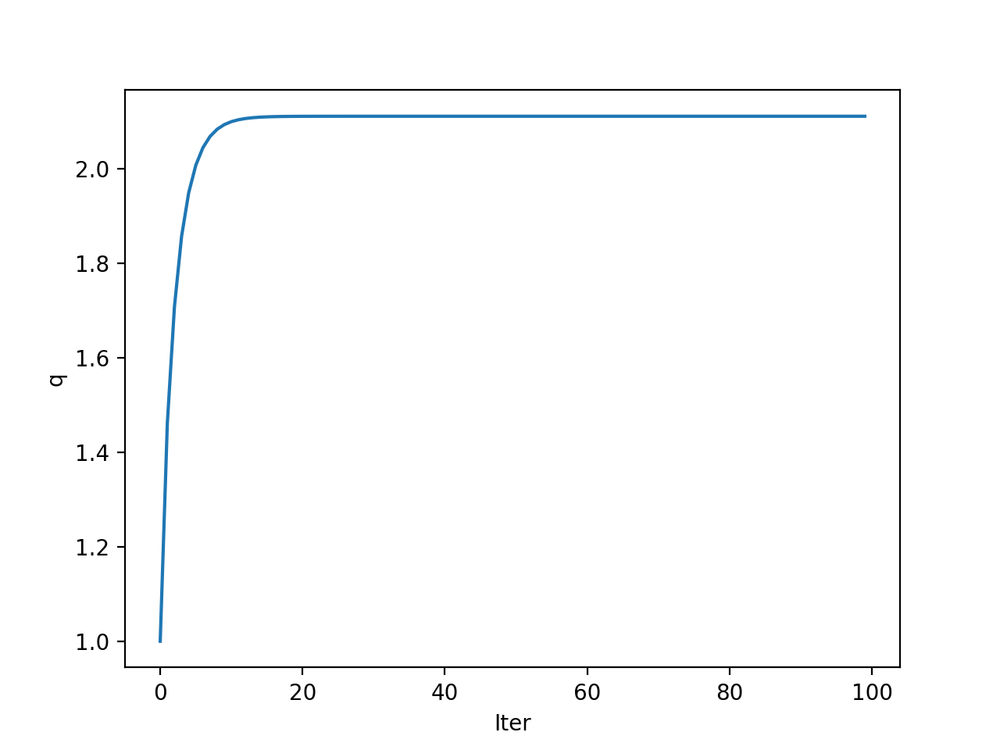

# 数学实验 Exp 06

赵晨阳 计 06 2020012363

## 实验目的

- 掌握非线性方程的基本解法并推广到解非线性方程组
- 在实际问题中获得非线性方程的数值解

## 6.3

### 问题分析、模型假设与模型建立

记总价值减去首付为 $S$，每个月还款 $m$ ，第 $i$ 个月结束后尚有 $x_i(i\geq 0)$ 元贷款。则在第 $0$ 个月结束后（即除了首付还没开始还款时），剩余还款为 $x_0=S$。

考虑第 $i+1(i\geq 0)$ 个月结束后时，首先尚未还完的 $x_i$ 会递增为 $(1+q)x_i$，而还款 $m$ 元，故 $x_{i+1}=(1+q)x_i-m$，这等价于：
$$
x_{i+1}-\frac{m}{q}=(1+q)x_i-\frac{(1+q)m}{q}=(1+q)(x_i-\frac{m}{q})\\x_{n}-\frac{m}{q}=(x_0-\frac{m}{q})(1+q)^{n}\\x_n=(S-\frac{m}{q})(1+q)^n+\frac{m}{q}
$$
得到递推公式后，倘若在第 $n$ 月结束后恰好还清，则有 $x_n=0$，也即：
$$
(S-\frac{m}{q})(1+q)^n+\frac{m}{q}=0
$$

### 算法设计

可直接调用 `scipy.optimize.fsolve` 接口完成分析即可。考虑到现实生活中的月利率实际上并不高，我选择以 0.1 为方程近似的根。当然，实际上近似解远远小于 0.1。

**第一问**

$S=(20-5)\times 10^4=15\times 10^4$、$m=1000$、$n=15\times12=180$，要求解的是未知量 $q$，可以考虑直接代入方程求解。

**第二问**

$S=5\times 10^5$，第一种方案贷款月利率与第一问类似，$m=4500$、$n=15\times 12=180$；第二种方案按照 $m=45000$、$n=20$ 计算出年利率，除以 $12$ 得到月利率。

### 代码

代码位于 `./codes/6_3.py` 下，通过 `python3 6_3.py` 可以运行整个程序：

```python
from scipy.optimize import fsolve
import numpy as np

np.set_printoptions(precision=15)

S = 150000
m = 1000
n = 180
q = fsolve(lambda q: (S - m / q) * (1 + q) ** n + m / q, 0.1)

S = 500000
m = 4500
n = 180
q1 = fsolve(lambda q: (S - m / q) * (1 + q) ** n + m / q, 0.1)

m = 45000
n = 20
q2 = fsolve(lambda q: (S - m / q) * (1 + q) ** n + m / q, 0.1) / 12

print(q)
print(q1)
print(q2)
```

### 结果、分析与结论

第一问中的月利率为 $0.208%$。在第二问中，第一种策略的月利率为 $0.585%$，而第二种策略的月利率为 $0.533%$，显示第二种策略的利率更低。

然而，如果考虑还款总额，第一种策略的总还款额为 $81\times 10^4$，而第二种策略的总还款额为 $90\times 10^4$，因此第一种策略的还款总额更小。

我认为，在实际的贷款选择中，需要综合考虑多个现实因素，如现金流、固定资产、整体通货膨胀等，以确定最佳选择方案。

## 6.6

### 问题分析、模型假设与模型建立

参考课本 6.1.2 小节建立物理模型。记 $x_i$ 为第 $i$ 种物质的含量，$P$ 和 $T$ 分别为压强和温度，参数和交互作用矩阵如题干所设。为使解符合实际意义，必有：
$$
\forall 1\leq i \leq n,x_i\geq 0\\
\sum_{i=1}^nx_i=1\Leftrightarrow (\sum_{i=1}^nx_i)-1=0
$$
对于所有物质，当 $x_i>0$ 时有：
$$
P=\gamma_i P_i\\
\ln P_i=a_i-\frac{b_i}{T+c_i}\\
\ln \gamma_i=1-\ln(\sum_{j=1}^nx_jq_{ij})-\sum_{j=1}^n\frac{x_jq_{ji}}{\sum_{k=1}^nx_kq_{jk}}\\
\Leftrightarrow(1-\ln(\sum_{j=1}^nx_jq_{ij})-\sum_{j=1}^n\frac{x_jq_{ji}}{\sum_{k=1}^nx_kq_{jk}}+a_i-\frac{b_i}{T+c_i})-\ln P=0
$$
当 $x_i=0$ 时，不需要考虑 $P=\gamma_i P_i$，故而上式即为全部约束条件。

### 算法设计

模型有 $n+1$ 个未知数（$x_1,x_2,\cdots,x_n$ 和 $T$）和 $n+1$ 个方程（每个物质的限制和对 $x_i$ 总和的限制）。对于此非线性方程组，可以直接用matlab的`fsolve`接口求解。可能有多种不同的占比和温度均满足可达到稳定，因此我实验了多种初始迭代条件，期望可以求得多种不同的解。

### 代码

代码位于 `./codes/6_6.py` 下，通过，`python3 6_6.py` 即可运行。

注意 `x_T_0` 的参数为前 $n-1$ 种物质的含量初值，第 $n$ 种物质能够根据 $\sum_{i=1}^nx_i=1$ 直接得到；最后一个参数是温度初值。

```py
import numpy as np
from scipy.optimize import fsolve

# Define inputs
a = np.array([18.607, 15.841, 20.443, 19.293])
b = np.array([3643.31, 2755.64, 4628.96, 4117.07])
c = np.array([239.73, 219.16, 252.64, 227.44])
Q = np.array([1.0, 0.192,2.169, 1.611,
              0.316, 1.0, 0.477, 0.524,
              0.377, 0.360, 1.0, 0.296,
              0.524, 0.282, 2.065, 1.0]).reshape((4,4))
P = 760

# Define functions
def calculate_Qx(Q, X):
    """Calculates the product of Q and X."""
    return Q @ X

def calculate_y(X, x_T):
    """Calculates y."""
    Qx = calculate_Qx(Q, X)
    return X * (b * (1.0 / (x_T[3] + c)) + np.log(Qx) + Q.T @ (X * (1 / Qx)) - a + (np.log(P) - 1))

def equations(x_T):
    """Calculates the system of equations to be solved."""
    X = np.zeros_like(x_T)
    X[0:3] = x_T[0:3]
    X[3] = 1 - np.sum(x_T[0:3])
    return calculate_y(X, x_T)

def solve_equations(x_T_0):
    """Solves the system of equations for x_T."""
    return fsolve(equations, x_T_0)

def print_results(x_T):
    """Prints the results of the calculations."""
    print("[组分]", '{:.2f} {:.2f} {:.2f} {:.2f}'.format(abs(x_T[0]*100.0), abs(x_T[1]*100.0), abs(x_T[2]*100.0), abs((1.0 - np.sum(x_T[0:3]))*100.0)))
    print("[温度]", round(x_T[3],2))

# Solve equations and print results
x_T_0s = [[1, 0, 0, 60], [0, 1, 0, 60], [0, 0, 1, 60], [0, 0, 0, 60],
          [0.25, 0.25, 0.25, 50], [0, 0.33, 0.33, 50], [0, 0.5, 0, 50]]
for x_T_0 in x_T_0s:
    x_T = solve_equations(x_T_0)
    print_results(x_T)
```

### 结果、分析

选取多组初值 $(x_1',x_2',x_3',x_4',T')$，如果得到了相同的最终解，仅保留了一个初值在表格上。

结果 $(x_1,x_2,x_3,x_4,T)$ 分别如下：

| 序号 |               初值                |  $x_1$   |  $x_2$   |  $x_3$   |  $x_4$   |   $T$   |
| :--: | :-------------------------------: | :------: | :------: | :------: | :------: | :-----: |
|  1   | $(1.00, 0.00, 0.00, 0.00, 60.00)$ | $1.000$  | $0.000$  | $0.000$  | $0.000$  | $64.55$ |
|  2   | $(0.00, 1.00, 0.00, 0.00, 60.00)$ | $0.000$  | $1.000$  | $0.000$  | $0.000$  | $80.12$ |
|  3   | $(0.00, 0.00, 1.00, 0.00, 60.00)$ | $0.000$  | $0.000$  | $1.000$  | $0.000$  | $82.56$ |
|  4   | $(0.00, 0.00, 0.00, 1.00, 60.00)$ | $0.000$  | $0.000$  | $0.000$  | $1.000$  | $97.77$ |
|  5   | $(0.00, 0.50, 0.00, 0.50, 50.00)$ | $0.000$  | $0.7803$ | $0.000$  | $0.2197$ | $76.96$ |
|  6   | $(0.00, 0.33, 0.33, 0.33, 50.00)$ | $0.000$  | $0.5858$ | $0.4142$ | $0.000$  | $71.97$ |
|  7   | $(0.25, 0.25, 0.25, 0.25, 50.00)$ | $0.6247$ | $0.3753$ | $0.000$  | $0.000$  | $58.14$ |

### 结论

经过对方程解的分析，我们得出以下结论：

1. 不仅不存在四个物质共存的情形，甚至连三个物质共存的情形都不存在。共沸物要求至少需要有两种不同的物质参与反应并达到平衡。因此，只有第 5、6、7 组解符合要求。这些解的实际意义是，在特定的初始条件下，系统会朝着某个平衡态发展，每种物质的比例和温度都能够通过这些解来描述。
2. 最终的平衡态不止一种。在现实世界中，系统的初始条件会决定最终达到哪个平衡态，或者系统可能会持续发生反应而无法达到平衡态。

## 6.8

### 问题分析、模型假设与模型建立

题目已经给出了初步的模型，其中初值 $q(0)$ 和 $c$ 均为正数：

$$
q(t+1)-q(t)=r(p(t)-q(t))\Leftrightarrow q(t+1)=(1-r)q(t)+rp(t) \\

p(t)=\frac{c-S(q(t))}{d}=\frac{c-\arctan(\mu q(t))}{d} \\

q(t+1)=(1-r)q(t)+r\frac{c-\arctan(\mu q(t))}{d}
$$

在本问题中，若一个序列为 $n$ 分岔，则 $\forall \epsilon>0$，均可取足够大的 $t_0'$，使得在考虑所有 $t_0>t_0'$ 时，均可以连续取 $2n$ 个点得到周期序列$(q(t_0),q(t_0+1),\cdots,q(t_0+n-1),q(t_0+n),\cdots,q(t_0+2n-1))$，满足：
$$
\forall 0 \leq i\leq n-1,\lvert q(t_0+i)-q(t_0+n+i)\rvert<\epsilon
$$
注意，此处分岔数 $n=2^k$。

### 算法设计

令初值 $q(0)=0.5$，$c$ 为 $[0.01,1.2]$ 内的实数、步长为 $0.0001$，考虑每个 $c$ 对应的情形。计算分岔数时，无法使用模型中严格的理论判定，只能近似判定。通过递推，我们计算出 $t$ 足够大时的 $q(t_0)$（代码中选择 $t_0=1000$），从其开始往后递推判断分岔的子序列数。若为 $n=2^k$ 分岔，则有 (6) 式中的限制条件，其中 $\epsilon$ 取常量 $10^{-6}$，从小到大枚举，得到的最小 $k$ 就是可行分岔数。

### 代码

代码位于 `./codes/6_8_1.py` 下，通过，`python3 6_8_1.py` 即可运行。

```python
import numpy as np
import math
import matplotlib.pyplot as plt

THRESHOLD = 1e-5
MU = 4.8
D = 0.25
R = 0.3
SAVE_START = 1000
SAVE_DURATION = 256
TOTAL_ITER = SAVE_START + SAVE_DURATION

def equ(q, c):
    return (1 - R) * q + R / D * (c - math.atan(MU * q))

def compute_q_values():
    q = np.zeros((11000, TOTAL_ITER))
    index = 0
    for c in np.arange(0.0, 1.1, 0.0001):
        q[index, 0] = 1.0
        for n in range(1, TOTAL_ITER):
            q[index, n] = equ(q[index, n - 1], c)
        index += 1
    return q

def find_forks(q):
    cur_n = 1
    for index in range(q.shape[0]):
        n = 1
        conv_fail = False
        while n <= 128:
            conv_fail = True
            for i in range(n):
                if abs(q[index, SAVE_START + i] - q[index, SAVE_START + n + i]) >= THRESHOLD:
                    conv_fail = False
                    break
            if conv_fail:
                if cur_n != n:
                    cur_n = n
                    print("c=", np.arange(0.0, 1.1, 0.0001)[index], "f=", n)
                break
            n = n * 2

def plot_q_values(q):
    x = np.arange(0.0, 1.1, 0.0001)
    plt.plot(x, q[:, SAVE_START: TOTAL_ITER])
    plt.xlabel('Parameter: c')
    plt.ylabel('Value: q')
    plt.show()

if __name__ == "__main__":
    q = compute_q_values()
    find_forks(q)
    plot_q_values(q)
```

### 结果、分析与结论

得到的分岔图如下：


观察到在 $c=1.08$ 时分岔数收敛到 $1$，往前的几个分岔点分别是 $0.9488$、$0.9073$、$0.8972$、$0.8949$、$0.8944$，最后在我选取的精度下最多可找到的分岔数为 $32$。当 $c$ 继续增加一个极小量时，我们的步长粒度已经较宽，难以确定下一个分岔点，出现了比较明显的混沌现象。

实际上，我们解出的分岔点的结果为:

```python
c= 0.8942 f= 64
c= 0.8943 f= 32
c= 0.8948 f= 16
c= 0.8971 f= 8
c= 0.9069 f= 4
c= 0.9484 f= 2
c= 1.0789 f= 1
```

以上即为分岔点以及对应的分岔数。实际上，当分岔数为 64 时，已经非常难以辨别，此后陷入混沌状态。

我们接着画出 $q(t)$ 独自的迭代曲线，验证分岔数目的合理性，相应代码位于 `./codes/6_8_2.py` 下，通过 `python3 6_8_2.py` 即可运行：

```python
import numpy as np
import math
import matplotlib.pyplot as plt

def equ(q, c, mu, r, d):
    return (1 - r) * q + r / d * (c - math.atan(mu * q))

def simulate(q0, c, mu, r, d, n=100):
    q = np.zeros(n)
    q[0] = q0
    for i in range(1, n):
        q[i] = equ(q[i - 1], c, mu, r, d)
    return q

def plot_q(q):
    x = np.arange(len(q))
    plt.plot(x, q)
    plt.xlabel('Iter')
    plt.ylabel('q')
    plt.show()

def main():
    mu = 4.8
    d = 0.25
    r = 0.3
    q0 = 1.0
    cs = [2, 1, 0.92, 0.9, 0.895]
    for c in cs:
        q = simulate(q0, c, mu, r, d)
        plot_q(q)

if __name__ == '__main__':
    main()
```

得到如下情形：

1. c = 2.0



2. c = 1.0


3. c = 0.92


4. c = 0.9


5. c = 0.895


收敛序列数量符合期待，因此相应的解的正确性符合实际。

最后验证 Feigenbaum 常数定律，也即检测 $\frac{b_n-b_{n-1}}{b_{n+1}-b_n}$ 是否趋于稳定。
$$
\frac{b_2-b_{1}}{b_{3}-b_2} = 3.14457 \\ \frac{b_3-b_{2}}{b_{4}-b_3} = 4.23469 \\ \frac{b_4-b_{3}}{b_{5}-b_4} = 4.2608\\ \frac{b_5-b_{4}}{b_{6}-b_5} = 4.6000
$$
数值不断向 4.669 靠近，这符合 Feigenbaum 常数定律的假设。

