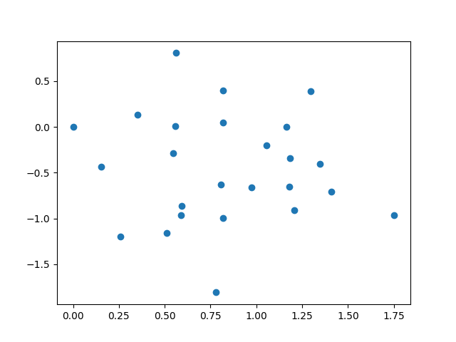
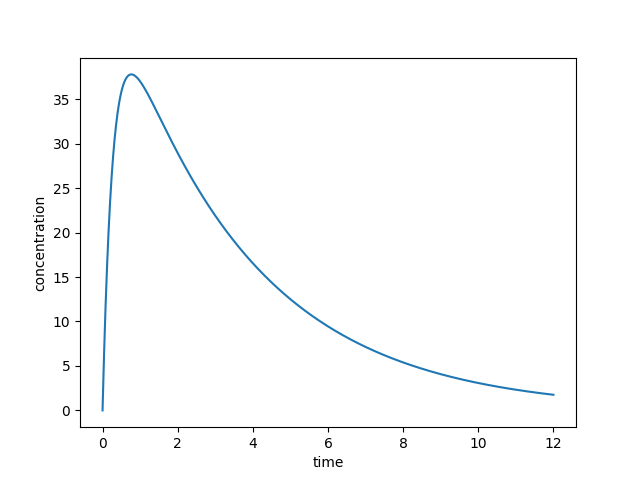

# 数学实验 Exp 07 & 8

赵晨阳 计 06 2020012363

## 7.5

### 问题分析、模型假设与模型建立

考虑到研究对象是平面结构，我们可以将原子的位置建模为一个二维平面直角坐标系中的点，第 $i$ 个原子的坐标可以表示为 $(x_i, y_i)$。为了确定原子之间的相对位置，我们可以假设第 $1$ 个原子位于原点 $(0,0)$，第 $2$ 个原子与第 $1$ 个原子在 $y$ 轴上相连（即 $x_2=0$）。因此，需要求解的未知变量为 $y_2, x_3, y_3, x_4, y_4, \cdots, x_{25}, y_{25}$。

考虑到实验测量距离 $d'_{ij}$ 可能存在误差，我们需要通过优化问题的角度来求解。如果假设原子 $i$ 和 $j$ 的实际距离为 $d_{ij}$，那么有 $\sqrt{(x_i-x_j)^2+(y_i-y_j)^2}=d_{ij}$。因为误差应该比较小，所以我们可以通过最小化误差的平方和来优化问题。同时，假设每次测量的误差都满足同一分布，不同的测量结果应该具有相同的权重。

因此，我们可以假设已知 $d'_{ij}$ 的 $(i,j)$ 构成了集合 $P$，并使用最小二乘的思想将问题转化为无约束优化问题：
$$
\arg\min*_{{y_2,x_3,y_3,\cdots,x_{25},y_{25}}}\sum_{(i,j)\in P}(\sqrt{ (x_i-x_j)^2+(y_i-y_j)^2}-d'_{ij})^2
$$
该优化问题的目标是让估计的真实值和测量结果尽量接近，从而得到更精确的结果。

### 算法设计

本问题涉及到 $2\times23+1=47$ 个自由度和 $\lvert P\rvert=52$ 个约束条件，因此可以将其看作一个最小二乘的无约束优化问题。为了求解该问题，我使用了 `scipy.optimize.minimize` 接口。

由于该问题可能存在多个局部极小值，为了避免陷入局部最小值，我同时使用三种不同的优化算法（`methods = ['BFGS', 'L-BFGS-B', 'CG']`），并多次随机迭代初值。具体而言，我进行了 50 轮实验，并从不同的初值开始求解，然后选择最优的结果。

同时，我通过调整不同的优化算法参数，例如步长、迭代次数、精度等，来优化求解过程。为了确保获得最优解，我设置最大目标函数调用次数为 10000，以控制求解的时间和精度。

### 代码

代码位于 `./codes/7_5.py` 下，通过 `python3 7_5.py` 可以运行整个程序，由于计算时间过长，我使用 `npz` 存储了相应的计算结果。此外，程序运行过程中的输出，包括每种方法的迭代误差、每个方法的迭代次数：

```python
import numpy as np
from scipy.optimize import minimize
import matplotlib.pyplot as plt
num_iteration = 0

index = np.array([[4, 1],
                  [12, 1],
                  [13, 1],
                  [17, 1],
                  [21, 1],
                  [5, 2],
                  [16, 2],
                  [17, 2],
                  [25, 2],
                  [5, 3],
                  [20, 3],
                  [21, 3],
                  [24, 3],
                  [5, 4],
                  [12, 4],
                  [24, 4],
                  [8, 6],
                  [13, 6],
                  [19, 6],
                  [25, 6],
                  [8, 7],
                  [14, 7],
                  [16, 7],
                  [20, 7],
                  [21, 7],
                  [14, 8],
                  [18, 8],
                  [13, 9],
                  [15, 9],
                  [22, 9],
                  [11, 10],
                  [13, 10],
                  [19, 10],
                  [20, 10],
                  [22, 10],
                  [18, 11],
                  [25, 11],
                  [15, 12],
                  [17, 12],
                  [15, 13],
                  [19, 13],
                  [15, 14],
                  [16, 14],
                  [20, 16],
                  [23, 16],
                  [18, 17],
                  [19, 17],
                  [20, 19],
                  [23, 19],
                  [24, 19],
                  [23, 21],
                  [23, 22]])

distance = np.array([0.9607, 0.4399, 0.8143, 1.3765, 1.2722, 0.5294, 0.6144,
                     0.3766, 0.6893, 0.9488, 0.8, 1.109, 1.1432,
                     0.4758, 1.3402, 0.7006, 0.4945, 1.0559, 0.681, 0.3587,
                     0.3351, 0.2878, 1.1346, 0.387, 0.7511, 0.4439,
                     0.8363, 0.3208, 0.1574, 1.2736, 0.5781, 0.9254, 0.6401,
                     0.2467, 0.4727, 1.384, 0.4366, 1.0307, 1.3904,
                     0.5725, 0.766, 0.4394, 1.0952, 1.0422, 1.8255, 1.4325,
                     1.0851, 0.4995, 1.2277, 1.1271, 0.706, 0.8052])

def objective(X):
    global num_iteration
    num_iteration += 1
    xi = X[((index[:, 0] > 2) * (index[:, 0] * 2 - 5)) + ((index[:, 0] == 2) * 0)]
    yi = X[((index[:, 0] > 2) * (index[:, 0] * 2 - 4)) + ((index[:, 0] == 2) * 0)]
    xj = X[((index[:, 1] > 2) * (index[:, 1] * 2 - 5)) + ((index[:, 1] == 2) * 0)]
    yj = X[((index[:, 1] > 2) * (index[:, 1] * 2 - 4)) + ((index[:, 1] == 2) * 0)]
    distances = np.sqrt((xi - xj)**2.0 + (yi - yj)**2.0)
    F = np.sum((distances - distance)**2.0)
    return F


minX = np.zeros(25 * 2 - 2 - 1)
minVal = objective(minX)

methods = ['BFGS', 'L-BFGS-B', 'CG']

from pathlib import Path
result_path = Path.cwd() / "7_5_result.npy"
if not (result_path.exists() and (Path.cwd() / "7_5_result.txt").exists()):
    results = []
    for epoch in range(50):
        print(f"epoch: {epoch}")
        result_dict = {}
        for method in methods:
            num_iteration = 0
            res = minimize(objective, np.random.rand(25 * 2 - 2 - 1), method=method, options={'maxiter': 10000})
            if res.fun < minVal:
                minX = res.x
                minVal = res.fun
            print(f'{method}: {res.fun}, {num_iteration}')
            with open(Path.cwd() / "7_5_result.txt", "a") as f:
                f.write(f'{method}: {res.fun}, {num_iteration}\n')
            result_dict[method] = [res.fun, num_iteration]
        result_dict["epoch"] = epoch
        with open(Path.cwd() / "7_5_result.txt", "a") as f:
            f.write("epoch: " + str(epoch) + '\n')
            f.write("minX: " + str(minX) + '\n')
            f.write("minVal: " + str(minVal) + '\n')
        results.append(result_dict)
    all_results = {"results": results, "minX": minX, "minVal": minVal}
    np.save(result_path, all_results)
else:
    all_results = np.load(result_path, allow_pickle=True).item()
    results = all_results["results"]
    minX = all_results["minX"]
    minVal = all_results["minVal"]

x = np.zeros(25)
x[1:] = minX[::2]
y = np.zeros(25)
y[2:] = minX[1::2]

print(f'Minimum value: {minVal}')

plt.scatter(x, y)
plt.show()

```

### 结果、分析与结论

最终我求得的目标函数最小值约为 $0.510$，得到的点在二维平面直角坐标系上的图如下：



此图展示的是在给定观测条件下，一种对原子相对位置的猜测，它和观测结果比较接近，同时在我的设定下具有较优的目标函数值。

通过参考 `./codes/7_5_result.txt`，可以观察到三种不同的优化算法在优化值和目标函数调用次数上的表现。在本问题中，BFGS 使用的迭代次数和目标函数调用次数较少，一般在 4000 以下；L-BFGS-B 需要的次数约为 9000；而 CG 需要的次数很多，普遍在 15000 以上，超过了设定的次数上限。总的来说，BFGS 能够得到更优的解。

此外，我们也发现本问题中有很多局部最优解，因此初值的选取非常关键，随机初值是一个可行的策略。我们可以预测，随着随机迭代初值的次数增加，得到的解会越来越优，但增加次数带来的收益也会逐渐减少。在实际应用中，需要平衡时间和效果两个因素，以决定这些参数和算法的选取。

## 7.8

### 问题分析、模型假设、模型建立与算法设计

参考题干已经建立了完善的数学模型。也即中心室的容积为 $V$，吸收室的容积为 $V_1$，$t$ 时刻的血药浓度分别为 $c(t)$ 与 $c_1(t)$，中心室的排除速率为 $k$，吸收速率为 $k_1$，故而得到吸收室的排除速率也为 $k_1$。此处的系数指的是中心室和吸收室血药浓度变化率与浓度本身的比例系数。根据两室的排放可以列出微分方程：
$$
\begin{cases}\dfrac{\mathrm{d}c_1}{\mathrm{d}t}=-k_1c_1\\c_1(0)=\dfrac{d}{V_1}\\ \dfrac{\mathrm{d}c}{\mathrm{d}t}=-kc+\dfrac{V_1}{V}k_1c_1\\c(0)=0\end{cases}
$$
解之有：
$$
c(t)=\dfrac{d}{V}\dfrac{k_1}{k_1-k}(e^{-kt}-e^{-k_1t})
$$
进一步记 $b=\dfrac{d}{v}$，有：
$$
c(t)=b\dfrac{k_1}{k_1-k}(e^{-kt}-e^{-k_1t})
$$
题目给定了若干个 $t$ 处（记它们构成的集合为 $P$） $c(t)$ 的测量值，我把它们记为 $c'(t)$。考虑到实验测量结果会有一定误差，所以可以尝试拟合 $k$、$k_1$、$b$，使得用公式计算出来的 $c(t)$ 和 $c'(t)$ 比较接近。

因此，问题转化为了根据题目提供的表格中的数据，求解出最优的参数$k,k_1,b$。由于方程的非线性性，将其转化为如下的无约束优化问题：
$$
\arg \min_{k,k_1,b}\sum_{t\in P}((k_1-k)c(t)-bk_1(e^{-kt}-e^{-k_1t}))^2
$$
其中 $T$ 为实验记录的数据集中的时刻。

为了统计误差，设计如下的误差函数：
$$
loss=\sum_i(c(t_i)-\hat c(t_i))^2
$$

### 代码

我们使用 Python 科学计算库中的 `least_squares` 以及 `minimize` 方法参考上方方程实现了整个程序。代码位于 `./codes/7_8.py` 下，通过，`python3 7_8.py` 即可运行。

```py
import numpy as np
from scipy.optimize import least_squares
import matplotlib.pyplot as plt

list_t = np.array(
    [0.083, 0.167, 0.25, 0.50, 0.75, 1.0, 1.5, 2.25, 3.0, 4.0, 6.0, 8.0, 10.0, 12.0]
)
list_ct = np.array(
    [10.9, 21.1, 27.3, 36.4, 35.5, 38.4, 34.8, 24.2, 23.6, 15.7, 8.2, 8.3, 2.2, 1.8]
)


def objective(x):
    b = x[0]
    k = x[1]
    k1 = x[2]
    F = np.empty_like(list_t)
    for i in range(14):
        t = list_t[i]
        ct = list_ct[i]
        F[i] = ct - b * k1 / (k1 - k) * (np.exp(-k * t) - np.exp(-k1 * t))
    return F


def compute_loss(x):
    b = x[0]
    k = x[1]
    k1 = x[2]
    tmp_ct = b * k1 / (k1 - k) * (np.exp(-k * list_t) - np.exp(-k1 * list_t))
    return np.sum((tmp_ct - list_ct) ** 2)


x0 = np.random.rand(3)
res = least_squares(objective, x0, bounds=([0, 0, 0], [100, 100, 100]))
x = res.x

resnorm = res.cost
print(x)
print(resnorm)

final_loss = compute_loss(x)
b = x[0]
k = x[1]
k1 = x[2]
x = np.arange(0, 12.01, 0.01)
y = b * k1 / (k1 - k) * (np.exp(-k * x) - np.exp(-k1 * x))
print(f"final_loss: {final_loss}")
print(f"b: {b}")
print(f"k: {k}")
print(f"k1: {k1}")
plt.plot(x, y)
plt.xlabel("time")
plt.ylabel("concentration")
plt.show()

```

### 结果、分析与结论

最终得到的结果如下：

```py
final_loss: 34.23173340076138
b: 46.82751549915527
k: 0.28025154033766553
k1: 3.6212297811285947
```

最终得到 $c(t)$ 的图像是：



我们从本问题中得到了如下三个结论：

1. 计算得到的浓度随时间的变化图与实际意义吻合。浓度在初期迅速上升，达到一个峰值后缓慢下降；
2. 计算得到的结果与其含义相符。$b$ 表示中心室中药量和体积的比，$bV$ 即总药量；$k_1>k$ 说明吸收速率高于排除速率，否则药物不起作用；
3. 求得的目标函数最小值为 $34.23$，这是一个比较大的误差。分析原因可以发现，在浓度的峰值附近（约 $0.76$）给定的测量数据有波动，这造成了干扰。总的来说，得到的结果比较可靠，反映了浓度随时间的变化。但如果要得到更为可靠的解，我认为从已有的数据入手是不太现实的，应该考虑进行更多次的测量以减小噪声造成的误差。

由于本问题中的优化参数数量很少，因此选择不同的迭代初值和方法对运行时间的影响并不显著。但如果遇到大量参数的情况，需要根据性能和效率等因素进行调整。

## 8.6

### 问题分析、模型假设与模型建立

假设我们有五种证券 A、B、C、D 和 E，它们的购买金额分别为 $x_1, x_2, x_3, x_4$ 和 $x_5$ 万元。在此情况下，我们需要满足以下限制条件：

1. 非负性：$x_i \geq 0$ 对于 $i = 1,2,3,4,5$。

2. 对于政府及代办机构的证券，购买金额至少为 400 万元：$x_2+x_3+x_4\geq 400$。

3. 所购证券的平均信用等级不超过 1.4，将其转化为线性约束条件，得到：
$$
\frac{2x_1+2x_2+x_3+x_4+5x_5}{x_1+x_2+x_3+x_4+x_5}\leq 1.4\Rightarrow \\
(2-1.4)x_1+(2-1.4)x_2+(1-1.4)x_3+(1-1.4)x_4+(5-1)x_5 \leq 0
$$

4. 所购证券的平均到期年限不超过 5 年，将其转化为线性约束条件，得到：

$$
\frac{9x_1+15x_2+4x_3+3x_2+2x_5}{x_1+x_2+x_3+x_4+x_5}\leq 5 \Rightarrow\\
(9-5)x_1+(15-5)x_2+(4-5)x_3+(3-5)x_2+(2-5)x_5\leq 0
$$

5. 如果总共有的资金为 $s$ 万元，则必须有 $x_1+x_2+x_3+x_4+x_5\leq s$。

此外，我们还需要考虑证券的收益率，收益率用税前收益扣除应纳税部分计算。例如，证券 A 和证券 E 不需要缴纳税款，因此其收益率为 $p_1=4.3\times 10^{-2}$ 和 $p_5=4.5\times 10^{-2}$。而对于其它证券，收益率需要扣除 50% 的税款，例如证券 B 的收益率为 $\frac{1}{2}\times 5.4\times 10^{-2}$。最终的收益函数为：
$$
f(x)=\sum_{i=1}^5p_ix_i
$$


我们的目标是找到最优解 $x^*$，使得收益函数最大化，即 $\max_{x^*} f(x^*)$，同时满足上述限制条件。

### 算法设计

利用 Python 科学计算库 `scipy` ，我们可以使用 `linprog` 函数来解决线性规划问题。具体而言，我们需要将问题转化为标准形式，然后传递给 `linprog` 函数进行求解。在这个过程中，我们需要指定目标函数、限制条件的系数矩阵和约束向量、以及变量的取值范围等参数。

**第一问**

对于第一问，我们只需要根据上述前 5 点的限制条件来求解即可。

**第二问**

以 $c$ 的利率借到不超过 $m$ 万元的资金，需对模型进行修改。具体而言，我们需要引入一个新的变量 $k$，表示以 $c$ 的利率借到的资金数，$k$ 的取值范围为 $0\leq k\leq m$。同时，我们需要修改限制条件 5，变为 $x_1+x_2+x_3+x_4+x_5\leq 1000+k$，即 $x_1+x_2+x_3+x_4+x_5-k\leq 1000$。此外，我们还需要修改收益函数 $f(x)$，变为 $f(x)=\sum_{i=1}^5p_ix_i-ck$。

**第三问**

对于第三问，我们只需要修改问题的参数即可。

### 代码

代码位于 `./codes/8_6.py` 下，通过，`python3 8_6.py` 即可运行。

```python
import numpy as np
from scipy.optimize import linprog

def _print_(x):
    x1 = x[0]
    x2 = x[1]
    x3 = x[2]
    x4 = x[3]
    x5 = x[4]
    k = x[5]
    print(f"x1: {x1}, x2: {x2}, x3: {x3}, x4: {x4}, x5: {x5}, k: {k}")

A = np.array([[0, -1, -1, -1, 0, 0],
              [2 - 1.4, 2 - 1.4, 1 - 1.4, 1 - 1.4, 5 - 1.4, 0],
              [9 - 5, 15 - 5, 4 - 5, 3 - 5, 2 - 5, 0],
              [1, 1, 1, 1, 1, 0],
              [0, 0, 0, 0, 0, -1]])
b = np.array([-400, 0, 0, 1000, 0])
lb = np.array([0, 0, 0, 0, 0, 0])
f = -np.array([4.3, 5.4 * 0.5, 5.0 * 0.5, 4.4 * 0.5, 4.5, 0]) / 100

# First optimization problem
res1 = linprog(f, A, b, bounds=list(zip(lb, [None]*6)))
_print_(res1.x)
print("interest: ", -res1.fun)

# Second optimization problem
constrain = A.copy()
constrain[0, 5] = 0.0
constrain[1, 5] = 0.0
constrain[2, 5] = 0.0
constrain[3, 5] = -1.0
lb[5] = 0.0
ub = [1000, 1000, 1000, 1000, 1000, 100]
res = linprog(f, constrain, b, bounds=list(zip(lb, ub)))
_print_(res.x)
print("interest: ", -res.fun)

# Third optimization problem
f2 = f.copy()
f2[0] = -4.5 / 100
res = linprog(f2, A, b, bounds=list(zip(lb, [None]*6)))
_print_(res.x)
print("interest: ", -res.fun)

# Fourth optimization problem
f3 = f.copy()
f3[2] = -4.8 * 0.5 / 100
res = linprog(f3, A, b, bounds=list(zip(lb, [None]*6)))
_print_(res.x)
print("interest: ", -res.fun)
```

### 结果、分析与结论

四次优化求解得到的答案如下：

```python
x1: 218.1818181818182, x2: 0.0, x3: 736.3636363636364, x4: 0.0, x5: 45.45454545454543, k: 0.0
interest:  29.836363636363636
x1: 240.0, x2: 0.0, x3: 810.0, x4: 0.0, x5: 49.99999999999997, k: 100.0
interest:  32.81999999999999
x1: 218.1818181818182, x2: 0.0, x3: 736.3636363636364, x4: 0.0, x5: 45.45454545454543, k: 0.0
interest:  30.272727272727273
x1: 335.99999999999994, x2: 0.0, x3: 0.0, x4: 648.0, x5: 15.999999999999982, k: 0.0
interest:  29.424
```

其中 $k$  表示应该额外借到的资金，且仅有第二问实际上需要借款。

第一问中，第一问中，最优解下的 $x_1,x_2,x_3,x_4,x_5$ 分别是 $218.18$、$0$、$736.36$、$0$、$45.45$（单位均为万元），最大收益约为 $29.84$ 万元。

第二问中，最优解下的 $x_1,x_2,x_3,x_3,x_4,x_5$ 分别是 $240$、$0$、$810$、$0$、$50$，$k$ 是 $100$，需要额外借款 100 万元，最大收益约为 $32.82$ 万元。此时，约束条件符合松弛变量为 0，最优值时各个变量取值的受到了正确的约束。

第三问中，第三问中，如果证券 A 的税前收益为 $4.5%$，则最优解不变，最大收益约为 $30.27$ 万元。如果证券 C 的税前收益改为 $4.8%$，则最优解下的 $x_1,x_2,x_3,x_4,x_5$ 分别是 $336$、$0$、$0$、$648$、$16$，最大收益约为 $29.42$ 万元。

这些解都具有明确的实际意义，即最优解下每种证券的具体购买金额，以及在第二问中需要额外借款的金额。在实际应用中，这些解可以作为参考，但需要注意到实际投资决策需要考虑更多因素，如风险和通货膨胀率等。
