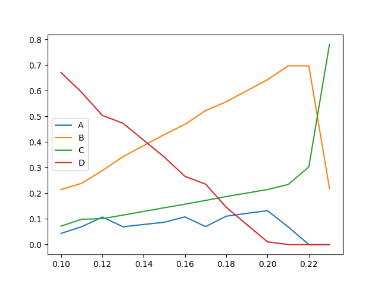
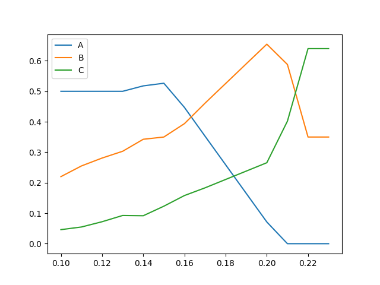

# 数学实验 Exp 8 & 9

赵晨阳 计 06 2020012363

## 8.10

### 问题分析、模型假设与模型建立

根据题意，可以做出如下假设：

1. 第 $i$ 个工厂和第 $i$ 个居民点互为江的正对岸；
2. 仅有工厂是排污点；
3. 不同污染浓度的水可以按比例混合。

设上游江水的流量和污水浓度分别为 $V_0$ 和 $P_0$，三个工厂的污水流量和污水浓度分别为 $V_1, V_2, V_3$ 和 $P_1, P_2, P_3$，处理系数为 $c$，工厂 1 和工厂 2 之间的自净系数为 $S_1$，工厂 2 和工厂 3 之间的自净系数为 $S_2$，国家规定水的污染浓度不得超过 $q$，以上这些量均为常数。

考虑到需要做出决策的量，我们定义三个工厂（经过处理后）最终排出的污水浓度分别为$Q_1,Q_2,Q_3$。由于排放浓度应该小于等于污水浓度，我们有限制条件 $\forall 1\leq i \leq 3,0\leq Q_i \leq P_i$。在有限制条件的情况下，我们需要求解使得代价函数 $F=c\sum_{i=1}^3 V_i(P_i-Q_i)$ 最小化的 $Q_1,Q_2,Q_3$。

根据题目所给条件，我们可以推导出工厂下游的污水浓度。

在工厂 1 下游，根据质量守恒原理，下游的污水浓度 $L_1$ 可以表示为：

$$
L_1=\frac{V_0P_0+V_1Q_1}{V_0+V_1}
$$
在工厂 2 下游，除了考虑质量守恒原理外，还要考虑两个工厂之间的自净作用，因此 $L_2$ 可以表示为：

$$
L_2=\frac{S_1L_1(V_0+V_1)+V_2Q_2}{(V_0+V_1)+V_2}=\frac{S_1(V_0P_0+V_1Q_1)+V_2Q_2}{V_0+V_1+V_2}
$$
在工厂 3 下游，同样需要考虑自净作用，因此 $L_3$ 可以表示为：

$$
L_3=\frac{S_2L_2(V_0+V_1+V_2)+V_3Q_3}{(V_0+V_1+V_2)+V_3}=\\\frac{S_2S_1(V_0P_0+V_1Q_1)+S_2V_2Q_2+V_3Q_3}{V_0+V_1+V_2+V_3}
$$
其中，$Q_1,Q_2,Q_3$ 分别为三个工厂最终排放的污水浓度。

如果要求江面上所有地段的水污染达到国家标准，考虑水的自净效果，那么每个工厂的下游处都必须达到国家标准，即$L_1 \leq q$、$L_2 \leq q$、$L_3 \leq q$。将$L_1,L_2,L_3$的表达式代入不等式中，可以得到：

$$
\frac{V_0P_0+V_1Q_1}{V_0+V_1} \leq q
$$

$$
\frac{S_1(V_0P_0+V_1Q_1)+V_2Q_2}{V_0+V_1+V_2} \leq q
$$

$$
\frac{S_2S_1(V_0P_0+V_1Q_1)+S_2V_2Q_2+V_3Q_3}{V_0+V_1+V_2+V_3} \leq q
$$

这些不等式可以化简为：

$$
V_0P_0+V_1Q_1 \leq q(V_0+V_1)
$$

$$
S_1V_0P_0+(S_1V_1+V_2)Q_2 \leq q(V_0+V_1+V_2)
$$

$$
S_2S_1V_0P_0+(S_2S_1V_1+S_2V_2+V_3)Q_3 \leq q(V_0+V_1+V_2+V_3)
$$

如果只要求3个居民点上游的水污染达到国家标准，那么这相当于只需要考虑污染源的污染浓度是否符合标准，即 $P_0 \leq q$、$S_1L_1 \leq q$、$S_2L_2 \leq q$。其中，$L_1$ 和 $L_2$ 的表达式已经在前面推导过了。

无论是哪种情况，所有限制都可以转化为对 $Q_1,Q_2,Q_3$ 的线性限制。

### 算法设计

对于题目中的两个问题，可以将具体的数值代入模型中，将限制和目标函数表示为关于 $Q_1,Q_2,Q_3$ 的线性方程。因此，这个问题可以转化为一个线性规划问题。可以使用 Scipy 中的 `linprog` 函数求解。

`linprog` 函数需要输入目标函数的系数矩阵、不等式约束条件的系数矩阵和右侧常数向量，以及等式约束条件的系数矩阵和右侧常数向量。这些系数矩阵和向量可以根据前面推导出的限制式和代价函数式直接得到。

具体地，对于第一个问题，目标函数：
$$
F=c\sum_{i=1}^3 V_i(P_i-Q_i)
$$
限制条件为：
$$
V_0P_0+V_1Q_1 \leq q(V_0+V_1)
$$

$$
S_1V_0P_0+(S_1V_1+V_2)Q_2 \leq q(V_0+V_1+V_2)
$$

$$
S_2S_1V_0P_0+(S_2S_1V_1+S_2V_2+V_3)Q_3 \leq q(V_0+V_1+V_2+V_3)
$$

$$
0\leq Q_1,Q_2,Q_3\leq P_1,P_2,P_3
$$

可以将这些限制条件表示成系数矩阵和向量的形式，然后使用 `linprog` 函数求解最小化代价函数的线性规划问题。

对于第二个问题，目标函数和限制条件与第一个问题相同：
$$
P_0\leq q\\
S_1L_1\leq q\\
S_2L_2\leq q \to V_0P_0 \leq q(V_0+V_1)\\
S_1V_0P_0+S_1V_1Q_1 \leq q(V_0+V_1)\\
S_2S_1V_0P_0+S_2S_1V_1Q_1+S_2V_2Q_2 \leq q(V_0+V_1+V_2)
$$
总之，由于两个问题都可以表示为线性规划问题，因此可以使用 `linprog` 函数解决。

### 代码

代码位于 `./codes/8_10.py` 下，通过 `python3 8_10.py` 可以运行整个程序：

```python
import numpy as np
from scipy.optimize import linprog


def solve_lp(Volumes, Prices, Scaling_factors, Constant, Quantity, A, b):
    """Solves a linear programming problem and calculates the total profit.

    Args:
        Volumes (numpy.ndarray): The volume of each product.
        Prices (numpy.ndarray): The price of each product.
        Scaling_factors (numpy.ndarray): Scaling factors for the constraints.
        Constant (int): A constant used in the profit calculation.
        Quantity (int): The quantity of products to produce.
        A (numpy.ndarray): The constraint matrix.
        b (numpy.ndarray): The constraint vector.

    Returns:
        tuple: A tuple containing the optimal solution and the total profit.
    """
    # Define the objective function coefficients for minimizing
    c_obj = [-Volumes[i] for i in range(1, len(Volumes))]
    # Define the upper bounds for the decision variables
    bounds = [(0, Prices[i]) for i in range(1, len(Prices))]
    # Solve the linear programming problem
    res = linprog(c_obj, A_ub=A, b_ub=b, bounds=bounds)
    # Extract the optimal solution and objective function value
    x = res.x
    fval = res.fun
    # Calculate the total profit
    total_profit = Constant * (fval + np.dot(Volumes[1:], Prices[1:]))
    return x, total_profit


def define_constraints(Volumes, Prices, Scaling_factors, Quantity):
    """Defines the constraints for the linear programming problems.

    Args:
        Volumes (numpy.ndarray): The volume of each product.
        Prices (numpy.ndarray): The price of each product.
        Scaling_factors (numpy.ndarray): Scaling factors for the constraints.
        Quantity (int): The quantity of products to produce.

    Returns:
        list: A list of tuples containing the constraint matrix and vector for each problem.
    """
    # Define the first set of constraints
    A1 = np.array(
        [
            [Volumes[1], 0, 0],
            [Scaling_factors[0] * Volumes[1], Volumes[2], 0],
            [
                Scaling_factors[1] * Scaling_factors[0] * Volumes[1],
                Scaling_factors[1] * Volumes[2],
                Volumes[3],
            ],
        ]
    )
    b1 = np.array(
        [
            Quantity * (Volumes[0] + Volumes[1]) - Volumes[0] * Prices[0],
            Quantity * (Volumes[0] + Volumes[1] + Volumes[2])
            - Scaling_factors[0] * Volumes[0] * Prices[0],
            Quantity * (Volumes[0] + Volumes[1] + Volumes[2] + Volumes[3])
            - Scaling_factors[1] * Scaling_factors[0] * Volumes[0] * Prices[0],
        ]
    )

    # Define the second set of constraints
    A2 = np.array(
        [
            [Scaling_factors[0] * Volumes[1], 0, 0],
            [
                Scaling_factors[1] * Scaling_factors[0] * Volumes[1],
                Scaling_factors[1] * Volumes[2],
                0,
            ],
        ]
    )
    b2 = np.array(
        [
            Quantity * (Volumes[0] + Volumes[1])
            - Scaling_factors[0] * Volumes[0] * Prices[0],
            Quantity * (Volumes[0] + Volumes[1] + Volumes[2])
            - Scaling_factors[1] * Scaling_factors[0] * Volumes[0] * Prices[0],
        ]
    )

    return [(A1, b1), (A2, b2)]


# Initialize variables
Volumes = np.array([1000, 5, 5, 5])  # Volume
Prices = np.array([0.8, 100, 60, 50])  # Price
Scaling_factors = np.array([0.9, 0.6])  # Scaling factors

# Define parameters
Constant = 1
Quantity = 1

# Define constraints
constraints = define_constraints(Volumes, Prices, Scaling_factors, Quantity)

# Solve the linear programming problems and print the results
for i, (A, b) in enumerate(constraints):
    x, total_profit = solve_lp(
        Volumes, Prices, Scaling_factors, Constant, Quantity, A, b
    )
    print(f"Results of problem {i+1}:")
    print(f"x = {x}")
    print(f"Total profit = {total_profit}\n")

```

### 结果、分析与结论

根据使用 `linprog` 函数求解得到的结果，第一问中满足条件的最小代价为 489.5 万元，三个工厂经过处理后的污水浓度分别为 41.0、21.1、50.0，而第二问中满足条件的最小代价约为 183.333333 万元，三个工厂经过处理后的污水浓度分别为 63.333333、60.0、50.0。

这些解对应的实际意义是：在模型所假设的完全理想的情况下，每个工厂可以把污水处理浓度控制在对应的量上，使得所有工厂的总花费最小且满足相应的要求。可以注意到，由于江水自净功能的存在，两个限制下所求得的最小代价差别很大。

根据常识与题目做出推测：江水的自净能力越差，第二问所花费的代价越高；最极端情形下，江水没有自净能力（即 $S_1=S_2=1$），那么第二问中的处理代价将达到最大。

## 9.4

### 问题分析、模型假设与模型建立

考虑一个生产混合物 A 和 B 的生产问题，其中混合物 A 和 B 的含硫量需满足不同的上限。该问题涉及到三种原材料：甲、乙、丙，以及它们的价格和含硫量。通过对供应量和产品需求量的分析，我们可以得到一系列限制条件。

其中甲和乙分别购买 $x$ 吨和 $y$ 吨，混合后得到 $x+y$ 吨混合物，其中 $w$ 吨用于生产混合物 A，$x+y-w$ 吨用于生产混合物 B。丙原料用于生产 A 和 B，分别购买 $z_1$ 吨和 $z_2$ 吨。

### 限制条件

供应量的限制：$0 \leq x \leq 500$，$0 \leq y \leq 500$，$0 \leq z_1+z_2 \leq 500$，$z_1,z_2\geq 0$，$0 \leq w \leq x+y$

需求量的限制：$w+z_1 \leq 100$，$(x+y-w)+z_2 \leq 200$ 或 $w+z_1 \leq 600$，$(x+y-w)+z_2 \leq 200$

含硫量的限制：
$$
\dfrac{\dfrac{0.03x+0.01y}{x+y}w+0.02z_1}{w+z_1}\leq 2.5\times 10^{-2}
$$

$$
\dfrac{\dfrac{0.03x+0.01y}{x+y}(x+y-w)+0.02z_2}{(x+y-w)+z_2}\leq 1.5\times 10^{-2}
$$
此外，总的收益可以表示为：
$$
F=9(w+z_1)+15((x+y-w)+z_2)-6x-16y-10(z_1+z_2)
$$
其中乙的进货价格如果下降到 $13$ 千元/吨，则：
$$
F=9(w+z_1)+15((x+y-w)+z_2)-6x-13y-10(z_1+z_2)
$$

求解该问题的目标是：
$$
\arg \max_{x,y,w,z_1,z_2\text{ is valid}}F
$$
即最大化收益。

### 算法设计

本模型建立出来的限制中存在非线性的限制，因此这是一个典型的非线性规划问题，可以调用 matlab 的 `fmincon `接口求解。注意该接口返回的是最小值，所以要把 $-F$ 作为目标函数。我对于每个问题，多次随机迭代初值进行求解，最终把得到的最优解记录下来作为最终求得的答案。

### 代码

代码位于 `./codes/9_4.m` 下：

```py
% x, y, w, z1, z2
lb = [0; 0; 0; 0; 0];
ub = [500; 500; 500 + 500; 500; 500];

A = [0, 0, 0, +1, +1;
    -1, -1, 1, 0, 0;
    0, 0, +1, +1, 0;
    +1, +1, -1, 0, +1;];
b1 = [500;0;100;200];
b2 = [500;0;600;200];

% Define the constraints
nonlcon = @(x)deal(mix(x));

% Set options for optimization
options = optimoptions('fmincon','Display','off');

% Initialize variables to store the solutions
ans1 = 0;
ansx1 = [];
ans2 = 0;
ansx2 = [];
ans3 = 0;
ansx3 = [];
ans4 = 0;
ansx4 = [];

% Loop through the optimization problems and store the best solutions
for iter_cnt = 1:50
    x0 = rand(1, 5) * 100;
    [x, fval, exitflag] = fmincon(@(vec)profit1(vec), x0, A, b1, [], [], lb, ub, nonlcon, options);
    if exitflag > 0 && -fval > ans1
        ans1 = -fval;
        ansx1 = x;
    end
    
    x0 = rand(1, 5) * 100;
    [x, fval, exitflag] = fmincon(@(vec)profit1(vec), x0, A, b2, [], [], lb, ub, nonlcon, options);
    if exitflag > 0 && -fval > ans2
        ans2 = -fval;
        ansx2 = x;
    end
    
    x0 = rand(1, 5) * 100;
    [x, fval, exitflag] = fmincon(@(vec)profit2(vec), x0, A, b1, [], [], lb, ub, nonlcon, options);
    if exitflag > 0 && -fval > ans3
        ans3 = -fval;
        ansx3 = x;
    end
    
    x0 = rand(1, 5) * 100;
    [x, fval, exitflag] = fmincon(@(vec)profit2(vec), x0, A, b2, [], [], lb, ub, nonlcon, options);
    if exitflag > 0 && -fval > ans4
        ans4 = -fval;
        ansx4 = x;
    end
    disp(ans1);
    disp(ansx1);
end

% Print the solutions
disp(ans1);
disp(ansx1);
disp(ans2);
disp(ansx2);
disp(ans3);
disp(ansx3);
disp(ans4);
disp(ansx4);

function [c, ceq] = mix(vec)
    x = vec(1);
    y = vec(2);
    w = vec(3);
    z_1 = vec(4);
    z_2 = vec(5);
    c(1) = (0.03 * x + 0.01 * y) / (x + y) * w + 0.02 * z_1 - 2.5 / 100 * (w + z_1);
    c(2) = (0.03 * x + 0.01 * y) / (x + y) * (x + y - w) + 0.02 * z_2 - 1.5 / 100 * ((x + y - w) + z_2);
    ceq = [];
end

function F = profit1(vec)
    x = vec(1);
    y = vec(2);
    w = vec(3);
    z_1 = vec(4);
    z_2 = vec(5);
    F = 9 * (w + z_1) + 15 * ((x + y - w) + z_2) - 6 * x - 16 * y - 10 * (z_1 + z_2);
    F = -F;
end

function F = profit2(vec)
    x = vec(1);
    y = vec(2);
    w = vec(3);
    z_1 = vec(4);
    z_2 = vec(5);
    F = 9 * (w + z_1) + 15 * ((x + y - w) + z_2) - 6 * x - 13 * y - 10 * (z_1 + z_2);
    F = -F;
end

```

### 结果、分析

经过五十轮迭代后，第一问的最大收益为 $400$ 千元，最优策略是购买 $100$ 吨乙原料、$100$ 吨丙原料，生产 $200$ 吨产品 B。在第二问中，最大市场需求量增加，最大收益为 $600$ 万元，最优策略是购买 $300$ 吨甲原料、$300$ 吨丙原料，生产 $600$ 吨产品 A。在两个问题中，当乙的进货价格下降为 $13$ 千元/吨时，最大收益均为 $750$ 万元，最优策略是购买 $50$ 吨甲原料、$150$ 吨乙原料，生产 $200$ 吨产品 B。这些最优解的实际意义是在理想情况下的生产策略，现实生活中还需要考虑杂质、生产速度、市场需求量等多种因素。

通过对最优解的分析，可以发现产品 A 的售价较低，因此在市场需求量较小的情况下，生产产品 A 的收益较低。而乙的含硫量最低、进价最高，因此当其进货价格下降时，使用更多乙的策略将更有利。因此，生产计划应该根据市场需求、原材料质量和价格等多种因素进行综合考虑，才能制定最优策略。

## 9.8

### 问题分析、模型假设与模型建立

在该股票投资问题中，我们用三维列向量$\mathbf{x}=[x_1,x_2,x_3]^T$表示股票 A、B、C 的投资比例，其中有限制 $\mathbf{x}_i\geq 0$ 和 $\sum_{i=1}^3\mathbf{x}_i=1$。通过已知年份的信息，我们可以估计出股票 A、B、C 的期望收益 $E(X_1),E(X_2),E(X_3)$ 以及它们的协方差：
$$
Cov(X_i,X_j)=E((E(X_i)-X_i)(E(X_j)-X_j))
$$
我们可以使用期望的线性性求出期望的收益率：
$$
E(\mathbf{x}_1X_1+\mathbf{x}_2X_2+\mathbf{x}_3X_3)=\mathbf{x}_1E(X_1)+\mathbf{x}_2E(X_2)+\mathbf{x}_3E(X_3)
$$
使用方差：
$$
D(\mathbf{x}_1X_1+\mathbf{x}_2X_2+\mathbf{x}_3X_3)=\sum_{i=1}^3\sum_{j=1}^3\mathbf{x}_i\mathbf{x}_jCov(X_i,X_j)
$$
来描述风险。注意到，协方差矩阵 $\mathbf{H}$ 是一个对称正定矩阵。

在模型中新增国库券后，记其收益为 $X_4$，且其收益率恒定为 $5\%$，同时与其它股票的收益率没有相关性，即：
$$
\forall 1\leq i \leq 4, Cov(X_i,X_4)=Cov(X_4,X_i) = 0
$$
其余部分的建模与前两问相同。对于前两问，要求收益率（加上 $1$ 后）至少为 $p$，这可以转化为 $\sum_{i=1}^n\mathbf{x}_iE(X_i)\geq p$ 的约束条件，同时最小化方差：
$$
F=D(\sum_{i=1}^n\mathbf{x}_iX_i)=\mathbf{x^T}\mathbf{H}\mathbf{x}=\frac{1}{2}\mathbf{x^T}(2\mathbf{H})\mathbf{x}
$$
在第三问中，我们需要对每支股票进行买入和售出。对于股票 A、B、C，我们分别设它们的买入和售出金额为 $\mathbf{b}_i$ 和 $\mathbf{s}_i$。为了考虑换手损失，我们仍然有 $\mathbf{x}_i=\mathbf{x'}_i+\mathbf{b}_i+\mathbf{s}_i$，其中 $\mathbf{x'}_i$ 是每支股票现有的比例。我们使用 $\mathbf{y}=[\mathbf{b}_1,\mathbf{b}_2,\mathbf{b}_3,\mathbf{s}_1,\mathbf{s}_2,\mathbf{s}_3]^T$ 表示买入和售出金额的向量。通过 $\mathbf{x}_i\geq 0$ 和 $\sum_{i=1}^3(\mathbf{x}_i+0.01(\mathbf{b}_i-\mathbf{s}_i))=1$，我们可以得到对 $\mathbf{b}$ 和 $\mathbf{s}$ 的限制。限制条件为 $\mathbf{b}_i\geq 0$ 和 $\mathbf{s}_i\leq 0$。最小化的目标仍然是方差，我们可以把所有的 $\mathbf{b}$ 和 $\mathbf{s}$ 拼起来得到向量 $\mathbf{y}$，进而把方差写成 $\mathbf{y^T}\mathbf{W}\mathbf{y}+\mathbf{c^T}\mathbf{y}$ 的形式，其中 $\mathbf{W}$ 仍然是一个对称正定矩阵。

### 算法设计

本题每一问的模型均可以被表示为一个凸二次规划问题，因此可以直接使用 `scipy` 中的 `Bounds minimize` 接口求解。

### 代码

代码位于 `./codes/9_8.py` 下，通过，`python3 9_8.py` 即可运行。

```python
import numpy as np
from matplotlib import pyplot as plt
from scipy.optimize import Bounds, minimize

price = np.array(
    [
        [1.300, 1.225, 1.149, 1.050],
        [1.103, 1.290, 1.260, 1.050],
        [1.216, 1.216, 1.419, 1.050],
        [0.954, 0.728, 0.922, 1.050],
        [0.929, 1.144, 1.169, 1.050],
        [1.056, 1.107, 0.965, 1.050],
        [1.038, 1.321, 1.133, 1.050],
        [1.089, 1.305, 1.732, 1.050],
        [1.090, 1.195, 1.021, 1.050],
        [1.083, 1.390, 1.131, 1.050],
        [1.035, 0.928, 1.006, 1.050],
        [1.176, 1.715, 1.908, 1.050],
    ]
)
conmission_rate = 0.01
x_0 = [0.5, 0.35, 0.15]
expectation = np.mean(price, axis=0)
convariance = np.cov(price, rowvar=False)
lower_earning_rate = 0.10
upper_earning_rate = np.max(expectation) - 1  # possible to be broken
step_earning_rate = 0.01
earning_rates = np.arange(lower_earning_rate, upper_earning_rate, step_earning_rate)


def x2var(x, n):
    return x.dot(convariance[:n, :n]).dot(x)


def func_con_bond_earning(x, nbonds, earning_rate):
    return np.sum(x * expectation[:nbonds]) - (1.0 + earning_rate)


def exchange(nbonds, earning_rate):
    cons_switch = [
        {
            "type": "ineq",
            "fun": lambda bs: func_con_switch_earning(bs, nbonds, earning_rate),
        },
        {"type": "ineq", "fun": func_con_switch},
        {"type": "ineq", "fun": convert_bs_to_x},
    ]

    bs_0 = np.zeros(6)
    bounds = Bounds(np.zeros(6), np.ones(6))
    result = minimize(
        bs2var,
        bs_0,
        args=(nbonds,),
        method="SLSQP",
        constraints=cons_switch,
        bounds=bounds,
    )
    return result.x, result.fun


def without_switch(nbonds, earning_rate):
    x_0 = np.random.rand(nbonds)
    con_normalize = {"type": "eq", "fun": lambda x: np.sum(x) - 1}
    con_earning_rate = {
        "type": "ineq",
        "fun": func_con_bond_earning,
        "args": [nbonds, earning_rate],
    }
    contraints = [con_normalize, con_earning_rate]
    bnds = Bounds(np.zeros(nbonds), np.ones(nbonds))
    res = minimize(
        x2var, x_0, args=(nbonds,), method="SLSQP", constraints=contraints, bounds=bnds
    )
    return res.x, res.fun


def divide_bs(bs):
    bs_reshaped = bs.reshape((2, 3))
    b = bs_reshaped[0]
    s = bs_reshaped[1]
    return b, s


def convert_bs_to_x(bs):
    b, s = divide_bs(bs)
    x = x_0 + (1 - conmission_rate) * b - s
    return x


def bs2var(bs, nbonds):
    x = convert_bs_to_x(bs)
    return x2var(x, nbonds)


def func_con_switch(bs):
    b, s = divide_bs(bs)
    return (1 - conmission_rate) * np.sum(s) - np.sum(b)


def func_con_switch_earning(bs, nbonds, earning_rate):
    x = convert_bs_to_x(bs)
    return func_con_bond_earning(x, nbonds, earning_rate) + func_con_switch(bs)


def optimization(nbonds=3, portfolio_func=without_switch):
    bond_decisions = []
    variances = []

    for earning_rate in earning_rates:
        bond_decision, variance = portfolio_func(
            nbonds=nbonds, earning_rate=earning_rate
        )
        bond_decisions.append(bond_decision)
        variances.append(variance)

    bond_decisions = np.array(bond_decisions)
    variances = np.array(variances)

    return bond_decisions, variances


def optimaize(nbonds, earning_rate, portfolio_func):
    x_opt, var_opt = portfolio_func(nbonds, earning_rate)
    return x_opt, var_opt


def plot_xs(xs, labels):
    fig, ax = plt.subplots()
    for i in range(xs.shape[1]):
        ax.plot(earning_rates, xs[:, i], label=labels[i])
    ax.legend()
    fig.show()


def plot_optimal_earnings(earning_rates, xs_list, vars_list, labels):
    _, ax = plt.subplots()
    for _, var, label in zip(xs_list, vars_list, labels):
        ax.plot(earning_rates, var, label=label)
    ax.legend()
    plt.show()


def optimaize(nbonds, earning_rate, portfolio_func):
    bond_decision, var = portfolio_func(nbonds, earning_rate)
    return bond_decision, var


def run_experiment():
    """Run an experiment and print the results.

    This code defines a function run_experiment that calls several other functions
    to get optimal solutions for different scenarios, divide them into two variables,
    and normalize them. It then calls plot_xs and plot_optimal_earnings to visualize
    the results. The code is likely part of a larger project that involves optimization
    and visualization of financial data.
    """
    x_A_B_C, var_A_B_C = optimaize(3, 0.15, without_switch)
    x_All, var_All = optimaize(4, 0.15, without_switch)
    bs_switch, var_switch = optimaize(3, 0.15, exchange)
    b_switch, s_switch = divide_bs(bs_switch)
    x_switch = convert_bs_to_x(bs_switch)
    xs_A_B_C, vars_A_B_C = optimization(3)
    xs_A_B_C_D, vars_A_B_C_D = optimization(4)
    bss_switch, vars_switch = optimization(3, exchange)
    xs_switch = np.array([convert_bs_to_x(bs) for bs in bss_switch])
    cost = 1 - np.sum(x_switch)

    print("================================================")
    print("x = ", x_A_B_C)
    print("v = ", var_A_B_C)
    plot_xs(xs_A_B_C, ["A", "B", "C"])

    print("================================================")
    print("x = ", x_All)
    print("v = ", var_All)
    plot_xs(xs_A_B_C_D, ["A", "B", "C", "D"])

    print("================================================")
    print("b = ", b_switch)
    print("s = ", s_switch)
    print("x = ", x_switch)
    print("v = ", var_switch)
    print("cost = ", cost)
    plot_xs(xs_switch, ["A", "B", "C"])

    plot_optimal_earnings(
        earning_rates,
        [xs_A_B_C],
        [vars_A_B_C],
        ["A+B+C"],
    )
    plot_optimal_earnings(
        earning_rates,
        [xs_A_B_C_D],
        [vars_A_B_C_D],
        ["A+B+C+D"],
    )
    plot_optimal_earnings(
        earning_rates,
        [xs_switch],
        [vars_switch],
        ["A+B+C (exchange)"],
    )


if __name__ == "__main__":
    run_experiment()

```

### 结果、分析与结论

程序输出如下：

```python
================================================
x =  [0.5300926  0.35640758 0.11349982]
v =  0.022413777150383427
================================================
x =  [0.08489607 0.43101861 0.14160867 0.34247665]
v =  0.02080365295685652
================================================
b =  [2.67231042e-02 2.76066502e-17 0.00000000e+00]
s =  [0.00000000e+00 1.50845939e-16 2.69930345e-02]
x =  [0.52645587 0.35       0.12300697]
v =  0.022612282536998374
cost =  0.0005371613865968738
```

我们发现，在三种情况下，投资比例随着期望收益率的增加呈现出类似的规律：产品的平均收益率随之增加，但投资比例下降得越来越慢，乃至全程增加，且在期望收益率较高时增加得更快。因此，如果追求高收益，应购买期望收益率最高的产品。

第一问投资金额比例随期望收益率的变化如下图：


风险变化如下图：


可以发现，随着期望收益率的增加，对投资组合的要求越来越严格，导致最优解越来越劣，同时风险（由方差量化）也逐渐增大。这一点符合现实的预期，因为更高的收益意味着更高的风险。此外，随着期望收益率的提高，股票 A 的购买量越来越少，而股票 B 的购买量下降，股票 C 的购买量上升。在期望收益率约为 $22\%$ 时，完全不购买股票 A。

当仅考虑股票 A、B、C 的情况下，要求期望年收益率不低于 $15\%$ 时，最优的购买比例为 $0.53009264$、$0.35640738$、$0.11349998$，此时的最小方差约为 $0.0224$。当期望年收益率从 $10\%$ 逐渐增大时，风险的方差也逐渐增大，这与现实中的“收益越大，风险越大”的经验法则相符，并反映了约束条件的严格化导致最优解变差的规律。

第二问中投资金额比例随期望收益率的变化如下图：



风险变化如下图：


在考虑国债券的情况下，当要求期望年收益率不低于 $15\%$ 时，购入比例分别为 $0.08319329$、$0.43034519$、$0.14256632$、$0.3438952$，此时的最小方差为 $0.020803620548873508$。可以看出，国债券取代了平均收益率较低的股票 A，由于其无风险性，降低了一定的方差，这说明国债券是一种优秀的投资选择。当期望年收益率从 $10\%$ 逐渐增大时，风险代表的方差也逐渐增大，但始终不高于仅考虑股票 A、B、C 的情况。这是因为国债券具有适当的收益率，却几乎没有风险，进一步说明了国债券作为投资品的优越性。当然，在要求的收益率不是特别高的情况下，可以通过购买国债来规避风险，但国债收益率较低，完全没有风险。当收益率提高后，国债的购买量会大幅降低，因为投资者需要承担一定风险来获取更高的收益。

第三问中投资金额比例随期望收益率的变化如下图：



风险变化如下图：


对于仅考虑股票 A、B、C 的情况，引入了换手操作，以进一步优化投资组合。当要求期望年收益率不低于 $15\%$ 时，购入比例约为 $0.52645587$、$0.35$、$0.12300697$（以换手前的总资金为 $1$），最小方差约为 $0.0226$。此时，仅消耗了 $0.054\%$ 的资金，换手成本在可接受范围内。随着期望年收益率的逐渐增加，风险也逐渐增加。在期望收益率较高时，换手的风险高于不进行换手的情况。

以上数值的实际意义对应的是投资的配置比例方案。但是需要注意的是，股票投资中不确定因素很多，因此用过去十几年的情形估算均值和斜方差的想法在现实中不一定适用，所以对于现实场景可能还要构建更复杂的模型。总之，如果希望期望收益越高，就肯定要承担越高的风险。
