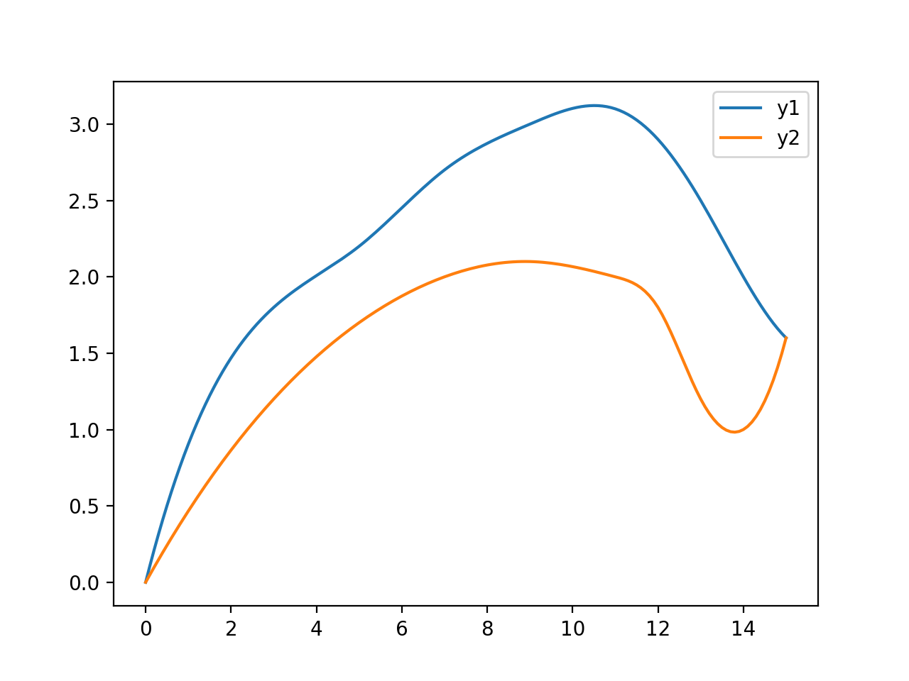
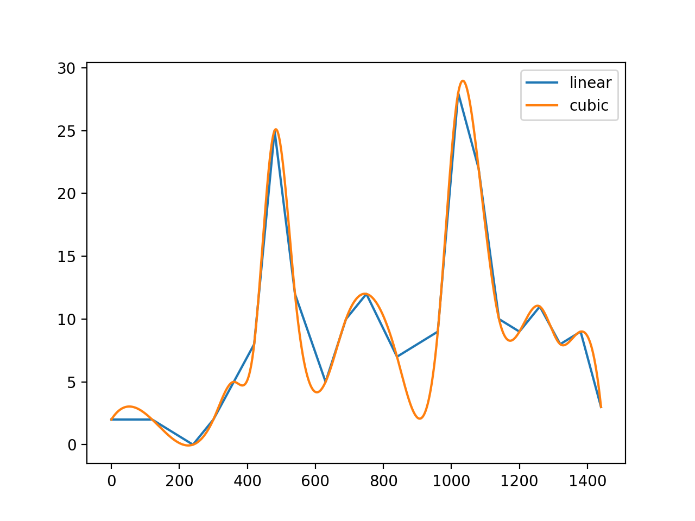

# 数学实验 Exp 03

赵晨阳 计 06 2020012363

## 实验目的

- 掌握计算拉格朗日、分段线性、三次样条三 种插值的方法，改变节点的数目，对三种插值结果进行初步分析。 

- 掌握用梯形公式、辛普森公式计算数值积分。
- 通过实例学习用插值和数值积分解决实际问题。

## 3.5

选用三种数值积分方法计算 $\pi$。

### 算法设计

题目要求采用三种数值积分方法计算 $\pi$ 值。首先，我给出三种方法的数学表达式。

方法 1：当圆的半径 $r=1$ 时，圆的面积 $S=\pi$，而该圆的四分之一面积可以用定积分求出 $\frac{1}{4}S=\int_{0}^1 \sqrt{1-x^2}dx$。将两式联立可以得到 $\pi = 4\int_{0}^1 \sqrt{1-x^2}dx$。

方法 2：考虑用 Gamma 函数积分的常用值 $\sqrt{\pi}=\Gamma(\frac{1}{2})=\int_{0}^{+\infty}e^{-t}t^{-\frac{1}{2}}dt=\int_{-\infty}^{+\infty}e^{-u^2}du$。因此，$\pi=(2\int_{0}^{+\infty}e^{-u^2}du)^2$。

方法 3：注意到 $\arctan1=\frac{\pi}{4}$，且 $\arctan 0=0$，同时 $(\arctan x)'=\frac{1}{1+x^2}$。根据 Newton-Leibniz 公式，可以得到 $\int_{0}^1\frac{dx}{1+x^2}=\arctan 1-\arctan 0=\frac{\pi}{4}$，因此 $\pi = 4\int_{0}^1\frac{dx}{1+x^2}$。

分别对 $\sqrt{1-x^2}$，$e^{-u^2}$，$\frac{1}{1+x^2}$ 进行定积分即可。

### 程序

程序位于 `codes/3_5.py` 下，直接运行 `python3 exp3_5.py` 即可查看结果。

```python
import numpy as np
from scipy.integrate import quad

fun1 = lambda x: np.sqrt(1.0 - x ** 2)
fun2 = lambda x: np.exp(-(x ** 2))
fun3 = lambda x: 1.0 / (1.0 + x ** 2)

pi_1 = quad(fun1, 0.0, 1.0, epsabs=1e-15)[0] * 4.0
pi_2 = (2.0 * quad(fun2, 0.0, np.inf, epsabs=1e-15)[0]) ** 2
pi_3 = quad(fun3, 0.0, 1.0, epsabs=1e-15)[0] * 4.0

print(f"pi_1 = {pi_1:.15f}")
print(f"pi_2 = {pi_2:.15f}")
print(f"pi_3 = {pi_3:.15f}")
```

### 结果、分析与结论

上述程序得到的输出结果如下：

```python
pi_1 = 3.141592653589792
pi_2 = 3.141592653589793
pi_3 = 3.141592653589794
```

注意到 $\pi$ 的真实值是 $3.1415926535897932\dots$，可以观察到只有第二种方法在有效数字内达到了准确值，而其他做法的最后一位（即第 $16$ 位有效数字）均出现了误差。考虑到在 `Python` 中，由于浮点数的特殊性质，一些数值计算会出现误差，但并不影响程序的可用性。

此外，在计算积分时，`epsabs = 1e-15`，而在 `1e-15` 以内，程序输出均为出现误差，可以见得 `scipy` 和 `numpy` 的数值积分函数精度是相当好的。

## 3.5 另解

题目要求采用三种数值积分方法计算 $\pi$ 值，也可以分别对于同一 $\pi$ 的积分表达式分别通过梯形公式、辛普森公式和高斯公式进行数值积分。

### 算法设计

选用数学公式 $\pi = 4\int_{0}^1 \sqrt{1-x^2}dx$ 进行求解，分别利用三种数值积分方法进行数值积分即可。

### 程序

程序位于 `codes/3_5_2.py` 下，直接运行 `python3 exp3_5_2.py` 即可查看结果。

```python
import numpy as np
from scipy.integrate import quad, simps, quadrature

def calculate_pi(method):
    # Define a function for calculating pi using different methods
    x = np.linspace(0.0, 1.0, 10000)
    y = np.sqrt(1.0 - x**2)
    fun1 = lambda x: np.sqrt(1.0 - x ** 2)

    if method == "quad":
        return quad(fun1, 0.0, 1.0, epsabs=1e-15)[0] * 4.0
    elif method == "simps":
        return simps(y,x) * 4.0
    elif method == "quadrature":
        return quadrature(fun1, 0.0, 1.0, tol=1e-30, maxiter=1000)[0] * 4.0
    else:
        raise ValueError("Invalid method")

# Call the function with different methods and print the results
methods = ["quad", "simps", "quadrature"]
for method in methods:
    pi = calculate_pi(method)
    print(f"pi_{method} = {pi:.15f}")
```

### 结果、分析与结论

上述程序得到的输出结果如下：

```python
pi_quad = 3.141592653589792
pi_simps = 3.141591948898189
pi_quadrature = 3.141593812833210
```

注意到 $\pi$ 的真实值是 $3.1415926535897932\dots$，可以观察到只有梯形公式在有效数字内达到了准确值，而其他做法在小数点后 6 位均出现了误差。考虑到在 `Python` 中，由于浮点数的特殊性质，一些数值计算会出现误差，但并不影响程序的可用性。

## 3.10

### 问题分析、模型假设与模型建立

出于空气动力学的相关考量，机翼剖面线条是相当光滑的。因此，设 $y_1(x)$ 和 $y_2(x)$ 分别表示横坐标为 $x\in[0,15]$ 时的轮廓上下纵坐标，模型中设定 $y1,y2\in C^1[0,15]$。已知有限个 $x$ 处的 $y_1(x),y_2(x)$ ，要求当横坐标发生更为精细变化时，求出对应的 $y_1$ 和 $y_2$。可以考虑利用 `scipy.interpolate` 中的一维插值函数类 `interp1d` 拟合出 $y_1$ 和 $y_2$ 的**拟合函数**，随后带入有待求解位置的横坐标即可。

至于机翼剖面的面积，根据 $y1,y2\in C^1[0,15]$ 的设定， $y1-y2$ 同样可积，故而借助数值积分方法求出 $\int_{0}^{15}(y_1(x)-y_2(x))dx$ 即为面积的估计值。

### 算法设计

模型设定 $y1,y2\in C^1[0,15]$，故而选用三次样条插值，通过设定 `interp1d(kind='cubic')` 即可实现 。

作图范围为 $x$ 从 $0$ 变化到 $15$，每次间距为 $0.1$。如此得到的 $151$ 个点的间隔已经足够小，用线段直接相连得到的图案在视觉上也应该是足够光滑的，因此直接将所有插值点作为输入调用 `matplotlib.pyplot` 内置的`plot`绘图即可。

最后，在前面得到密集点的横纵坐标后，可以直接将其作为数值积分时选取的采样点，通过梯形公式计算 $\int_{0}^{15}(y_1(x)-y_2(x))dx$。

实际上，采用梯形公式和上面绘图的方式是完全对应的，都利用分段线性插值函数去拟合未知的所有点，最终计算出的区域面积也和画图得到的区域完全对应。具体实现的时候直接调用 `Numpy` 内置的 `trapz` 即可。

### 代码

程序位于 `codes/3_10.py` 下，直接运行 `python3 exp3_10.py` 即可查看结果。

```python
import numpy as np
from scipy.interpolate import interp1d
import matplotlib.pyplot as plt

np.set_printoptions(precision=15)

x = np.array([0, 3, 5, 7, 9, 11, 12, 13, 14, 15])
y1 = np.array([0, 1.8, 2.2, 2.7, 3.0, 3.1, 2.9, 2.5, 2.0, 1.6])
y2 = np.array([0, 1.2, 1.7, 2.0, 2.1, 2.0, 1.8, 1.2, 1.0, 1.6])

all_x = np.arange(0, 15.1, 0.1)
all_y1 = interp1d(x, y1, kind="cubic")(all_x)
all_y2 = interp1d(x, y2, kind="cubic")(all_x)

with open("./3_10_result.txt", "w") as f:
    for i in range(len(all_x)):
        f.write(
            f"y1({all_x[i]:.1f}) = {all_y1[i]:.15f}   y2({all_x[i]:.1f}) = {all_y2[i]:.15f}\n"
        )

plt.plot(all_x, all_y1, all_x, all_y2)
plt.legend(["y1", "y2"])
plt.show()

print("The area of the fitted area is " + str(np.trapz(all_y1 - all_y2, all_x)))
```

### 结果、分析与结论

所有 $x=0.1k (0\leq k \leq 150)$ 处 $y_1(x)$ 和 $y_2(x)$ 的值位于 `codes/3_10_result.txt` 中。作图效果如下：



注意到在上下机翼的交汇点，也即 $x=0$ 和 $x=15$ 两处，机翼是不光滑的。这是因为在模型设定于还是实现时，都并没有限制 $y1$ 和 $y2$ 在这两点处的切线重合。然而，根据互联网上的机翼剖面草图来看，这样的情况应该是允许的。

除此之外，图上的 $y_1$ 在 $x=5$ 附近存在一明显凹口，说明在这个区域内一阶导数先增后减，二阶导数是非恒负的。观察原数值，$y_1(5)-y_1(3)=0.4$，$y_1(7)-y_1(5)=0.5$，$y_1(9)-y_1(7)=0.3$，因此这个现象和宏观上的离散增长率是吻合的，结果合理。

最后，考虑截面面积为 11.344385312933316。如前文所述，最终计算出的界面面积也和画图得到的区域完全对应。为了计算结果进一步精确，尝试缩小梯形公式中的 $h$，将 $x$ 的间隔缩小，得到如下结果：

|   间隔   |     $10^{-1}$      |     $10^{-2}$      |     $10^{-3}$      |     $10^{-4}$      |
| :------: | :----------------: | :----------------: | :----------------: | :----------------: |
| 计算结果 | 11.344385312933316 | 11.345999546120636 | 11.346015688452509 | 11.346015849875828 |

区域面积的计算结果仅在小数点后第三位有区别。考虑到间隔越小，所需计算时间越长，为了平衡精度和计算效率，取 $0.1$ 作为 $h$ 是合适的。

上述数学建模后计算得到的结果具有其实际意义。制造机翼时，可以根据上述数值控制各个位置的参数。这个实验还说明，当要用一个相对光滑的函数去拟合一个实际存在的曲线时，三次样条插值是是一个合适的选择。

## 3.12

### 问题分析、模型假设与模型建立

​		估计一天的车流量 $S$：设数列 $f(t)$ 表示在 $[t,t+1)$ 这个时间内（以分钟为单位）通过的车的个数。那么最终一天的车流量可以如下计算：$S=\sum_{t=0}^{1440}f(t)$。考虑到题目已知多个时间节点上一分钟内的车流量变化，也即已有若干点处 $f$ 的值，由它们通过插值拟合得到曲线 $g(t)$ ，再取 $g(t)$ 在 $[0,1440]$ 上的整点的值作为 $f(t)$ 的值。考虑到期望意义上 $\sum_{t=0}^{1440}f(t)=\int_{0}^{1440}g(t)dt$，故而最后直接计算 $g(t)$ 的数值积分即可。

这一模型基于假设 $g$ 在 $[0,1440]$ 上可积，考虑到现实生活中的车流量有界且恒正，这是能够保证的。然而，直接由有限多点来拟合得到的 $g$ 值在离散的时间点上可能并不符合现实。譬如可能得到 $f(700)=9.34$ 这样的函数值，而现实生活中车流量均为整数。对于这一问题，可以舍入来避免。然而，舍入的偏差在对上千数据点进行求和后的期望为 0，故而不进行舍入，直接求和，并不会和舍入后再求和有根本区别。

### 算法设计

由于需要 $g(t)\geq 0$ 恒成立且 $f$ 有界，**分段线性插值**是一个可以同时满足这两个条件的选择。此外，本次实验也尝试了三次样条插值，它并不保证拟合得到的 $f(t)\geq 0$ 恒成立，但仍然是一个值得对比的方法。

具体的算法流程如下：

1. 用给定的数据确定若干个点处的 $g；;

2. 用 1. 中得到的点分别做分段线性插值和三次样条插值，拟合得到函数 $g(t)(t\in[0,1440])$；

3. 用数值积分计算 $\int_{0}^{1440}g(t)dt$ 作为答案。

对于数值积分，实验中采用梯形公式，如此 2. 中可以只拟合得到若干密集点处的 $g$ 值，而不用求出拟合函数的具体表达式。

### 代码

程序位于 `codes/3_12.py` 下，直接运行 `python3 exp3_12.py` 即可查看结果。

```python
import numpy as np
from scipy.interpolate import interp1d

x = np.array([0, 2, 4, 5, 6, 7, 8, 9, 10.5, 11.5, 12.5, 14, 16, 17, 18, 19, 20, 21, 22, 23, 24]) * 60.0
y = np.array([2, 2, 0, 2, 5, 8, 25, 12, 5, 10, 12, 7, 9, 28, 22, 10, 9, 11, 8, 9, 3])
print(np.trapz(y, x))

new_x = np.arange(0, 1440.1, 0.1)
f = interp1d(x, y, kind='cubic')
new_y = f(new_x)
print(np.trapz(new_y, new_x))

import matplotlib.pyplot as plt
plt.plot(x, y, label='linear')
plt.plot(new_x, new_y, label='cubic')
plt.legend()
plt.show()
```

### 结果、分析与结论



两种插值方法得到的 $g$ 如上图所示。结合图例，我们做出如下分析：

1. 线性插值和三次样条插值的区分较为明显，考虑到给出的样本点仅有 21 个，相对于一整天 1440 个完整点的尺度还是很稀疏，所以很多中间的波动是无法预测的，这与插值方法无关；
2. 两种方法都在某些点处有比较大的波动，这是符合现实生活中实际情况的。在通勤高峰期，车流量较大，而其它时段（比如凌晨和午后）车流量往往较小；
3. 注意到原始数据点中存在车流量为 0 的时刻，因此三次样条曲线会导致某些时刻的车流为负，这不符合现实意义。然而，但是另一方面，这样的负值绝对值较小，且较少出现，所以可以忽略。

使用分段线性插值，得到的车流量为 $12990$；使用三次样条插值，得到的车流量为 $12669$。这两个结果相对误差较小，因此视作可靠结果。
